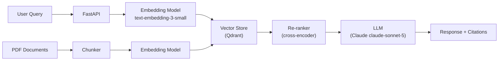

# Projects

End-to-end projects connect theory to production. Each project is structured like a real engineering task.

## Project Structure

Every project includes:

1. **Problem Statement** — Business context and measurable success criteria
2. **Architecture** — System design with Mermaid diagrams
3. **Implementation** — Step-by-step build guide with full code
4. **Testing** — Unit tests, integration tests, evaluation metrics
5. **Deployment** — Docker, API, and cloud deployment instructions
6. **Optimisation** — Profiling and performance improvements
7. **Interview Questions** — Technical discussion questions about design decisions

---

## Project Index

| Project | Volume | Difficulty | Estimated Time |
|---|---|---|---|
| P01: Spam Classifier | Vol 3 | Beginner | 4 hours |
| P02: Image Classifier (ResNet fine-tune) | Vol 4 | Intermediate | 8 hours |
| P03: Sentiment Analysis API | Vol 5 | Intermediate | 8 hours |
| P04: Document Q&A with RAG | Vol 7 | Advanced | 16 hours |
| P05: AI Research Assistant Agent | Vol 8 | Advanced | 24 hours |
| P06: LLM Production Pipeline | Vol 9 | Expert | 40 hours |

---

## P04: Document Q&A with RAG

### Problem Statement

Build a production-ready Q&A system that answers questions over a corpus of PDF documents. The system must:

- Achieve >80% answer relevancy on a held-out evaluation set
- Return answers in under 2 seconds (p95)
- Support up to 10,000 documents
- Provide source citations with every answer

### Architecture



### Implementation

=== "Ingestion Pipeline"

    ```python
    from pathlib import Path
    import anthropic
    from qdrant_client import QdrantClient
    from qdrant_client.models import Distance, VectorParams, PointStruct
    from sentence_transformers import SentenceTransformer
    import fitz  # PyMuPDF

    EMBED_MODEL = "all-MiniLM-L6-v2"
    COLLECTION = "documents"
    CHUNK_SIZE = 512
    CHUNK_OVERLAP = 64


    def chunk_text(text: str, size: int = CHUNK_SIZE, overlap: int = CHUNK_OVERLAP) -> list[str]:
        words = text.split()
        chunks = []
        for i in range(0, len(words), size - overlap):
            chunks.append(" ".join(words[i : i + size]))
        return chunks


    def ingest_pdf(path: Path, embedder: SentenceTransformer, client: QdrantClient) -> int:
        doc = fitz.open(path)
        text = " ".join(page.get_text() for page in doc)
        chunks = chunk_text(text)
        embeddings = embedder.encode(chunks, show_progress_bar=True)
        points = [
            PointStruct(id=i, vector=embeddings[i].tolist(), payload={"text": chunks[i], "source": str(path)})
            for i in range(len(chunks))
        ]
        client.upsert(collection_name=COLLECTION, points=points)
        return len(chunks)
    ```

=== "Query Pipeline"

    ```python
    def query(question: str, embedder: SentenceTransformer, client: QdrantClient) -> dict:
        q_vec = embedder.encode([question])[0].tolist()
        hits = client.search(collection_name=COLLECTION, query_vector=q_vec, limit=5)
        context = "\n\n".join(f"[{i+1}] {h.payload['text']}" for i, h in enumerate(hits))
        sources = [h.payload["source"] for h in hits]

        claude = anthropic.Anthropic()
        message = claude.messages.create(
            model="claude-sonnet-5",
            max_tokens=1024,
            messages=[{
                "role": "user",
                "content": f"Answer the question using only the context below.\n\nContext:\n{context}\n\nQuestion: {question}"
            }]
        )
        return {"answer": message.content[0].text, "sources": sources}
    ```

### Evaluation

Measure retrieval quality separately from generation quality:

| Metric | Tool | Target |
|---|---|---|
| Recall@5 | Custom eval harness | > 0.85 |
| Answer Relevancy | Ragas | > 0.80 |
| Faithfulness | Ragas | > 0.90 |
| Latency p95 | Prometheus | < 2000ms |
