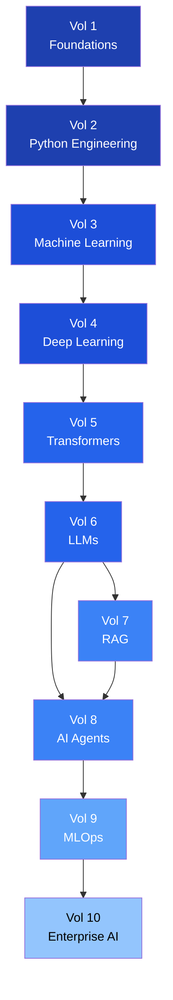
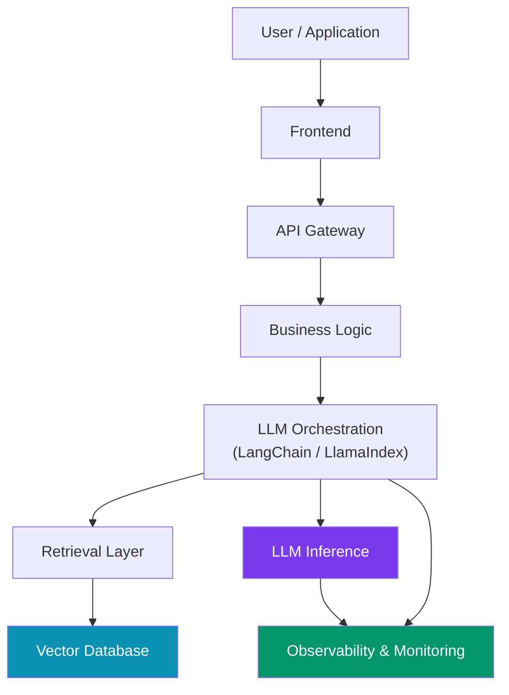

# Roadmap

## Curriculum Map

## Completion Status

| Volume | Title | Chapters | Status |
|---|---|---|---|
| 01 | Foundations of AI | Ch 0-3 | In Progress |
| 02 | Python Engineering | Ch 1-3 | In Progress |
| 03 | Machine Learning | Ch 1-4 | Planned |
| 04 | Deep Learning | Ch 1-4 | Planned |
| 05 | Transformers | Ch 1-3 | Planned |
| 06 | Large Language Models | Ch 1-4 | Planned |
| 07 | RAG | Ch 1-3 | Planned |
| 08 | AI Agents | Ch 1-3 | Planned |
| 09 | MLOps | Ch 1-3 | Planned |
| 10 | Enterprise AI | Ch 1-3 | Planned |

## Modern AI Stack

!!! note
    LLMs are **one component** of a production AI system. This course covers the entire stack.
