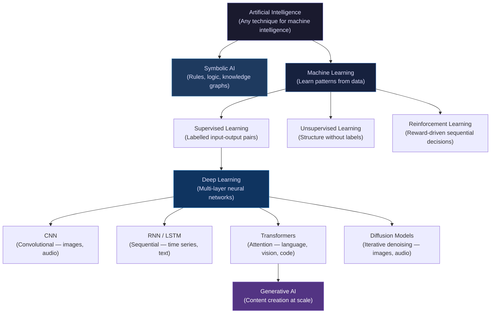
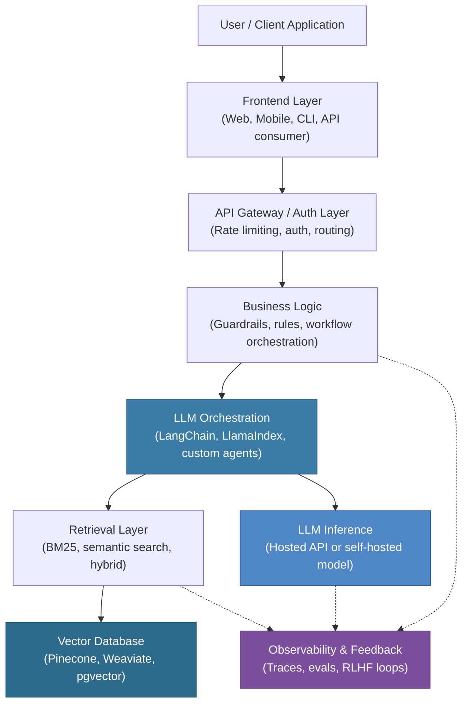

# Ch 0 — Welcome to Applied AI

!!! abstract "Chapter Meta"
    | Attribute | Value |
    |-----------|-------|
    | **Difficulty** | Beginner |
    | **Estimated Reading Time** | 45 minutes |
    | **Prerequisites** | None |
    | **Volume** | Volume 1 — Foundations |

---

## Learning Objectives

By the end of this chapter you will be able to:

1. **Define** artificial intelligence using a formal, engineering-grounded definition and distinguish it from adjacent terms such as machine learning, deep learning, and generative AI.
2. **Classify** a given AI system into its correct sub-discipline (symbolic AI, classical ML, deep learning, or generative AI) and justify the classification.
3. **Describe** the layers of the modern AI stack — from user interface through orchestration, retrieval, and inference — and explain the role each layer plays.
4. **Differentiate** applied AI engineering from AI research, articulating the distinct goals, constraints, and success criteria of each.
5. **Outline** the responsibilities, required skills, and career trajectory of an Applied AI Engineer in a contemporary technology organisation.

---

## What is Artificial Intelligence?

Artificial intelligence is the branch of computer science concerned with building computational systems that exhibit behaviour we would characterise as intelligent if observed in a human being. The word "intelligence" is deliberately broad: it encompasses perception (recognising a face or transcribing speech), reasoning (solving a logic puzzle or planning a route), learning (improving performance with experience), language (understanding and generating natural text), and action (manipulating objects or browsing the web). What unifies these capabilities is that they were historically considered to require human-level cognitive effort — and that computers are now able to perform many of them at or above human accuracy.

This breadth is also a source of confusion. "AI" is not a single technology; it is a problem domain that has been approached with radically different techniques in different eras. The symbolic AI of the 1950s–1980s attempted to encode human knowledge as explicit rules and logical predicates. The statistical ML of the 1980s–2000s replaced hand-coded rules with learned patterns extracted from data. The deep learning revolution of the 2010s replaced hand-engineered features with hierarchical representations learned end-to-end from raw inputs. And the foundation model era of the 2020s replaced task-specific models with general-purpose pre-trained systems that can be instructed in natural language. Each wave did not discard its predecessors entirely — production AI systems routinely combine learned models with rule-based logic, search algorithms, and database lookups.

For engineering purposes, a working definition is: **an AI system is any software artefact that uses learned or programmatically encoded models of the world to make decisions or generate outputs that would otherwise require human judgment.** Notice what this definition excludes: it excludes simple conditional logic with no learned component, and it excludes systems that merely store and retrieve data. It includes classical machine learning classifiers, large language models, computer vision pipelines, recommender systems, and autonomous agents.

---

## The AI Family Tree

The sub-disciplines of AI form a nested hierarchy, where each inner circle is a specialisation of the one that contains it.

!!! note "Generative AI is not a separate branch"
    Generative AI is not a parallel discipline to machine learning — it is the application of deep learning (primarily transformers and diffusion models) to *generate* novel content. A large language model is a transformer, which is a deep learning architecture, which is trained using supervised learning on unlabelled text treated as self-supervised prediction targets. Understanding this nesting prevents category errors like "should we use ML or AI for this?"

---

## Comparing the Core Sub-disciplines

| Dimension | Artificial Intelligence | Machine Learning | Deep Learning | Generative AI |
|-----------|------------------------|-----------------|---------------|---------------|
| **Definition** | Any system that mimics cognitive functions | Systems that learn from data without being explicitly programmed | ML using multi-layer neural networks that learn hierarchical representations | DL systems that produce novel text, images, audio, video, or code |
| **Primary Approach** | Symbolic reasoning, search, learned models | Statistical pattern recognition on features | End-to-end representation learning | Large-scale pre-training + prompting or fine-tuning |
| **Requires Training Data** | Not necessarily (rule systems do not) | Yes — typically thousands to millions of labelled examples | Yes — typically millions to billions of examples | Yes — often trillions of tokens or billions of images |
| **Example Applications** | Chess engines, route planning, spam filters | Credit scoring, churn prediction, image classification | Object detection, speech recognition, machine translation | ChatGPT, Midjourney, GitHub Copilot, Sora |

---

## Applied AI vs. Research AI

Research AI is concerned with discovering what is *possible*. Its primary output is peer-reviewed papers, new architectures, benchmark records, and theoretical proofs. Success is measured by state-of-the-art accuracy on a standardised dataset, by a novel mathematical contribution, or by a surprising emergent capability. Time horizons are long; deployment is not the goal.

Applied AI engineering is concerned with delivering *value* reliably in production. Its primary output is software systems that are correct, robust, observable, and cost-effective. Success is measured by business metrics — user engagement, error rate at scale, latency at the 99th percentile, cost per inference, regulatory compliance — not by benchmark accuracy alone. A model that achieves 95 % accuracy in a research setting but halluccinates 3 % of the time in a medical context is not a success; a model that achieves 88 % accuracy but has well-understood failure modes and a human-in-the-loop fallback may be entirely acceptable.

The distinction has three practical implications:

1. **Applied AI engineers are system designers, not just model trainers.** The model is one component; the surrounding retrieval, orchestration, caching, monitoring, and feedback layers often determine whether the product works.
2. **Applied AI engineers operate under constraints that researchers do not.** Budget, latency, data privacy, legal liability, and team capacity all constrain the solution space before a single model is evaluated.
3. **Applied AI engineers must translate between research contributions and engineering requirements.** Reading a paper critically — understanding what the benchmark measures, what assumptions the authors made, and whether those assumptions hold in your domain — is a core professional skill.

---

## The Modern AI Stack

A production AI system is not a model; it is an architecture. The diagram below shows the canonical layers of a modern enterprise AI application. Each layer has distinct engineering concerns.

!!! warning "LLMs are one component of an enterprise AI system — not the whole system"
    A common misconception among engineers new to AI is that building an AI product means choosing an LLM and calling its API. In practice, the LLM inference call typically represents less than 20 % of the engineering work in a production system. The retrieval layer, the orchestration logic, the guardrails, the evaluation pipeline, the latency and cost optimisation, the observability instrumentation, and the feedback loop collectively require the majority of effort. Engineering a good prompt is necessary but nowhere near sufficient.

---

## The Role of the Applied AI Engineer

### Responsibilities

An Applied AI Engineer is responsible for the full lifecycle of an AI-powered feature or product, from problem scoping through production maintenance. Day-to-day responsibilities typically include:

- **Problem framing** — translating a business requirement ("reduce support ticket volume") into an AI problem specification with well-defined inputs, outputs, success criteria, and fallback behaviour.
- **Model selection and evaluation** — benchmarking foundation models, fine-tuned variants, and classical ML baselines against task-specific evaluation sets; making cost-quality-latency trade-offs explicitly.
- **System design** — architecting the retrieval, orchestration, caching, and serving layers around the model; designing for graceful degradation when the model fails or hallucinates.
- **Prompt and context engineering** — crafting system prompts, few-shot examples, retrieval-augmented context windows, and structured output schemas that reliably elicit correct model behaviour.
- **Evaluation pipeline engineering** — building automated evaluation harnesses that measure correctness, safety, and consistency at scale, using LLM-as-judge, human review, and regression test suites.
- **MLOps and observability** — logging traces, monitoring output distributions, setting up alerts for anomalous behaviour, and maintaining feedback loops that continuously improve the system.
- **Stakeholder communication** — explaining model limitations, confidence levels, and failure modes to non-technical stakeholders; setting accurate expectations about what AI can and cannot do reliably.

### Skills Required

| Skill Area | Specific Competencies |
|------------|-----------------------|
| **Programming** | Python (fluent), async I/O, REST API design, containerisation (Docker) |
| **ML Foundations** | Supervised/unsupervised learning, loss functions, gradient descent, overfitting/regularisation |
| **Deep Learning** | Transformer architecture, attention mechanism, tokenisation, embeddings |
| **LLM Engineering** | Prompt engineering, RAG pipelines, function calling, structured outputs, fine-tuning |
| **Data Engineering** | SQL, pandas, vector databases, data cleaning, schema design |
| **Systems** | Latency profiling, caching strategies, horizontal scaling, async queues |
| **Evaluation** | Metric design, statistical significance, LLM-as-judge patterns, red-teaming |
| **Communication** | Writing design documents, presenting model limitations, risk communication |

### Career Trajectory

Applied AI Engineering is a relatively new specialisation that emerged as a distinct role around 2022–2023, when LLM APIs became sufficiently capable to build production systems on top of them. A typical trajectory runs:

1. **Junior Applied AI Engineer** — Implements prompt templates, RAG pipelines, and evaluation scripts under supervision; focused on a single product surface.
2. **Applied AI Engineer** — Owns end-to-end AI features; designs retrieval and orchestration architectures; leads evaluation design.
3. **Senior Applied AI Engineer** — Sets technical direction for an AI product area; defines evaluation standards; mentors junior engineers; contributes to model fine-tuning and safety red-teaming.
4. **Staff / Principal AI Engineer** — Designs cross-product AI platform infrastructure; defines engineering practices at the organisation level; works with research teams to productionise novel capabilities.

!!! tip "Distinguishing Applied AI Engineering from Adjacent Roles"
    - **ML Engineer**: Focuses on training infrastructure, distributed training, and model serving at scale. Spends more time on the model training pipeline than on the application layer.
    - **Data Scientist**: Focuses on statistical analysis, experimentation, and insight generation. May train models but typically hands off to engineering for productionisation.
    - **AI Researcher**: Publishes novel architectures and training methods. Not primarily concerned with production constraints.
    - **Applied AI Engineer**: Sits at the intersection — takes research-grade models and engineering-grade production requirements and builds the system that satisfies both.

---

## Exercises

1. **Recall.** In your own words and without referring back to the text, write a two-sentence definition of (a) artificial intelligence, (b) machine learning, and (c) generative AI. Then check your definitions against the ones in the chapter and note where they diverge.

2. **Classification.** For each of the following systems, identify which sub-discipline of AI it primarily belongs to (symbolic AI, supervised learning, unsupervised learning, reinforcement learning, deep learning, generative AI) and briefly justify your answer: (a) a spam filter trained on labelled emails; (b) a customer clustering algorithm that groups users by purchase behaviour; (c) an AlphaGo-style game-playing agent; (d) a rule-based invoice extraction system using regex; (e) DALL-E 3.

3. **Stack mapping.** Choose a real AI product you use regularly (e.g., a coding assistant, a search engine with AI summaries, or a customer support chatbot). Sketch the modern AI stack diagram for that product, filling in what you believe each layer does in that specific context. Note which layers you are uncertain about.

4. **Research vs. Applied.** Read the abstract of any recent paper from arXiv (cs.AI or cs.LG). Identify two assumptions the paper makes that would not hold in a production system you are familiar with. How would those gaps change the engineering approach?

5. **Role design.** You have been asked to build an AI-powered feature that automatically triages incoming customer support tickets into five priority categories and suggests a draft response. Write a one-page technical design brief that (a) frames the problem with formal input/output specification, (b) identifies the components of the AI stack you would need, (c) specifies at least two evaluation metrics and how you would measure them, and (d) describes the failure modes you are most concerned about.

---

## Summary

- Artificial intelligence is the broad discipline of building systems that exhibit intelligent behaviour; it encompasses symbolic reasoning, statistical learning, deep neural networks, and generative models.
- Machine learning, deep learning, and generative AI are nested sub-disciplines of AI — each is a specialisation of the one above it, not a separate field.
- The two primary approaches throughout AI history are **symbolic** (explicit rules and logic) and **statistical / learned** (patterns extracted from data); modern production systems combine both.
- The modern AI stack has at least eight distinct layers; the LLM inference call is one of them. Most production engineering effort lives in the orchestration, retrieval, evaluation, and observability layers.
- Applied AI engineering differs from AI research in goals (value delivery vs. knowledge creation), constraints (budget, latency, compliance), and success criteria (business metrics vs. benchmark accuracy).
- The Applied AI Engineer role requires a cross-disciplinary skill set spanning ML theory, systems engineering, data engineering, evaluation design, and stakeholder communication.
