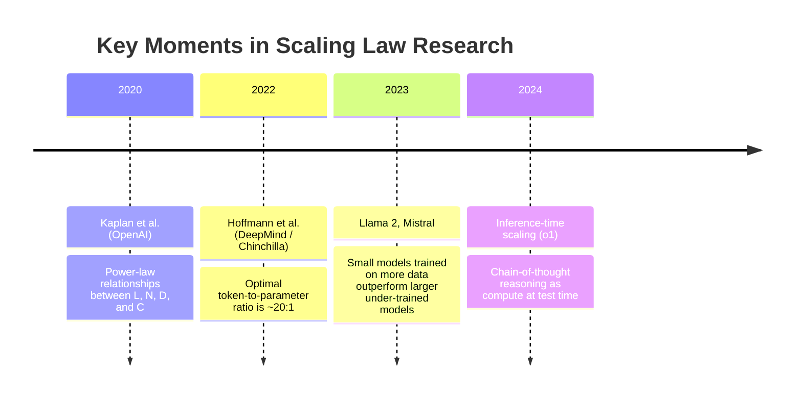
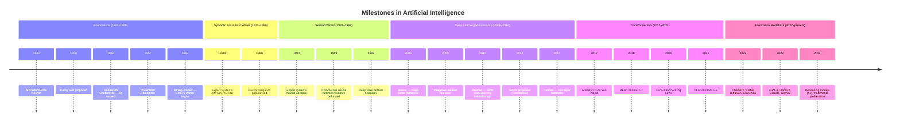

# Ch 1 — History of Artificial Intelligence

!!! abstract "Chapter Meta"
    | Attribute | Value |
    |-----------|-------|
    | **Difficulty** | Beginner |
    | **Estimated Reading Time** | 60 minutes |
    | **Prerequisites** | [Ch 0 — Welcome to Applied AI](../ch00-welcome/index.md) |
    | **Volume** | Volume 1 — Foundations |

---

## Learning Objectives

By the end of this chapter you will be able to:

1. **Narrate** the history of AI in chronological order, naming the key milestones, figures, and institutions responsible for each inflection point.
2. **Explain** the structural causes of the two AI winters — both why funding and interest collapsed, and why the recovery was not merely hype but grounded in new technical capabilities.
3. **Describe** the three converging factors (algorithmic improvements, large-scale datasets, GPU compute) that made the deep learning renaissance of 2006–2012 durable.
4. **Articulate** why the transformer architecture succeeded where recurrent networks struggled, using the concepts of parallelism, long-range attention, and gradient flow.
5. **Interpret** scaling laws (Kaplan et al. 2020, Hoffmann et al. 2022) and explain their implication for how compute budgets should be allocated between model size and training data.

---

## Historical Timeline

The table below traces the milestones that shaped modern AI. Dates mark the year of publication or public announcement; context fills in the engineering significance.

| Year | Milestone | Significance |
|------|-----------|-------------|
| **1943** | McCulloch & Pitts neuron | First mathematical model of a biological neuron as a binary threshold unit; demonstrated that networks of such units could compute logical functions. Established the conceptual bridge between neuroscience and computation. |
| **1950** | Turing's "Computing Machinery and Intelligence" | Introduced the Imitation Game (now the Turing Test) as an operational definition of machine intelligence. Framed AI as a behavioural rather than metaphysical question, shifting discourse away from "can machines think?" to "can machines behave indistinguishably from thinkers?" |
| **1956** | Dartmouth Summer Research Project | John McCarthy, Marvin Minsky, Claude Shannon, and Nathaniel Rochester coined the term "artificial intelligence" and proposed it as a serious research programme. Launched the symbolic AI era with optimistic projections of human-level intelligence within a decade. |
| **1957** | Perceptron (Rosenblatt) | Frank Rosenblatt's perceptron was the first trainable single-layer neural network, capable of learning a binary classification boundary from examples. Sparked enormous excitement and significant funding. |
| **1969** | *Perceptrons* (Minsky & Papert) | Minsky and Papert's rigorous proof that single-layer perceptrons cannot learn the XOR function, and their scepticism about multi-layer networks, contributed to the defunding of neural network research and the onset of the **First AI Winter**. |
| **1970s–1980s** | Expert Systems era | MYCIN (medicine), XCON (hardware configuration), and hundreds of commercial systems encoded domain expertise as thousands of IF-THEN rules. The approach achieved real commercial success but required enormous manual curation and could not generalise beyond their narrow rule set. |
| **1987** | Expert Systems collapse / Second AI Winter begins | Hardware cheaper than anticipated made dedicated Lisp machines commercially unviable. Expert systems proved brittle and expensive to maintain as rules multiplied. DARPA cut the Strategic Computing Initiative. Neural network research was defunded again. |
| **1989** | Backpropagation popularised (Rumelhart, Hinton, Williams) | Though the algorithm had earlier antecedents, the 1986 *Nature* paper by Rumelhart, Hinton, and Williams made backpropagation widely understood and usable. Demonstrated that multi-layer networks could learn internal representations — directly refuting the Minsky-Papert critique. |
| **1997** | Deep Blue defeats Kasparov | IBM's Deep Blue used brute-force search with hand-tuned evaluation functions, not learning — but its defeat of reigning world chess champion Garry Kasparov signalled to the public that computers had crossed a threshold. Reignited popular and government interest in AI. |
| **1998** | LeNet-5 (LeCun et al.) | Yann LeCun demonstrated convolutional neural networks (CNNs) trained with backpropagation on handwritten digit recognition (MNIST). Established CNNs as the correct architecture for grid-structured inputs and showed that learned hierarchical features outperformed hand-crafted ones. |
| **2006** | Deep belief networks / Hinton's renaissance paper | Geoffrey Hinton, Simon Osindero, and Yee-Whye Teh showed that deep networks could be pre-trained layer-by-layer as restricted Boltzmann machines, solving the vanishing gradient problem. The following year, Bengio et al. extended this to autoencoders. Marked the formal beginning of the **deep learning renaissance**. |
| **2009** | ImageNet dataset (Fei-Fei Li et al.) | The ImageNet Large Scale Visual Recognition Challenge (ILSVRC) provided 1.2 million labelled images across 1,000 categories. For the first time, a benchmark was large enough to train and compare deep networks fairly. Made the 2012 breakthrough possible. |
| **2012** | AlexNet wins ILSVRC | Alex Krizhevsky, Ilya Sutskever, and Geoffrey Hinton trained a deep CNN on two GPUs to achieve a top-5 error rate of 15.3 % — almost 11 percentage points better than the next best entry. Proved beyond doubt that deep learning on GPUs outperformed all other approaches on large-scale vision. The modern AI industry traces its origin to this moment. |
| **2013** | Word2Vec (Mikolov et al.) | Google's Word2Vec demonstrated that shallow neural networks trained on large text corpora learn dense vector representations of words that encode semantic relationships (the famous `king − man + woman ≈ queen`). Introduced the idea of transfer learning through pre-trained embeddings. |
| **2014** | Generative Adversarial Networks (Goodfellow et al.) | Ian Goodfellow proposed training two networks — a generator and a discriminator — in a minimax game. GANs enabled photorealistic image synthesis and became the dominant generative architecture until diffusion models superseded them. |
| **2015** | ResNet (He et al.) | Introduced skip connections (residual connections) that allowed training networks up to 152 layers deep without vanishing gradients. ResNet-50 and ResNet-101 remain widely used backbone architectures. The paper introduced the insight that very deep networks, if properly connected, can learn identity functions and therefore cannot be worse than shallower ones. |
| **2017** | "Attention Is All You Need" (Vaswani et al.) | Google Brain researchers proposed the transformer architecture, replacing recurrence entirely with self-attention. The paper demonstrated that transformers outperform recurrent and convolutional sequence models on machine translation, at higher training parallelism. Every major LLM in production today is a descendant of this architecture. |
| **2018** | BERT (Devlin et al.) and GPT-1 (Radford et al.) | Google's BERT and OpenAI's GPT-1 independently demonstrated that large transformer language models pre-trained on unlabelled text could be fine-tuned to set new state-of-the-art results across a wide range of NLP tasks with very little task-specific data. Established the **pre-train → fine-tune** paradigm. |
| **2019** | GPT-2 (Radford et al.) | OpenAI's 1.5 billion parameter GPT-2 generated coherent, multi-paragraph text and demonstrated that the pre-train objective of next-token prediction was sufficient for emergent multi-task capability. OpenAI controversially staged its release, citing misuse concerns — the first major public debate about AI safety in the foundation model era. |
| **2020** | GPT-3 (Brown et al.) | OpenAI's 175 billion parameter GPT-3 demonstrated **in-context learning**: by including examples in the prompt (few-shot prompting), the model could perform tasks it was never explicitly fine-tuned for. Also the paper that introduced **scaling laws** quantitatively. Launched the modern LLM API economy. |
| **2021** | CLIP and DALL-E (OpenAI) | CLIP showed that contrastive pre-training on image-text pairs learns a joint embedding space enabling zero-shot image classification. DALL-E demonstrated text-to-image generation at sufficient quality to be practically useful. Opened the multi-modal era. |
| **2022** | ChatGPT, Stable Diffusion, InstructGPT | OpenAI's ChatGPT (RLHF fine-tuned GPT-3.5) crossed 1 million users in 5 days and 100 million in 2 months — the fastest consumer product adoption in history. Stability AI's Stable Diffusion brought open-source, latent diffusion image generation to consumer hardware. |
| **2022** | Chinchilla (Hoffmann et al.) | DeepMind's paper demonstrated that GPT-3 and contemporaries were severely *under-trained* relative to model size. A 70 B parameter model trained on 1.4 trillion tokens outperformed a 280 B model trained on the same compute budget with fewer tokens. Revised the entire industry's assumptions about optimal training. |
| **2023** | GPT-4, Llama, Claude, Gemini | The multi-model era: OpenAI's GPT-4 (multimodal, with improved reasoning), Meta's Llama 2 (open-weights), Anthropic's Claude 2 (with 100K context and Constitutional AI safety training), and Google's Gemini established a competitive, multi-provider foundation model ecosystem. |
| **2024** | Reasoning models, multimodal proliferation | OpenAI o1 and o3 demonstrated that spending more compute *at inference time* through chain-of-thought reasoning dramatically improves performance on mathematics, coding, and logic benchmarks, challenging the assumption that all capability must be baked into training. |

---

## The Two AI Winters

### First AI Winter (approximately 1969–1980)

The first AI winter was not a single event but a slow contraction. Its proximate cause was the 1969 *Perceptrons* book, but the deeper cause was systematic over-promise. The 1956 Dartmouth proposal predicted human-level AI within a decade. By 1969 those predictions had not materialised, and the Minsky-Papert proof gave critics a technically grounded reason to withdraw support. The US Department of Defense (via DARPA) and the UK Science Research Council (via the Lighthill Report of 1973) both concluded that AI research was not producing militarily or commercially useful results and substantially reduced funding.

The symbolic AI programmes that continued found a temporary lifeline in expert systems, which offered genuine utility in narrow domains. This bought the field another decade — but by the mid-1980s the structural limitations of hand-coded knowledge bases became undeniable.

### Second AI Winter (approximately 1987–1993)

The second winter was triggered by a market collapse rather than a theoretical critique. The commercial expert systems industry had grown to several hundred million dollars annually by the mid-1980s, built largely on specialised Lisp hardware (Symbolics, LMI, Texas Instruments). When general-purpose workstations from Sun and DEC became cheaper and more capable, the business case for dedicated AI hardware evaporated. XCON, the canonical success story, had grown to 10,000 rules and required a dedicated team of 30 engineers to maintain — scaling by human rule-writing had hit a wall.

Neural network research also experienced a secondary funding collapse: DARPA's Strategic Computing Initiative, which had funded much neural network research in the hope of producing autonomous military vehicles, was defunded as results fell short of expectations.

### Why the Winters Ended

The first winter ended because expert systems demonstrated real commercial utility — not because the underlying theory advanced. The second winter ended for a more fundamental reason: three distinct capabilities converged simultaneously in the 2000s in a way that had no historical precedent.

1. **Algorithmic improvements** — Hinton's 2006 layer-wise pre-training paper solved the vanishing gradient problem that had made training deep networks impractical. Subsequent innovations — dropout (Srivastava et al., 2014), batch normalisation (Ioffe and Szegedy, 2015), Adam optimiser (Kingma and Ba, 2014) — made deep networks dramatically easier and more reliable to train.
2. **Large-scale labelled datasets** — ImageNet (2009), Common Crawl, and the digitisation of books, scientific papers, and web pages created datasets large enough to train the deep networks that algorithmic advances had made possible. Data was the fertiliser that allowed the algorithmic seeds to grow.
3. **GPU compute** — Krizhevsky's insight that the parallel architecture of graphics cards maps naturally onto the matrix multiplications in neural networks allowed teams to train networks that would have taken years on CPUs in weeks. The cost of a fixed compute budget dropped by roughly two orders of magnitude between 2007 and 2012.

!!! warning "The Lesson for Applied AI Engineers"
    Both AI winters were caused by the same pattern: capability claims outran demonstrated results. Investors and governments funded the hype, then withdrew when the hype did not materialise on promised timelines. Applied AI engineers have a professional obligation to set accurate expectations — not out of false modesty, but because over-promise followed by under-delivery is how the cycle restarts. The industry's credibility is a shared resource.

---

## The Deep Learning Renaissance (2006–2012)

Geoffrey Hinton's 2006 paper on deep belief networks was technically a paper about unsupervised pre-training, not about the final supervised model. Its real contribution was showing that deep networks — five or more layers — could be initialised in a state from which gradient descent could refine them to useful performance, rather than getting stuck in the flat regions of the loss landscape that had previously made deep network training unreliable.

Between 2006 and 2012, several subsidiary innovations compounded the effect:

- **Rectified Linear Units (ReLU)** — replacing the sigmoid activation function with `max(0, x)` made gradients flow more reliably through many layers, because ReLU does not saturate in the positive regime the way sigmoid does near its asymptotes.
- **Dropout** — randomly zeroing 50 % of neuron activations during training forces the network to learn redundant representations and acts as a powerful regulariser, dramatically reducing overfitting in large networks.
- **Data augmentation** — applying random crops, flips, colour jitter, and rotations to training images during training effectively multiplied the size of the training set and improved generalisation.
- **Multi-GPU training** — Krizhevsky's AlexNet was trained across two NVIDIA GTX 580 GPUs in parallel. This engineering contribution was at least as important as the architectural innovations.

The combination of these factors meant that by 2012, teams with access to a university computing cluster could train networks that would have been computationally inaccessible to government-funded national laboratories a decade earlier. The democratisation of compute was a precondition for the explosion of research that followed.

---

## The Transformer Revolution (2017–present)

### Why RNNs Were Insufficient

Recurrent Neural Networks (RNNs) and their variants — Long Short-Term Memory networks (LSTMs, Hochreiter & Schmidhuber 1997) and Gated Recurrent Units (GRUs, Cho et al. 2014) — process sequences step by step, maintaining a hidden state that is updated at each position. This design has two structural problems that become severe at scale:

1. **Sequential computation** — because each step depends on the previous hidden state, the forward pass cannot be parallelised across the sequence. Training on long sequences is therefore slow, and the maximum practical sequence length is bounded by training time budgets.
2. **Vanishing gradients across long distances** — despite LSTMs' gating mechanisms, gradients that must flow across hundreds or thousands of time steps diminish exponentially, making it hard for the model to learn dependencies between tokens that are far apart in the sequence. An LSTM reading a 2,000-word document can easily "forget" information from the beginning before it finishes reading.

### What Transformers Did Differently

The transformer's core innovation is **self-attention**: instead of processing the sequence step by step, every token attends simultaneously to every other token. The attention score between token \(i\) and token \(j\) is computed as:

\[
\text{Attention}(Q, K, V) = \text{softmax}\!\left(\frac{QK^\top}{\sqrt{d_k}}\right)V
\]

where \(Q\) (queries), \(K\) (keys), and \(V\) (values) are linear projections of the input embeddings, and \(d_k\) is the key dimensionality. The division by \(\sqrt{d_k}\) prevents the dot products from growing too large in magnitude before the softmax, which would push the softmax into a regime where gradients are very small.

This formulation has three consequences that RNNs cannot match:

- **Full parallelism** — all attention scores can be computed simultaneously as a single matrix multiplication. Training time scales with sequence length squared (\(O(n^2)\)), not with sequence length times model depth (\(O(n \cdot d)\)) as in RNNs, and because matrix multiplication is GPU-native, the constant factor on the quadratic scaling is very small.
- **Constant-depth gradient paths** — the gradient path between any two tokens in a transformer is at most two layers deep (one attention + one feedforward), regardless of their distance in the sequence. This makes it easy to learn long-range dependencies.
- **Interpretable attention patterns** — attention weights are readable, allowing practitioners to inspect which tokens the model is attending to when making a prediction — an important property for debugging and safety analysis.

### Positional Encodings

One subtle problem: self-attention is permutation-invariant. If you shuffle all tokens in the sequence, the attention scores change but the model has no way to know the original order. Transformers solve this by adding **positional encodings** to each token embedding before the attention layers. The original paper used sinusoidal encodings:

\[
\text{PE}_{(pos, 2i)} = \sin\!\left(\frac{pos}{10000^{2i/d_{\text{model}}}}\right), \quad
\text{PE}_{(pos, 2i+1)} = \cos\!\left(\frac{pos}{10000^{2i/d_{\text{model}}}}\right)
\]

Later work introduced **Rotary Positional Embeddings** (RoPE, Su et al. 2021) and **ALiBi** (Press et al. 2021), which have better length generalisation properties. Most modern LLMs use RoPE or a variant.

---

## The Foundation Model Era

### Emergent Capabilities and Scale

GPT-3 (Brown et al. 2020) introduced a phenomenon that was not predicted by theory: **emergent capabilities** — behaviours that appear discontinuously as model scale increases, rather than improving gradually. Arithmetic, multi-step reasoning, and language translation all exhibited sharp transitions at roughly 10–100 billion parameters, performing near randomly below a threshold and near human level above it. This non-linearity was unexpected and has significant practical implications: it means that a 10× increase in model scale may produce qualitatively different (not just quantitatively better) behaviour.

### Scaling Laws

Kaplan et al. (2020) at OpenAI published the first systematic empirical study of how language model performance scales with three variables: the number of model parameters \(N\), the number of training tokens \(D\), and the total compute budget \(C \approx 6ND\) (assuming a standard training setup). Their central finding was that loss \(L\) follows approximate power laws in each variable independently:

\[
L(N) \approx \left(\frac{N_c}{N}\right)^{\alpha_N}, \quad
L(D) \approx \left(\frac{D_c}{D}\right)^{\alpha_D}
\]

with exponents \(\alpha_N \approx 0.076\) and \(\alpha_D \approx 0.095\). They concluded that, for a fixed compute budget, it is almost always better to train a larger model for fewer steps than a smaller model to convergence — because model size has a slightly larger exponent.

Hoffmann et al. (2022) at DeepMind challenged this conclusion. By training over 400 models of varying sizes and token counts and measuring final loss, they found that the Kaplan et al. models were trained on far fewer tokens than optimal. The **compute-optimal** (Chinchilla-optimal) frontier is:

\[
N^* = \left(\frac{C}{6 \cdot 20}\right)^{1/2}, \quad D^* = 20 \cdot N^*
\]

That is, the compute-optimal model has roughly **20 training tokens per parameter**. GPT-3 (175B parameters, ~300B tokens) was massively under-trained by this criterion; Chinchilla (70B parameters, 1.4T tokens) was compute-optimal and outperformed it on every benchmark. This finding reoriented the entire industry: Meta's Llama models, Google's Gemma, and Mistral were all designed with the Chinchilla ratio in mind.

!!! note "Inference Costs Change the Optimal Point"
    The Chinchilla result maximises performance for a fixed *training* compute budget, assuming the model will be run many times after training. If inference cost is also included, smaller models trained on more data are even more favourable — because a smaller model costs less per inference call. This is why 7B and 13B parameter models trained on 1–2 trillion tokens have become the practical workhorses of the industry for many applications.

---

## Key Research Labs and Their Contributions

| Organisation | Founded | Key Contributions | Signature Models / Papers |
|-------------|---------|-------------------|--------------------------|
| **Google Brain / DeepMind** | 2011 / 2010 | Transformer architecture; distributed training (DistBelief, TPUs); AlphaGo / AlphaFold; Chinchilla scaling laws; BERT; T5 | Transformer (2017), BERT (2018), AlphaFold2 (2020), Chinchilla (2022), Gemini (2023) |
| **OpenAI** | 2015 | GPT series; RLHF for alignment; CLIP; DALL-E; scaling laws; o1 reasoning | GPT-1/2/3/4 (2018–2023), InstructGPT (2022), ChatGPT (2022), Sora (2024) |
| **Anthropic** | 2021 | Constitutional AI; model cards; interpretability research; long-context models | Claude (2023), Claude 2 (100K context, 2023), Claude 3 family (2024) |
| **Meta AI (FAIR)** | 2013 | Open-weights models; PyTorch framework; Self-Supervised learning (DINO, DINOv2); byte-pair encoding | LLaMA 1/2/3, PyTorch, Segment Anything Model (SAM) |
| **Stanford HAI / academic** | Ongoing | Benchmark design (HELM, BIG-Bench); Foundation Models report; bias and fairness research | BIG-Bench (2022), HELM (2023), Alpaca (2023) |
| **Stability AI / independent** | 2021 | Open-source diffusion models; democratised image generation | Stable Diffusion 1.x/2.x/XL (2022–2023) |

!!! note "The Concentration of AI Research"
    A notable and contested feature of the current era is that the most capable foundation models are produced by a handful of well-capitalised organisations — not because the intellectual problems require large organisations, but because pre-training a frontier model requires \$10–100 million in compute. Academic groups and independent researchers remain essential contributors to interpretability, evaluation methodology, safety research, and adapter-based fine-tuning — areas where large compute budgets are not prerequisite.

---

## A Mermaid Timeline Overview

---

## Common Misconceptions About AI History

!!! warning "Misconception 1: Deep learning was invented in the 2010s"
    **Correction:** The theoretical foundations of deep learning — backpropagation, convolutional networks, recurrent networks — were established in the 1980s and 1990s. LeCun's convolutional networks date to 1989. Hochreiter and Schmidhuber's LSTM dates to 1997. What happened in 2012 was not invention but the convergence of algorithmic refinements, large datasets, and GPU hardware that made these architectures practically viable at scale.

!!! warning "Misconception 2: AI winters proved that AI was fundamentally misguided"
    **Correction:** The winters were caused by over-promise and under-delivery against specific near-term timelines, not by evidence that intelligent machines were impossible. Each winter ended when a new technical approach made genuine progress on previously intractable problems. The winters were failures of forecasting and expectation management, not failures of the underlying science.

!!! warning "Misconception 3: Large language models understand language the way humans do"
    **Correction:** LLMs learn statistical relationships between tokens across an extraordinarily large and diverse corpus. They can produce fluent, accurate, and contextually appropriate text across a remarkable range of tasks. Whether this constitutes "understanding" in a philosophically meaningful sense is genuinely contested — but what is clear is that the mechanism (next-token prediction over learned representations) differs fundamentally from human language acquisition and comprehension. Applied AI engineers should describe what LLMs demonstrably do, not claim capabilities that are not yet well characterised.

!!! warning "Misconception 4: The transformer replaced all prior architectures"
    **Correction:** Transformers dominate natural language processing and have made significant inroads into vision (Vision Transformers), audio, and time series. But convolutional networks remain the backbone of many production vision systems because they are more parameter-efficient for local feature extraction. Recurrent networks are still used in streaming and on-device scenarios where latency matters. Gradient boosted decision trees (XGBoost, LightGBM) remain the dominant approach for tabular data in most industry ML applications. The transformer is the most versatile general-purpose deep learning architecture yet discovered, but it is not the universal solution.

---

## Exercises

1. **Timeline reconstruction.** Without referring back to the table, write down the 10 milestones you consider most important in the history of AI and place them in chronological order. Compare your list with the table. For any milestone you missed, write a two-sentence explanation of why it belongs on a short list.

2. **Causation analysis.** The deep learning renaissance had three converging causes. For each one (algorithmic improvements, large datasets, GPU compute), describe a plausible counterfactual: if that factor had *not* appeared by 2012, what would the state of AI be today? Are there substitutes that could have achieved the same effect?

3. **Transformer self-attention.** Given the attention formula \(\text{Attention}(Q, K, V) = \text{softmax}(QK^\top / \sqrt{d_k})V\), explain in plain language what each of \(Q\), \(K\), and \(V\) represents. Why is the division by \(\sqrt{d_k}\) necessary? What would go wrong without it?

4. **Chinchilla implications.** A company has a compute budget equivalent to \(10^{23}\) FLOPs for training a language model. Using the Chinchilla-optimal ratio of 20 tokens per parameter, and assuming \(C \approx 6ND\), calculate the optimal model size \(N^*\) and training token count \(D^*\). Show your working. How does this compare to GPT-3 (175 B parameters, ~300 B tokens)?

5. **Research lab profile.** Choose one research organisation from the table (or one not listed, such as EleutherAI, Cohere, Mistral, or xAI) and write a one-page profile covering: (a) founding year and mission, (b) three specific technical contributions with the paper title and year, (c) the distinctive research philosophy or safety approach of the organisation, and (d) how their contributions have shaped the AI systems you use today.

---

## Seminal Research Papers

The following papers are primary sources for the history covered in this chapter. Every Applied AI Engineer should have read at least the abstracts of all of these and the full text of at least five.

| Year | Authors | Title | Key Contribution |
|------|---------|-------|-----------------|
| 1943 | McCulloch & Pitts | "A Logical Calculus of the Ideas Immanent in Nervous Activity" | First mathematical model of a neuron; showed neural circuits can compute logical functions |
| 1950 | A. M. Turing | "Computing Machinery and Intelligence" | Proposed the Imitation Game; operationalised "machine intelligence" as a behavioural criterion |
| 1986 | Rumelhart, Hinton & Williams | "Learning Representations by Back-propagating Errors" | Popularised backpropagation; demonstrated that multi-layer networks learn internal representations |
| 1998 | LeCun, Bottou, Bengio & Haffner | "Gradient-Based Learning Applied to Document Recognition" | Introduced LeNet-5; established CNNs as the correct approach for image tasks |
| 2006 | Hinton, Osindero & Teh | "A Fast Learning Algorithm for Deep Belief Nets" | Solved deep network training with layer-wise pre-training; launched the deep learning renaissance |
| 2012 | Krizhevsky, Sutskever & Hinton | "ImageNet Classification with Deep Convolutional Neural Networks" | AlexNet — proved that GPU-trained deep CNNs dominate all other approaches on large-scale vision |
| 2014 | Goodfellow et al. | "Generative Adversarial Nets" | Introduced the GAN framework; enabled photorealistic image synthesis |
| 2017 | Vaswani et al. | "Attention Is All You Need" | Proposed the transformer architecture; replaced recurrence with self-attention |
| 2018 | Devlin, Chang, Lee & Toutanova | "BERT: Pre-training of Deep Bidirectional Transformers for Language Understanding" | Established pre-train → fine-tune as the standard NLP paradigm |
| 2020 | Brown et al. | "Language Models are Few-Shot Learners" | Introduced GPT-3; demonstrated emergent in-context learning and quantified scaling laws |
| 2022 | Hoffmann et al. | "Training Compute-Optimal Large Language Models" | Chinchilla — proved that prior frontier models were under-trained; established the 20-tokens-per-parameter rule |
| 2022 | Ouyang et al. | "Training Language Models to Follow Instructions with Human Feedback" | InstructGPT — introduced RLHF as a practical method for aligning LLMs to human intent |

---

## Summary

- AI is a seventy-year-old discipline with at least four distinct paradigm shifts: symbolic AI, expert systems, classical machine learning, and deep learning / foundation models.
- The two AI winters (1969–1980 and 1987–1993) were caused by over-promising against specific near-term milestones, not by evidence that AI was fundamentally impossible. Both ended when new technical approaches produced demonstrably better results.
- The deep learning renaissance was enabled by three converging factors arriving simultaneously: algorithmic improvements (ReLU, dropout, batch normalisation), large-scale labelled datasets (ImageNet, Common Crawl), and affordable GPU compute.
- The transformer's self-attention mechanism solved two structural problems of RNNs: sequential computation and vanishing gradients across long distances. Every major LLM in production is a transformer.
- Scaling laws (Kaplan 2020, Chinchilla 2022) quantify the relationship between compute, model size, and training data. The compute-optimal ratio is approximately 20 training tokens per parameter.
- Foundation models exhibit emergent capabilities — qualitative behaviour changes that appear discontinuously at scale — which were not predicted by earlier theory and remain an active area of research.
- The history of AI is marked by concentration (a few labs producing frontier models) and by cycles of hype and disillusionment. Applied AI engineers should be precise about what current systems can and cannot reliably do.
