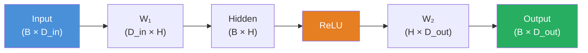

# Chapter 2 — Mathematics for AI

!!! abstract "Chapter Overview"
    This chapter develops the mathematical foundations that every applied AI engineer must internalise. The goal is not to replace a full course in linear algebra, calculus, or probability — it is to build a working vocabulary precise enough to read research papers, implement algorithms correctly, and debug models when they fail. Every concept introduced here will reappear, sometimes many times, in later chapters.

## Learning Objectives

By the end of this chapter you will be able to:

1. Manipulate scalars, vectors, matrices, and tensors in both mathematical notation and NumPy code.
2. Explain eigendecomposition and Singular Value Decomposition, and describe where each appears in modern ML pipelines.
3. Apply the chain rule to derive gradients for composite functions, and relate it directly to the backpropagation algorithm.
4. Reason about probability distributions, Bayes' Theorem, and Maximum Likelihood Estimation in the context of model training.
5. Compute entropy, cross-entropy, and KL divergence, and justify their use as training objectives.

---

## 2.1 Linear Algebra

### 2.1.1 Scalars, Vectors, Matrices, and Tensors

**Scalar** — A single real number. Written in italics: \(a \in \mathbb{R}\). Example: a learning rate \(\alpha = 0.01\).

**Vector** — An ordered list of scalars. Written in bold lower-case: \(\mathbf{x} \in \mathbb{R}^n\). A column vector is the default convention:

\[
\mathbf{x} =
\begin{bmatrix} x_1 \\ x_2 \\ \vdots \\ x_n \end{bmatrix}
\]

The \(i\)-th element is \(x_i\) (1-indexed in math, 0-indexed in Python).

**Matrix** — A 2-D array of scalars. Written in bold upper-case: \(\mathbf{A} \in \mathbb{R}^{m \times n}\). Element in row \(i\), column \(j\) is \(A_{ij}\).

**Tensor** — A generalisation to arbitrary rank (number of axes). A scalar is rank-0, a vector rank-1, a matrix rank-2. In deep learning, the activations flowing through a network are rank-4 tensors of shape \((\text{batch}, \text{channels}, H, W)\).

```python
import numpy as np
from numpy.typing import NDArray

# Scalar
alpha: float = 0.01

# Vector — shape (3,)
x: NDArray[np.float64] = np.array([1.0, 2.0, 3.0])

# Matrix — shape (2, 3)
A: NDArray[np.float64] = np.array([[1.0, 2.0, 3.0],
                                    [4.0, 5.0, 6.0]])

# Rank-3 tensor — shape (batch=2, height=4, width=4)
T: NDArray[np.float64] = np.random.randn(2, 4, 4)

print(f"x shape: {x.shape}")   # (3,)
print(f"A shape: {A.shape}")   # (2, 3)
print(f"T shape: {T.shape}")   # (2, 4, 4)
```

---

### 2.1.2 Matrix Multiplication

Given \(\mathbf{A} \in \mathbb{R}^{m \times k}\) and \(\mathbf{B} \in \mathbb{R}^{k \times n}\), the product \(\mathbf{C} = \mathbf{AB} \in \mathbb{R}^{m \times n}\) is defined element-wise as:

\[
C_{ij} = \sum_{l=1}^{k} A_{il} \, B_{lj}
\]

The inner dimensions must match: **columns of A** must equal **rows of B**.

!!! warning "Shape Rule"
    \((m \times k) \cdot (k \times n) = (m \times n)\). The contracting dimension \(k\) disappears. NumPy will raise `ValueError` if shapes are incompatible — that error almost always means you need a transpose somewhere.

**Key properties:**

| Property | Formula | Note |
|---|---|---|
| Associativity | \((\mathbf{AB})\mathbf{C} = \mathbf{A}(\mathbf{BC})\) | Grouping does not matter |
| Distributivity | \(\mathbf{A}(\mathbf{B}+\mathbf{C}) = \mathbf{AB} + \mathbf{AC}\) | — |
| **Non-commutativity** | \(\mathbf{AB} \neq \mathbf{BA}\) in general | Order matters |
| Transpose of product | \((\mathbf{AB})^T = \mathbf{B}^T \mathbf{A}^T\) | Order reverses |
| Inverse of product | \((\mathbf{AB})^{-1} = \mathbf{B}^{-1}\mathbf{A}^{-1}\) | If both are invertible |

```python
import numpy as np
from numpy.typing import NDArray

def matmul_demo() -> None:
    """Demonstrate matrix multiplication and verify with einsum."""
    A: NDArray[np.float64] = np.random.randn(3, 4)  # (3, 4)
    B: NDArray[np.float64] = np.random.randn(4, 5)  # (4, 5)

    C_np = A @ B                                # (3, 5) using @ operator
    C_einsum = np.einsum("ik,kj->ij", A, B)    # explicit contraction

    assert np.allclose(C_np, C_einsum), "Results must match"
    print(f"C shape: {C_np.shape}")  # (3, 5)

    # Transpose reversal: (AB)^T = B^T A^T
    lhs = (A @ B).T               # shape (5, 3)
    rhs = B.T @ A.T               # shape (5, 3)
    assert np.allclose(lhs, rhs)
    print("Transpose reversal verified.")

matmul_demo()
```

---

### 2.1.3 Transpose and Inverse

**Transpose** \(\mathbf{A}^T\): swap rows and columns, so \((A^T)_{ij} = A_{ji}\).

**Inverse** \(\mathbf{A}^{-1}\): defined only for square, full-rank matrices. Satisfies \(\mathbf{A}^{-1}\mathbf{A} = \mathbf{A}\mathbf{A}^{-1} = \mathbf{I}\).

!!! tip "Practical Advice"
    Explicit matrix inversion is numerically unstable and computationally expensive — \(\mathcal{O}(n^3)\). In practice, solve the linear system \(\mathbf{Ax} = \mathbf{b}\) with `np.linalg.solve(A, b)` rather than computing `np.linalg.inv(A) @ b`. The solver uses LU decomposition under the hood and is both faster and more stable.

```python
import numpy as np

A = np.array([[2.0, 1.0],
              [5.0, 3.0]])

# Solve Ax = b directly (preferred)
b = np.array([4.0, 7.0])
x_solve = np.linalg.solve(A, b)

# Via explicit inverse (for illustration only)
x_inv = np.linalg.inv(A) @ b

print(f"solve:   {x_solve}")   # [5. -6.]
print(f"inv @ b: {x_inv}")     # [5. -6.]
print(f"residual: {np.linalg.norm(A @ x_solve - b):.2e}")  # ~0
```

---

### 2.1.4 Dot Product and Cosine Similarity

The **dot product** of two vectors \(\mathbf{u}, \mathbf{v} \in \mathbb{R}^n\) is:

\[
\mathbf{u} \cdot \mathbf{v} = \sum_{i=1}^{n} u_i v_i = \mathbf{u}^T \mathbf{v}
\]

Geometrically:

\[
\mathbf{u} \cdot \mathbf{v} = \|\mathbf{u}\| \|\mathbf{v}\| \cos\theta
\]

where \(\theta\) is the angle between the vectors. This gives the **cosine similarity**:

\[
\text{cos\_sim}(\mathbf{u}, \mathbf{v}) = \frac{\mathbf{u} \cdot \mathbf{v}}{\|\mathbf{u}\| \|\mathbf{v}\|}
\]

Cosine similarity ranges from \(-1\) (opposite directions) to \(+1\) (identical directions). It is the backbone of semantic search: embed two documents, compute cosine similarity, high value = high relevance.

```python
import numpy as np
from numpy.typing import NDArray

def cosine_similarity(u: NDArray[np.float64],
                      v: NDArray[np.float64]) -> float:
    """
    Compute cosine similarity between two 1-D vectors.

    Parameters
    ----------
    u, v : 1-D float arrays of the same length.

    Returns
    -------
    Cosine similarity in [-1, 1].
    """
    return float(np.dot(u, v) / (np.linalg.norm(u) * np.linalg.norm(v)))

# Example: two word embeddings (toy dimension=4)
embedding_cat = np.array([0.9, 0.1, 0.3, 0.7])
embedding_dog = np.array([0.8, 0.2, 0.4, 0.6])
embedding_car = np.array([0.1, 0.9, 0.8, 0.1])

print(cosine_similarity(embedding_cat, embedding_dog))  # high: ~0.997
print(cosine_similarity(embedding_cat, embedding_car))  # lower: ~0.512
```

---

### 2.1.5 Eigenvalues and Eigenvectors

For a square matrix \(\mathbf{A} \in \mathbb{R}^{n \times n}\), a scalar \(\lambda\) and non-zero vector \(\mathbf{v}\) satisfying:

\[
\mathbf{A}\mathbf{v} = \lambda \mathbf{v}
\]

are called an **eigenvalue** and its corresponding **eigenvector**. The matrix only *scales* the eigenvector — it does not rotate it.

**Eigendecomposition** (when it exists):

\[
\mathbf{A} = \mathbf{Q} \mathbf{\Lambda} \mathbf{Q}^{-1}
\]

where columns of \(\mathbf{Q}\) are eigenvectors and \(\mathbf{\Lambda}\) is diagonal with eigenvalues. For symmetric positive semi-definite matrices (like covariance matrices), \(\mathbf{Q}\) is orthogonal (\(\mathbf{Q}^{-1} = \mathbf{Q}^T\)).

**Why it matters:** Principal Component Analysis (PCA) is exactly the eigendecomposition of the data covariance matrix. The eigenvector with the largest eigenvalue is the direction of maximum variance.

```python
import numpy as np
from numpy.typing import NDArray

def pca_via_eig(X: NDArray[np.float64], n_components: int) -> NDArray[np.float64]:
    """
    Project X onto its top principal components via eigendecomposition.

    Parameters
    ----------
    X           : Data matrix, shape (n_samples, n_features). Assumed mean-centred.
    n_components: Number of principal components to keep.

    Returns
    -------
    X_proj : Projected data, shape (n_samples, n_components).
    """
    cov: NDArray[np.float64] = (X.T @ X) / (X.shape[0] - 1)
    eigenvalues, eigenvectors = np.linalg.eigh(cov)  # eigh for symmetric matrices

    # eigh returns ascending order — reverse for descending
    idx = np.argsort(eigenvalues)[::-1]
    top_vecs: NDArray[np.float64] = eigenvectors[:, idx[:n_components]]  # (n_features, k)

    return X @ top_vecs  # (n_samples, k)

rng = np.random.default_rng(42)
X = rng.standard_normal((100, 10))
X_2d = pca_via_eig(X - X.mean(axis=0), n_components=2)
print(f"Projected shape: {X_2d.shape}")  # (100, 2)
```

---

### 2.1.6 Singular Value Decomposition (SVD)

Every real matrix \(\mathbf{A} \in \mathbb{R}^{m \times n}\) can be factored as:

\[
\mathbf{A} = \mathbf{U} \mathbf{\Sigma} \mathbf{V}^T
\]

where:

- \(\mathbf{U} \in \mathbb{R}^{m \times m}\) — **left singular vectors** (orthonormal columns), span the column space of \(\mathbf{A}\).
- \(\mathbf{\Sigma} \in \mathbb{R}^{m \times n}\) — **diagonal matrix** of singular values \(\sigma_1 \geq \sigma_2 \geq \cdots \geq 0\).
- \(\mathbf{V} \in \mathbb{R}^{n \times n}\) — **right singular vectors** (orthonormal columns), span the row space of \(\mathbf{A}\).

**Truncated SVD for dimensionality reduction:** Keep only the top \(k\) singular values:

\[
\mathbf{A} \approx \mathbf{U}_k \mathbf{\Sigma}_k \mathbf{V}_k^T
\]

This is the *best rank-\(k\) approximation* to \(\mathbf{A}\) in the Frobenius norm (Eckart-Young theorem). Applications include:

- Latent Semantic Analysis (LSA) for text
- Image compression
- Initialisation of neural network weights (Glorot/He init is related)
- Noise reduction in recommendation systems

```python
import numpy as np
from numpy.typing import NDArray

def truncated_svd(
    A: NDArray[np.float64], k: int
) -> tuple[NDArray[np.float64], NDArray[np.float64], NDArray[np.float64]]:
    """
    Compute the rank-k SVD approximation of A.

    Parameters
    ----------
    A : Input matrix, shape (m, n).
    k : Number of singular values/vectors to retain.

    Returns
    -------
    U_k, Sigma_k, Vt_k with shapes (m, k), (k,), (k, n).
    """
    U, s, Vt = np.linalg.svd(A, full_matrices=False)
    return U[:, :k], s[:k], Vt[:k, :]

# Reconstruct and measure approximation error
rng = np.random.default_rng(0)
A = rng.standard_normal((50, 30))
U_k, s_k, Vt_k = truncated_svd(A, k=5)
A_approx = U_k * s_k @ Vt_k  # broadcasting: U_k * s_k scales each column

fro_error = np.linalg.norm(A - A_approx, "fro")
print(f"Frobenius error (rank-5 approx): {fro_error:.4f}")
# Compare to total energy captured:
_, s_full, _ = np.linalg.svd(A, full_matrices=False)
explained = s_k.sum() / s_full.sum()
print(f"Singular value energy captured: {explained:.1%}")
```

---

### 2.1.7 Matrix Shapes in a Neural Network Forward Pass

The following diagram traces tensor shapes through a two-layer MLP:



Each `@` (matmul) takes `(B × D) @ (D × H) → (B × H)`. The batch dimension \(B\) is carried through unchanged.

---

## 2.2 Calculus

### 2.2.1 Derivatives and Partial Derivatives

The **derivative** of \(f : \mathbb{R} \to \mathbb{R}\) at \(x\) is the instantaneous rate of change:

\[
f'(x) = \frac{df}{dx} = \lim_{h \to 0} \frac{f(x+h) - f(x)}{h}
\]

When \(f\) depends on multiple variables \(\mathbf{x} = (x_1, \ldots, x_n)\), the **partial derivative** with respect to \(x_i\) treats all other variables as constants:

\[
\frac{\partial f}{\partial x_i} = \lim_{h \to 0} \frac{f(x_1, \ldots, x_i+h, \ldots, x_n) - f(\mathbf{x})}{h}
\]

---

### 2.2.2 The Chain Rule — Foundation of Backpropagation

If \(z = f(g(x))\), then:

\[
\frac{dz}{dx} = \frac{dz}{dg} \cdot \frac{dg}{dx}
\]

For vector-valued compositions \(\mathbf{z} = f(g(\mathbf{x}))\):

\[
\frac{\partial z_i}{\partial x_k} = \sum_j \frac{\partial z_i}{\partial g_j} \cdot \frac{\partial g_j}{\partial x_k}
\]

In matrix form this is a **Jacobian product**. Backpropagation is nothing more than the chain rule applied repeatedly from the loss \(L\) back through each layer. The gradient \(\partial L / \partial \mathbf{W}_1\) in a two-layer network is:

\[
\frac{\partial L}{\partial \mathbf{W}_1} = \frac{\partial L}{\partial \hat{\mathbf{y}}} \cdot \frac{\partial \hat{\mathbf{y}}}{\partial \mathbf{h}} \cdot \frac{\partial \mathbf{h}}{\partial \mathbf{W}_1}
\]

Each factor is computed by a layer's backward pass and multiplied in the correct order.

!!! note "Why the Chain Rule Is Non-Trivial"
    The chain rule is trivial to state but subtle to implement efficiently. Automatic differentiation frameworks (PyTorch, JAX) build a computation graph and traverse it in reverse topological order, computing Jacobian-vector products (JVPs) in reverse mode (reverse-mode AD = backprop). This costs roughly one forward pass worth of compute regardless of the number of parameters — which is why training large models is feasible.

```python
import numpy as np

def chain_rule_demo() -> None:
    """
    Manual chain rule for z = sin(x^2).
    dz/dx = cos(x^2) * 2x
    """
    x = np.array([0.5, 1.0, 1.5])

    # Forward pass
    g = x ** 2        # g(x) = x^2
    z = np.sin(g)     # z = sin(g)

    # Backward pass via chain rule
    dz_dg = np.cos(g)  # dz/dg = cos(g)
    dg_dx = 2 * x      # dg/dx = 2x
    dz_dx = dz_dg * dg_dx  # chain rule

    # Numerical verification using finite differences
    eps = 1e-6
    dz_dx_numerical = (np.sin((x + eps)**2) - np.sin((x - eps)**2)) / (2 * eps)

    print("Analytic: ", np.round(dz_dx, 6))
    print("Numerical:", np.round(dz_dx_numerical, 6))
    assert np.allclose(dz_dx, dz_dx_numerical, atol=1e-5)

chain_rule_demo()
```

---

### 2.2.3 Gradient

The **gradient** of a scalar-valued function \(f : \mathbb{R}^n \to \mathbb{R}\) is the vector of all partial derivatives:

\[
\nabla_{\mathbf{x}} f(\mathbf{x}) = \begin{bmatrix} \frac{\partial f}{\partial x_1} \\ \frac{\partial f}{\partial x_2} \\ \vdots \\ \frac{\partial f}{\partial x_n} \end{bmatrix}
\]

The gradient points in the **direction of steepest ascent**. Gradient descent moves in the opposite direction to minimise \(f\).

---

### 2.2.4 Jacobian and Hessian

**Jacobian** — When \(f : \mathbb{R}^n \to \mathbb{R}^m\), the Jacobian \(\mathbf{J} \in \mathbb{R}^{m \times n}\) contains all first-order partial derivatives:

\[
J_{ij} = \frac{\partial f_i}{\partial x_j}
\]

The gradient is the special case where \(m=1\): \(\nabla f = \mathbf{J}^T\).

**Hessian** — The matrix of second-order partial derivatives of a scalar function:

\[
H_{ij} = \frac{\partial^2 f}{\partial x_i \partial x_j}
\]

The Hessian characterises the local curvature. If \(\mathbf{H} \succ 0\) (positive definite), the point is a local minimum. Second-order optimisers (Newton's method, L-BFGS) use the Hessian or its approximation to take better steps than gradient descent.

```python
import numpy as np
from numpy.typing import NDArray

def numerical_hessian(
    f, x: NDArray[np.float64], eps: float = 1e-4
) -> NDArray[np.float64]:
    """
    Compute the Hessian of scalar f at x via central finite differences.

    Parameters
    ----------
    f   : Callable mapping (n,) → scalar.
    x   : Point at which to evaluate the Hessian.
    eps : Step size for finite differences.

    Returns
    -------
    H : Hessian matrix, shape (n, n).
    """
    n = x.shape[0]
    H = np.zeros((n, n))
    for i in range(n):
        for j in range(n):
            x_pp = x.copy(); x_pp[i] += eps; x_pp[j] += eps
            x_pm = x.copy(); x_pm[i] += eps; x_pm[j] -= eps
            x_mp = x.copy(); x_mp[i] -= eps; x_mp[j] += eps
            x_mm = x.copy(); x_mm[i] -= eps; x_mm[j] -= eps
            H[i, j] = (f(x_pp) - f(x_pm) - f(x_mp) + f(x_mm)) / (4 * eps**2)
    return H

# f(x) = x1^2 + 2*x2^2, H = [[2, 0], [0, 4]]
f = lambda x: x[0]**2 + 2 * x[1]**2
x0 = np.array([1.0, 1.0])
H = numerical_hessian(f, x0)
print(np.round(H, 4))  # [[2. 0.] [0. 4.]]
```

---

### 2.2.5 Gradient Descent

The canonical parameter update rule is:

\[
\theta \leftarrow \theta - \alpha \nabla_\theta L(\theta)
\]

where \(\alpha > 0\) is the **learning rate** (step size) and \(L\) is the scalar loss. Variants in modern ML:

| Variant | Key Idea |
|---|---|
| SGD | Use one (or a mini-batch of) sample(s) per step |
| SGD + Momentum | Accumulate a velocity vector to damp oscillations |
| Adam | Adaptive per-parameter learning rates using first and second gradient moments |
| AdamW | Adam with decoupled weight decay |
| LAMB | Layerwise adaptive learning rates for large-batch training |

```python
import numpy as np
from numpy.typing import NDArray

def gradient_descent(
    grad_fn,
    theta_init: NDArray[np.float64],
    alpha: float = 0.01,
    n_steps: int = 1000,
) -> NDArray[np.float64]:
    """
    Vanilla gradient descent optimiser.

    Parameters
    ----------
    grad_fn    : Function returning ∇_θ L(θ), shape same as theta.
    theta_init : Starting parameter vector.
    alpha      : Learning rate.
    n_steps    : Number of update steps.

    Returns
    -------
    theta : Parameter vector after optimisation.
    """
    theta = theta_init.copy()
    for step in range(n_steps):
        grad = grad_fn(theta)
        theta -= alpha * grad
        if step % 100 == 0:
            pass  # log loss here in a real implementation
    return theta

# Minimise f(theta) = theta^2; gradient = 2*theta; minimum at 0
grad_quadratic = lambda t: 2 * t
theta_star = gradient_descent(grad_quadratic, np.array([10.0]), alpha=0.1)
print(f"Converged to: {theta_star}")  # close to [0.]
```

---

## 2.3 Probability and Statistics

### 2.3.1 Sample Space, Events, and Axioms

- **Sample space** \(\Omega\): the set of all possible outcomes of an experiment.
- **Event** \(A \subseteq \Omega\): any subset of outcomes.
- **Probability measure** \(P\): assigns a number to each event.

**Kolmogorov's three axioms:**

1. \(P(A) \geq 0\) for all events \(A\).
2. \(P(\Omega) = 1\) (something must happen).
3. For mutually exclusive events \(A_1, A_2, \ldots\): \(P\!\left(\bigcup_i A_i\right) = \sum_i P(A_i)\).

---

### 2.3.2 Conditional Probability

\[
P(A \mid B) = \frac{P(A \cap B)}{P(B)}, \quad P(B) > 0
\]

Intuitively: given that \(B\) has occurred, how probable is \(A\)? Restricting the sample space to \(B\) and re-normalising.

Events \(A\) and \(B\) are **independent** iff \(P(A \cap B) = P(A)P(B)\), equivalently \(P(A \mid B) = P(A)\).

---

### 2.3.3 Bayes' Theorem

\[
P(A \mid B) = \frac{P(B \mid A) \, P(A)}{P(B)}
\]

In the context of a probabilistic model with parameters \(\theta\) and data \(\mathcal{D}\):

\[
\underbrace{P(\theta \mid \mathcal{D})}_{\text{posterior}} = \frac{\underbrace{P(\mathcal{D} \mid \theta)}_{\text{likelihood}} \; \underbrace{P(\theta)}_{\text{prior}}}{\underbrace{P(\mathcal{D})}_{\text{evidence}}}
\]

- **Prior** \(P(\theta)\): belief about parameters before seeing data.
- **Likelihood** \(P(\mathcal{D} \mid \theta)\): how probable is the data under model \(\theta\)?
- **Posterior** \(P(\theta \mid \mathcal{D})\): updated belief after seeing data.
- **Evidence** \(P(\mathcal{D}) = \int P(\mathcal{D} \mid \theta) P(\theta) \, d\theta\): normalisation constant (often intractable).

!!! note "Bayesian vs Frequentist"
    Frequentists treat \(\theta\) as a fixed (unknown) constant and report confidence intervals. Bayesians treat \(\theta\) as a random variable and maintain a full posterior. Deep learning is predominantly frequentist in practice (MLE training), but Bayesian concepts appear in uncertainty quantification, prior regularisation (weight decay ≈ Gaussian prior on weights), and variational inference.

---

### 2.3.4 Expectation, Variance, and Standard Deviation

For a discrete random variable \(X\):

\[
\mathbb{E}[X] = \sum_x x \, P(X = x)
\]

\[
\text{Var}(X) = \mathbb{E}\!\left[(X - \mathbb{E}[X])^2\right] = \mathbb{E}[X^2] - (\mathbb{E}[X])^2
\]

\[
\text{SD}(X) = \sqrt{\text{Var}(X)}
\]

For continuous variables, replace sums with integrals over the probability density function (PDF) \(p(x)\).

**Key identities:**

- \(\mathbb{E}[aX + b] = a\mathbb{E}[X] + b\)
- \(\text{Var}(aX) = a^2 \text{Var}(X)\)
- If \(X, Y\) independent: \(\text{Var}(X + Y) = \text{Var}(X) + \text{Var}(Y)\)

```python
import numpy as np

rng = np.random.default_rng(42)
samples = rng.normal(loc=5.0, scale=2.0, size=100_000)

print(f"E[X]  ≈ {samples.mean():.4f}  (true: 5.0)")
print(f"Var   ≈ {samples.var():.4f}   (true: 4.0)")
print(f"SD    ≈ {samples.std():.4f}   (true: 2.0)")
```

---

### 2.3.5 Key Probability Distributions

| Distribution | Parameters | Support | PMF / PDF | Common Use |
|---|---|---|---|---|
| Bernoulli | \(p \in [0,1]\) | \(\{0,1\}\) | \(p^x(1-p)^{1-x}\) | Binary classification output |
| Binomial | \(n, p\) | \(\{0,\ldots,n\}\) | \(\binom{n}{k}p^k(1-p)^{n-k}\) | Count of successes |
| Gaussian | \(\mu, \sigma^2\) | \(\mathbb{R}\) | \(\frac{1}{\sigma\sqrt{2\pi}}e^{-\frac{(x-\mu)^2}{2\sigma^2}}\) | Noise, weight initialisation |
| Categorical | \(\mathbf{p} \in \Delta^{K-1}\) | \(\{1,\ldots,K\}\) | \(\prod_k p_k^{\mathbb{1}[x=k]}\) | Multi-class output |
| Dirichlet | \(\boldsymbol{\alpha} > 0\) | \(\Delta^{K-1}\) | \(\propto \prod_k p_k^{\alpha_k-1}\) | Prior over Categorical |

The **Gaussian** (Normal) distribution \(\mathcal{N}(\mu, \sigma^2)\) deserves special attention:

\[
p(x) = \frac{1}{\sigma\sqrt{2\pi}} \exp\!\left(-\frac{(x - \mu)^2}{2\sigma^2}\right)
\]

```python
import numpy as np
import matplotlib
matplotlib.use("Agg")  # non-interactive backend
import matplotlib.pyplot as plt

fig, axes = plt.subplots(1, 2, figsize=(10, 4))

# Bernoulli
p = 0.3
outcomes = [0, 1]
probs = [1 - p, p]
axes[0].bar(outcomes, probs, color=["steelblue", "coral"])
axes[0].set_title("Bernoulli(p=0.3)")
axes[0].set_xlabel("Outcome"); axes[0].set_ylabel("P")

# Gaussian
x = np.linspace(-4, 4, 400)
for mu, sigma, label in [(0, 1, "N(0,1)"), (1, 0.5, "N(1,0.25)")]:
    pdf = np.exp(-0.5 * ((x - mu) / sigma)**2) / (sigma * np.sqrt(2 * np.pi))
    axes[1].plot(x, pdf, label=label)
axes[1].legend(); axes[1].set_title("Gaussian PDFs")
plt.tight_layout()
plt.savefig("distributions.png", dpi=150)
plt.close()
```

---

### 2.3.6 Central Limit Theorem

**Statement:** Let \(X_1, X_2, \ldots, X_n\) be i.i.d. random variables with mean \(\mu\) and finite variance \(\sigma^2\). Then as \(n \to \infty\):

\[
\frac{\bar{X}_n - \mu}{\sigma / \sqrt{n}} \xrightarrow{d} \mathcal{N}(0, 1)
\]

**Significance for ML:**

- Justifies using the Gaussian distribution as a default prior and noise model.
- Guarantees that mini-batch gradient estimates are approximately normally distributed for large enough batches.
- Underlies statistical hypothesis testing used to evaluate model performance differences.

---

### 2.3.7 Maximum Likelihood Estimation

Given i.i.d. data \(\mathcal{D} = \{x^{(1)}, \ldots, x^{(N)}\}\) drawn from distribution \(p(x; \theta)\), MLE finds:

\[
\hat{\theta}_{\text{MLE}} = \arg\max_\theta \, P(\mathcal{D} \mid \theta) = \arg\max_\theta \prod_{i=1}^{N} p\!\left(x^{(i)}; \theta\right)
\]

Taking the log (log is monotonic, turns products to sums):

\[
\hat{\theta}_{\text{MLE}} = \arg\max_\theta \sum_{i=1}^{N} \log p\!\left(x^{(i)}; \theta\right)
\]

Training a neural network with cross-entropy loss **is** MLE under a Categorical likelihood. L2 regularisation corresponds to adding a Gaussian prior (MAP estimation).

```python
import numpy as np
from scipy.optimize import minimize

# MLE for Gaussian mean and variance
rng = np.random.default_rng(7)
true_mu, true_sigma = 3.0, 1.5
data = rng.normal(true_mu, true_sigma, size=200)

def neg_log_likelihood(params: np.ndarray) -> float:
    """Negative log-likelihood for Gaussian model."""
    mu, log_sigma = params
    sigma = np.exp(log_sigma)  # enforce sigma > 0
    nll = 0.5 * np.sum(((data - mu) / sigma)**2) + data.size * np.log(sigma)
    return float(nll)

result = minimize(neg_log_likelihood, x0=[0.0, 0.0], method="L-BFGS-B")
mu_hat, sigma_hat = result.x[0], np.exp(result.x[1])
print(f"MLE mu: {mu_hat:.4f} (true: {true_mu})")
print(f"MLE sigma: {sigma_hat:.4f} (true: {true_sigma})")
```

---

## 2.4 Information Theory

### 2.4.1 Entropy

The **Shannon entropy** of a discrete random variable \(X\) with PMF \(P\) measures the expected uncertainty (or information content) in bits (base 2) or nats (base \(e\)):

\[
H(X) = -\sum_{x \in \mathcal{X}} P(x) \log P(x)
\]

Properties:

- \(H(X) \geq 0\)
- \(H = 0\) iff \(P\) is a point mass (no uncertainty)
- \(H\) is maximised by the uniform distribution: \(H = \log |\mathcal{X}|\)

A fair coin has entropy \(H = -0.5 \log 0.5 - 0.5 \log 0.5 = 1\) bit. A biased coin with \(P(\text{heads}) = 0.99\) has entropy close to 0 — we are nearly certain of the outcome.

---

### 2.4.2 Cross-Entropy

\[
H(P, Q) = -\sum_{x} P(x) \log Q(x)
\]

Cross-entropy measures the average number of bits needed to encode samples from distribution \(P\) using a code optimised for distribution \(Q\). It decomposes as:

\[
H(P, Q) = H(P) + D_{KL}(P \| Q)
\]

Since \(H(P)\) is a constant with respect to model parameters \(Q\), **minimising cross-entropy is equivalent to minimising KL divergence**.

---

### 2.4.3 KL Divergence

The **Kullback-Leibler divergence** from \(P\) to \(Q\):

\[
D_{KL}(P \| Q) = \sum_{x} P(x) \log \frac{P(x)}{Q(x)}
\]

Properties:

- \(D_{KL}(P \| Q) \geq 0\) (Gibbs' inequality)
- \(D_{KL}(P \| Q) = 0 \iff P = Q\)
- **Not symmetric**: \(D_{KL}(P \| Q) \neq D_{KL}(Q \| P)\) in general

!!! warning "KL is not a metric"
    Because KL divergence is asymmetric, it is not a true metric. The choice of "forward" \(D_{KL}(P \| Q)\) vs "reverse" \(D_{KL}(Q \| P)\) has significant implications in variational inference — forward KL leads to mean-seeking behaviour, reverse KL leads to mode-seeking.

---

### 2.4.4 Why Cross-Entropy is Used as a Loss Function

In a \(K\)-class classification problem, the model predicts a probability distribution \(\hat{\mathbf{y}} = \text{softmax}(\mathbf{z})\). The true label is a one-hot vector \(\mathbf{y}\) (i.e., \(P = \mathbf{y}\), \(Q = \hat{\mathbf{y}}\)):

\[
\mathcal{L}_{\text{CE}} = H(\mathbf{y}, \hat{\mathbf{y}}) = -\sum_{k=1}^{K} y_k \log \hat{y}_k = -\log \hat{y}_{c}
\]

where \(c\) is the correct class. When the model assigns high probability to the correct class, the loss is small. When the model is confident in the wrong answer, the log penalty is severe.

Minimising \(\mathcal{L}_{\text{CE}}\) over training data is exactly MLE under the Categorical likelihood — the connection between optimisation and probability is tight.

```python
import numpy as np
from numpy.typing import NDArray

def softmax(z: NDArray[np.float64]) -> NDArray[np.float64]:
    """Numerically stable softmax."""
    z_shifted = z - z.max()  # subtract max for stability
    exp_z = np.exp(z_shifted)
    return exp_z / exp_z.sum()

def cross_entropy_loss(
    logits: NDArray[np.float64], true_class: int
) -> float:
    """
    Compute scalar cross-entropy loss.

    Parameters
    ----------
    logits     : Raw model outputs (before softmax), shape (K,).
    true_class : Index of the ground-truth class.

    Returns
    -------
    Scalar cross-entropy loss.
    """
    probs = softmax(logits)
    return float(-np.log(probs[true_class] + 1e-12))  # eps for numerical safety

def entropy(p: NDArray[np.float64]) -> float:
    """Shannon entropy (nats)."""
    p_safe = np.clip(p, 1e-12, 1.0)
    return float(-np.sum(p_safe * np.log(p_safe)))

def kl_divergence(p: NDArray[np.float64], q: NDArray[np.float64]) -> float:
    """KL(P || Q)."""
    p_safe = np.clip(p, 1e-12, 1.0)
    q_safe = np.clip(q, 1e-12, 1.0)
    return float(np.sum(p_safe * np.log(p_safe / q_safe)))

# Example
logits = np.array([2.0, 1.0, 0.1])
true_class = 0
loss = cross_entropy_loss(logits, true_class)
print(f"CE loss (correct class 0): {loss:.4f}")  # low

loss_wrong = cross_entropy_loss(logits, 2)
print(f"CE loss (wrong class 2):   {loss_wrong:.4f}")  # high

# Entropy and KL
p = np.array([0.7, 0.2, 0.1])
q = np.array([0.4, 0.4, 0.2])
print(f"H(P):       {entropy(p):.4f}")
print(f"H(P,Q):     {entropy(p) + kl_divergence(p, q):.4f}")
print(f"KL(P||Q):   {kl_divergence(p, q):.4f}")
```

---

## 2.5 Chapter Summary Cheat Sheet

### Linear Algebra

| Concept | Formula |
|---|---|
| Matrix product | \(C_{ij} = \sum_k A_{ik} B_{kj}\) |
| Transpose reversal | \((AB)^T = B^T A^T\) |
| Cosine similarity | \(\frac{\mathbf{u}^T \mathbf{v}}{\|\mathbf{u}\|\|\mathbf{v}\|}\) |
| Eigenvector equation | \(A\mathbf{v} = \lambda \mathbf{v}\) |
| SVD | \(A = U \Sigma V^T\) |

### Calculus

| Concept | Formula |
|---|---|
| Chain rule | \(\frac{dz}{dx} = \frac{dz}{dg}\frac{dg}{dx}\) |
| Gradient | \(\nabla_\mathbf{x} f = \left[\frac{\partial f}{\partial x_i}\right]\) |
| Gradient descent | \(\theta \leftarrow \theta - \alpha \nabla_\theta L\) |

### Probability

| Concept | Formula |
|---|---|
| Conditional probability | \(P(A\mid B) = P(A\cap B)/P(B)\) |
| Bayes' theorem | \(P(\theta\mid\mathcal{D}) = P(\mathcal{D}\mid\theta)P(\theta)/P(\mathcal{D})\) |
| Expectation | \(\mathbb{E}[X] = \sum_x x\,P(x)\) |
| Variance | \(\text{Var}(X) = \mathbb{E}[X^2] - (\mathbb{E}[X])^2\) |
| MLE | \(\hat\theta = \arg\max_\theta \sum_i \log p(x^{(i)};\theta)\) |

### Information Theory

| Concept | Formula |
|---|---|
| Entropy | \(H(X) = -\sum_x P(x)\log P(x)\) |
| Cross-entropy | \(H(P,Q) = -\sum_x P(x)\log Q(x)\) |
| KL divergence | \(D_{KL}(P\|Q) = \sum_x P(x)\log\frac{P(x)}{Q(x)}\) |
| CE loss (classification) | \(\mathcal{L} = -\log \hat{y}_c\) |

---

## 2.6 Exercises

!!! question "Exercise 2.1 — Matrix Calculus"
    Let \(\mathbf{A} \in \mathbb{R}^{3 \times 4}\), \(\mathbf{B} \in \mathbb{R}^{4 \times 2}\). Compute the shape of \(\mathbf{A}\mathbf{B}\), \((\mathbf{A}\mathbf{B})^T\), and \(\mathbf{B}^T \mathbf{A}^T\). Verify numerically in NumPy.

!!! question "Exercise 2.2 — SVD Compression"
    Load any grayscale image as a NumPy array of shape \((H, W)\). Compute the full SVD and reconstruct the image using only the top 10, 50, and 200 singular values. Plot the results side-by-side and compute the Frobenius norm error for each rank.

!!! question "Exercise 2.3 — Gradient Descent on a Bowl"
    Implement vanilla gradient descent (without NumPy's linear-algebra solvers) to minimise \(f(\mathbf{x}) = (x_1 - 3)^2 + 2(x_2 + 1)^2\). Start from \(\mathbf{x}_0 = (0, 0)\), use \(\alpha = 0.1\), run 200 steps. Plot the loss curve.

!!! question "Exercise 2.4 — Bayes' Theorem in Spam Detection"
    You have a spam filter where 30 % of incoming emails are spam. The word "prize" appears in 80 % of spam emails and 5 % of ham emails. Given an email containing "prize", compute \(P(\text{spam} \mid \text{"prize"})\) analytically and verify with a Monte Carlo simulation (\(10^6\) samples).

!!! question "Exercise 2.5 — Cross-Entropy vs Accuracy"
    Train a toy logistic regression model on the sklearn `make_moons` dataset. Plot both cross-entropy loss and classification accuracy over 500 gradient descent steps. Explain why accuracy is not differentiable and why cross-entropy is a better training objective.
