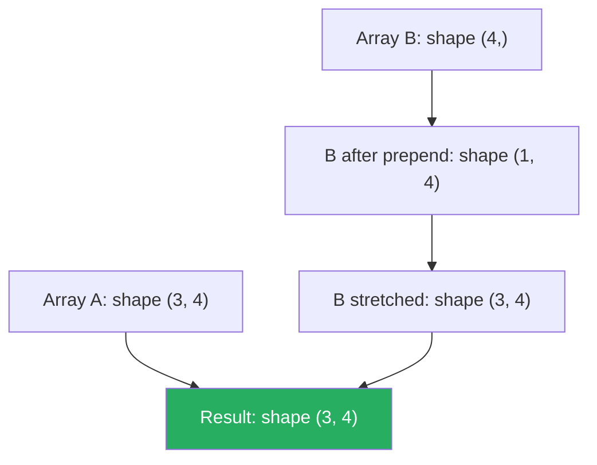

# Chapter 3 — Python Tools for AI

!!! abstract "Chapter Overview"
    Before writing a single line of model code, a practitioner needs a reproducible environment, reliable numerical computing, efficient data manipulation, and clear visualisation. This chapter builds that foundation methodically. Every library introduced here is used throughout the rest of the textbook. Learning them well now pays compound interest.

## Learning Objectives

By the end of this chapter you will be able to:

1. Set up an isolated, reproducible Python environment using `uv` and a `pyproject.toml`.
2. Manipulate multi-dimensional arrays in NumPy with confidence, including broadcasting and `einsum`.
3. Load, clean, merge, and aggregate tabular data with Pandas, handling missing values correctly.
4. Produce publication-quality figures with Matplotlib and Seaborn.
5. Write Jupyter notebooks that are reproducible, well-structured, and shareable via `nbconvert`.

---

## 3.1 Environment Setup

### 3.1.1 Python Version Requirements

Applied AI work requires **Python 3.10 or later**. The structural pattern matching syntax (`match`/`case`), improved `typing` module ergonomics, and `tomllib` in the standard library all first appeared in 3.10+. As of 2025, 3.11 and 3.12 are recommended — they deliver 10–60 % speed improvements over 3.10 in CPU-bound code.

!!! tip "Check your version"
    ```bash
    python --version          # should be ≥ 3.10
    python -c "import sys; print(sys.version_info)"
    ```

### 3.1.2 uv vs pip vs conda

| Feature | `pip` + `venv` | `conda` | `uv` |
|---|---|---|---|
| Speed | Moderate | Slow (SAT solver) | **Very fast** (written in Rust) |
| Lock files | `pip freeze` (imprecise) | `conda env export` | `uv.lock` (exact, cross-platform) |
| Non-Python deps | No | Yes (BLAS, CUDA) | No |
| Workspace support | No | No | Yes |
| PEP 517/518 | Yes | Partial | Yes |
| Recommended for | Simple projects | CUDA/non-Python deps | **Most AI projects** |

For most pure-Python ML workflows, `uv` is the right choice. Use `conda` only when you need non-Python system libraries (e.g., a specific CUDA toolkit version) that are not provided by pip wheels.

### 3.1.3 Setting Up a Project with uv

```bash
# Install uv (once per machine)
curl -Lso- https://astral.sh/uv/install.sh | sh

# Create a new project
uv init applied-ai-project
cd applied-ai-project

# Add dependencies
uv add numpy pandas matplotlib seaborn scikit-learn jupyter

# Add development-only dependencies
uv add --dev pytest ruff mypy

# Run a script inside the managed environment
uv run python scripts/train.py

# Sync the environment from lock file (reproducible install)
uv sync
```

The result is a `pyproject.toml` that serves as the single source of truth:

```toml
[project]
name = "applied-ai-project"
version = "0.1.0"
requires-python = ">=3.10"
dependencies = [
    "numpy>=1.26",
    "pandas>=2.1",
    "matplotlib>=3.8",
    "seaborn>=0.13",
    "scikit-learn>=1.4",
    "jupyter>=1.0",
]

[tool.ruff]
line-length = 88
select = ["E", "F", "I", "UP"]

[tool.mypy]
python_version = "3.11"
strict = true
```

### 3.1.4 `requirements.txt` vs `pyproject.toml`

| | `requirements.txt` | `pyproject.toml` |
|---|---|---|
| Standard | No (informal) | Yes (PEP 518 / 621) |
| Dev / test split | Manual (two files) | `[project.optional-dependencies]` |
| Build metadata | No | Yes (author, license, entry points) |
| Tool config | No | Yes (`[tool.ruff]`, `[tool.mypy]`) |
| Recommendation | Legacy projects | All new projects |

!!! note "uv.lock vs pinned requirements.txt"
    `uv.lock` pins every transitive dependency to an exact version *and* hash. This gives stronger reproducibility guarantees than `pip freeze > requirements.txt`, which only pins your direct dependencies' versions but not hashes.

---

## 3.2 NumPy

NumPy is the bedrock of scientific Python. PyTorch, TensorFlow, JAX, and scikit-learn all expose interfaces that mirror NumPy's API or interoperate with it directly.

### 3.2.1 ndarray Fundamentals

The core data structure is `numpy.ndarray`. Key attributes:

| Attribute | Meaning | Example |
|---|---|---|
| `shape` | Tuple of dimension sizes | `(32, 3, 224, 224)` |
| `dtype` | Element data type | `float32`, `int64`, `bool` |
| `ndim` | Number of axes | `4` |
| `size` | Total number of elements | `32 * 3 * 224 * 224` |
| `strides` | Bytes to step along each axis | Advanced memory layout |
| `itemsize` | Bytes per element | `4` for `float32` |

```python
import numpy as np
from numpy.typing import NDArray

# Creating arrays
zeros: NDArray[np.float32] = np.zeros((3, 4), dtype=np.float32)
ones:  NDArray[np.float64] = np.ones((2, 5))
rng = np.random.default_rng(seed=42)
rand: NDArray[np.float64] = rng.standard_normal((100, 10))
arange: NDArray[np.int64] = np.arange(0, 20, 2)       # [0, 2, 4, ..., 18]
linspace: NDArray[np.float64] = np.linspace(0, 1, 50)  # 50 evenly spaced points

print(f"rand shape: {rand.shape}, dtype: {rand.dtype}")  # (100, 10), float64
print(f"Memory (MB): {rand.nbytes / 1e6:.4f}")          # 0.008 MB

# dtype matters for memory and GPU transfer
x_f64 = np.ones((1000, 1000), dtype=np.float64)  # 8 MB
x_f32 = np.ones((1000, 1000), dtype=np.float32)  # 4 MB
print(f"float64: {x_f64.nbytes // 1_000_000} MB, float32: {x_f32.nbytes // 1_000_000} MB")
```

!!! warning "float64 vs float32"
    NumPy defaults to `float64`. Most GPU frameworks (PyTorch, JAX) default to `float32`. When bridging the two, always check dtypes — a silent upcast or downcast can introduce bugs or blow up memory.

### 3.2.2 Broadcasting Rules

Broadcasting lets NumPy perform arithmetic on arrays of *different* (but compatible) shapes without explicit replication. The rules applied left-to-right on the shape tuples (right-aligned, prepend 1s for shorter arrays):

1. If the shapes differ in the number of dimensions, prepend `1`s to the smaller shape.
2. Dimensions with size `1` are stretched to match the other array.
3. If shapes disagree on a dimension and neither is `1`, raise `ValueError`.

```
Shape examples:
  (3, 4)  op  (4,)    → (3, 4)   # row broadcast
  (3, 1)  op  (1, 4)  → (3, 4)   # outer-product style
  (3, 4)  op  (3, 1)  → (3, 4)   # column broadcast
  (3, 4)  op  (3,)    → ERROR     # rightmost mismatch
```



```python
import numpy as np
from numpy.typing import NDArray

# Subtract per-feature mean from a (n_samples, n_features) matrix
X: NDArray[np.float64] = np.random.randn(100, 10)
mu: NDArray[np.float64] = X.mean(axis=0)  # shape (10,)
X_centred: NDArray[np.float64] = X - mu   # broadcasting: (100, 10) - (10,) → (100, 10)

# Add a bias vector to each row in a batch
W: NDArray[np.float64] = np.random.randn(5, 3)   # (5, 3)
b: NDArray[np.float64] = np.array([1.0, 2.0, 3.0])   # (3,)
out: NDArray[np.float64] = W + b  # (5, 3) + (3,) → (5, 3)

# Outer product via broadcast
u = np.array([[1], [2], [3]])    # (3, 1)
v = np.array([[4, 5, 6]])        # (1, 3)
outer = u * v                     # (3, 3)
print(outer)
# [[4  5  6]
#  [8 10 12]
#  [12 15 18]]
```

### 3.2.3 Vectorised Operations vs Loops

Python loops over NumPy arrays are slow — each iteration has interpreter overhead and forfeits SIMD vectorisation. The rule is: **never loop over array elements if a NumPy operation exists**.

```python
import numpy as np
import time
from numpy.typing import NDArray

N = 10_000_000
x: NDArray[np.float64] = np.random.rand(N)

# Loop — slow (Python interpreter)
start = time.perf_counter()
total = 0.0
for v in x:
    total += v * v
loop_time = time.perf_counter() - start

# Vectorised — fast (C/BLAS/SIMD)
start = time.perf_counter()
total_vec = np.dot(x, x)  # or (x ** 2).sum()
vec_time = time.perf_counter() - start

print(f"Loop:       {loop_time:.3f}s")    # e.g., 3.2s
print(f"Vectorised: {vec_time:.4f}s")     # e.g., 0.012s
print(f"Speedup:    {loop_time / vec_time:.0f}x")
```

!!! tip "When you think you need a loop"
    Before writing a Python `for` loop over array elements, ask: Can I express this with `np.apply_along_axis`, `np.vectorize` (still slow), a reduction (`np.sum`, `np.prod`), a conditional (`np.where`), or `np.einsum`? Usually yes. `np.einsum` is the most expressive single function in NumPy.

### 3.2.4 Key Operations: reshape, transpose, dot, einsum

=== "reshape / transpose"

    ```python
    import numpy as np

    A = np.arange(24).reshape(2, 3, 4)  # shape (2, 3, 4)

    # Transpose reorders axes
    B = A.transpose(0, 2, 1)  # shape (2, 4, 3)

    # Flatten and restore
    flat = A.reshape(-1)           # shape (24,)
    restored = flat.reshape(2, 3, 4)

    # View vs copy — reshape returns a view when possible
    C = A.reshape(6, 4)
    C[0, 0] = 999
    print(A[0, 0, 0])  # also 999 — same memory

    # Use .copy() when you need an independent array
    D = A.reshape(6, 4).copy()
    ```

=== "dot / matmul"

    ```python
    import numpy as np

    A = np.random.randn(3, 4)
    B = np.random.randn(4, 5)

    C1 = np.dot(A, B)     # classic dot — works for 1-D and 2-D
    C2 = A @ B            # @ operator — preferred for matrices
    C3 = np.matmul(A, B)  # explicit matmul — handles batch dims

    assert np.allclose(C1, C2) and np.allclose(C2, C3)

    # Batched matmul: (B, m, k) @ (B, k, n) → (B, m, n)
    batch = np.random.randn(8, 3, 4)
    W     = np.random.randn(8, 4, 5)
    out   = batch @ W       # shape (8, 3, 5)
    ```

=== "einsum"

    ```python
    import numpy as np

    A = np.random.randn(3, 4)
    B = np.random.randn(4, 5)

    # Matrix multiply: sum over k
    C = np.einsum("ik,kj->ij", A, B)

    # Batch outer product: (B, m) and (B, n) → (B, m, n)
    u = np.random.randn(8, 3)
    v = np.random.randn(8, 5)
    outer = np.einsum("bi,bj->bij", u, v)   # shape (8, 3, 5)

    # Trace of a matrix
    M = np.random.randn(5, 5)
    trace = np.einsum("ii->", M)
    assert np.isclose(trace, np.trace(M))

    # Multi-head attention QK^T: (B, H, T, d) @ (B, H, d, T) → (B, H, T, T)
    Q = np.random.randn(2, 4, 10, 64)
    K = np.random.randn(2, 4, 10, 64)
    scores = np.einsum("bhid,bhjd->bhij", Q, K)  # (2, 4, 10, 10)
    print(scores.shape)
    ```

---

## 3.3 Pandas

Pandas provides the DataFrame — a labelled, column-heterogeneous 2-D data structure built on NumPy arrays. It is the lingua franca for tabular data in Python.

### 3.3.1 DataFrame and Series

```python
import pandas as pd
import numpy as np

# Creating a DataFrame
df = pd.DataFrame({
    "name":   ["Alice", "Bob", "Charlie", "Diana"],
    "age":    [29, 34, 22, 41],
    "salary": [95_000.0, 120_000.0, 72_000.0, 145_000.0],
    "dept":   ["eng", "eng", "sales", "eng"],
})

print(df.dtypes)
# name       object
# age         int64
# salary    float64
# dept       object

# A Series is a single column — 1-D with an index
ages: pd.Series = df["age"]
print(ages.mean(), ages.std())

# Basic info
print(df.shape)        # (4, 4)
print(df.describe())   # summary statistics for numeric columns
```

### 3.3.2 Reading Data

```python
import pandas as pd

# CSV
df_csv = pd.read_csv(
    "data/train.csv",
    dtype={"user_id": "int32", "amount": "float32"},
    parse_dates=["timestamp"],
    na_values=["N/A", "null", ""],
)

# JSON (records orient)
df_json = pd.read_json("data/events.json", orient="records", lines=True)

# Parquet — columnar format, much faster for large datasets
df_parquet = pd.read_parquet("data/features.parquet", engine="pyarrow")

# Reading only specific columns (large files)
df_cols = pd.read_csv("data/big.csv", usecols=["id", "label", "feature_1"])
```

!!! tip "Parquet over CSV for ML"
    Parquet encodes column dtypes, compresses efficiently, and supports predicate pushdown. For datasets over a few hundred MB, always prefer Parquet. Reading a 1 GB CSV can take 30+ seconds; reading the same data as Parquet typically takes 2–3 seconds.

### 3.3.3 Indexing: loc vs iloc

| | `loc` | `iloc` |
|---|---|---|
| Index type | **Label-based** | **Integer position** |
| Slice end | **Inclusive** | **Exclusive** (Python convention) |
| Accepts boolean arrays | Yes | Yes |
| Use for | Labelled access, boolean masks | Positional slicing |

```python
import pandas as pd

df = pd.DataFrame({
    "val": [10, 20, 30, 40, 50],
}, index=["a", "b", "c", "d", "e"])

# loc: label-based (inclusive on both ends)
print(df.loc["b":"d"])    # rows b, c, d

# iloc: position-based (exclusive end)
print(df.iloc[1:4])       # positions 1, 2, 3 → rows b, c, d

# Boolean mask (works with both)
mask = df["val"] > 25
print(df.loc[mask])       # c, d, e

# Setting values — always use loc/iloc to avoid SettingWithCopyWarning
df.loc[df["val"] > 40, "val"] = 999
```

!!! warning "SettingWithCopyWarning"
    `df[mask]["col"] = value` does **not** reliably modify `df`. Pandas may be operating on a copy. Use `df.loc[mask, "col"] = value` instead. This is one of the most common Pandas bugs.

### 3.3.4 groupby, merge, pivot_table

=== "groupby"

    ```python
    import pandas as pd

    df = pd.DataFrame({
        "dept":   ["eng", "eng", "sales", "eng", "sales"],
        "name":   ["Alice", "Bob", "Charlie", "Diana", "Eve"],
        "salary": [95_000, 120_000, 72_000, 145_000, 68_000],
        "score":  [4.2, 3.8, 4.5, 4.9, 3.6],
    })

    # Group and aggregate
    summary = (
        df.groupby("dept")
        .agg(
            headcount=("name", "count"),
            avg_salary=("salary", "mean"),
            max_score=("score", "max"),
        )
        .reset_index()
    )
    print(summary)
    #    dept  headcount  avg_salary  max_score
    # 0   eng          3  120000.00        4.9
    # 1 sales          2   70000.00        4.5

    # Apply custom function
    df["salary_rank"] = df.groupby("dept")["salary"].rank(ascending=False)
    ```

=== "merge"

    ```python
    import pandas as pd

    users = pd.DataFrame({
        "user_id": [1, 2, 3, 4],
        "name":    ["Alice", "Bob", "Carol", "Dave"],
    })

    orders = pd.DataFrame({
        "order_id": [101, 102, 103, 104, 105],
        "user_id":  [1, 2, 2, 3, 9],   # 9 not in users
        "amount":   [50, 30, 70, 20, 10],
    })

    # Inner join (only matching user_ids)
    inner = pd.merge(orders, users, on="user_id", how="inner")

    # Left join (all orders, NaN for unmatched users)
    left  = pd.merge(orders, users, on="user_id", how="left")
    print(left[left["name"].isna()])  # user_id=9

    # Anti-join: orders with no matching user
    anti = orders[~orders["user_id"].isin(users["user_id"])]
    ```

=== "pivot_table"

    ```python
    import pandas as pd
    import numpy as np

    df = pd.DataFrame({
        "month":    ["Jan", "Jan", "Feb", "Feb", "Mar", "Mar"],
        "product":  ["A", "B", "A", "B", "A", "B"],
        "revenue":  [100, 150, 120, 130, 140, 160],
    })

    pivot = df.pivot_table(
        values="revenue",
        index="month",
        columns="product",
        aggfunc="sum",
        fill_value=0,
    )
    print(pivot)
    # product    A    B
    # month
    # Feb      120  130
    # Jan      100  150
    # Mar      140  160
    ```

### 3.3.5 Handling Missing Data

```python
import pandas as pd
import numpy as np

df = pd.DataFrame({
    "age":    [25.0, np.nan, 30.0, np.nan, 45.0],
    "income": [50_000.0, 60_000.0, np.nan, 80_000.0, np.nan],
    "city":   ["NYC", None, "LA", "NYC", None],
})

# Detect
print(df.isna().sum())        # count missing per column
print(df.isna().mean())       # fraction missing

# Drop rows with any NaN
df_dropped = df.dropna()

# Drop columns with > 30 % missing
threshold = 0.30
df_filtered = df.loc[:, df.isna().mean() < threshold]

# Fill — different strategies per column
df_filled = df.copy()
df_filled["age"]    = df["age"].fillna(df["age"].median())
df_filled["income"] = df["income"].fillna(df["income"].mean())
df_filled["city"]   = df["city"].fillna("Unknown")

# Forward fill (time-series)
df_ffill = df.ffill()

print(df_filled.isna().sum())  # all zeros
```

!!! warning "Mean imputation limitations"
    Filling with the mean removes variance and distorts correlations between features. For ML pipelines, prefer `sklearn.impute.IterativeImputer` (MICE) or explicitly model missingness as a feature. Always impute *after* the train/test split to avoid data leakage.

---

## 3.4 Matplotlib and Seaborn

### 3.4.1 Figure Anatomy

A Matplotlib figure has a hierarchy:

```
Figure (fig)
└── Axes (ax)  — one or many, arranged in a grid
    ├── x-axis (xlabel, xticks, xlim)
    ├── y-axis (ylabel, yticks, ylim)
    ├── Title
    ├── Artists (Line2D, PathCollection, BarContainer, …)
    └── Legend
```

Always use the **object-oriented interface** (`fig, ax = plt.subplots()`) rather than the implicit stateful interface (`plt.plot()`) in production code:

```python
import matplotlib.pyplot as plt
import numpy as np

fig, ax = plt.subplots(figsize=(8, 4))

x = np.linspace(0, 4 * np.pi, 300)
ax.plot(x, np.sin(x), label="sin(x)", color="#2563EB", linewidth=2)
ax.plot(x, np.cos(x), label="cos(x)", color="#DC2626", linewidth=2, linestyle="--")

ax.set_xlabel("x", fontsize=13)
ax.set_ylabel("Amplitude", fontsize=13)
ax.set_title("Trigonometric Functions", fontsize=15, fontweight="bold")
ax.legend(fontsize=12)
ax.grid(alpha=0.3)

fig.tight_layout()
fig.savefig("trig.png", dpi=150, bbox_inches="tight")
plt.close(fig)  # release memory — always close in scripts
```

### 3.4.2 Common Plot Types

=== "Line and Scatter"

    ```python
    import matplotlib.pyplot as plt
    import numpy as np

    rng = np.random.default_rng(0)
    n = 200

    fig, (ax1, ax2) = plt.subplots(1, 2, figsize=(11, 4))

    # Training curve (line)
    steps = np.arange(n)
    loss  = 2.0 * np.exp(-steps / 40) + 0.05 * rng.standard_normal(n)
    ax1.plot(steps, loss, color="#2563EB", lw=1.5, alpha=0.8, label="train loss")
    ax1.set_xlabel("Step"); ax1.set_ylabel("Loss"); ax1.set_title("Training Curve")
    ax1.legend()

    # Scatter with colour encoding
    x_vals = rng.standard_normal(n)
    y_vals = 0.7 * x_vals + 0.5 * rng.standard_normal(n)
    labels = rng.integers(0, 2, n)

    scatter = ax2.scatter(x_vals, y_vals, c=labels,
                          cmap="RdBu", alpha=0.7, edgecolors="white", lw=0.3)
    plt.colorbar(scatter, ax=ax2, label="Class")
    ax2.set_title("Scatter — Two Classes")

    fig.tight_layout()
    fig.savefig("line_scatter.png", dpi=150, bbox_inches="tight")
    plt.close(fig)
    ```

=== "Histogram and Heatmap"

    ```python
    import matplotlib.pyplot as plt
    import seaborn as sns
    import numpy as np

    rng = np.random.default_rng(1)
    fig, (ax1, ax2) = plt.subplots(1, 2, figsize=(11, 4))

    # Histogram
    data = rng.standard_normal(2000)
    ax1.hist(data, bins=40, color="#2563EB", edgecolor="white", alpha=0.85)
    ax1.axvline(data.mean(), color="red", lw=2, linestyle="--", label=f"mean={data.mean():.2f}")
    ax1.set_xlabel("Value"); ax1.set_ylabel("Count")
    ax1.set_title("Distribution of Samples")
    ax1.legend()

    # Heatmap (correlation matrix)
    corr = np.corrcoef(rng.standard_normal((5, 100)))  # 5 variables
    labels = [f"F{i}" for i in range(5)]
    sns.heatmap(
        corr, ax=ax2, annot=True, fmt=".2f",
        cmap="coolwarm", center=0, vmin=-1, vmax=1,
        xticklabels=labels, yticklabels=labels,
    )
    ax2.set_title("Correlation Matrix")

    fig.tight_layout()
    fig.savefig("hist_heatmap.png", dpi=150, bbox_inches="tight")
    plt.close(fig)
    ```

=== "Seaborn Statistical Plots"

    ```python
    import seaborn as sns
    import pandas as pd
    import matplotlib.pyplot as plt
    import numpy as np

    rng = np.random.default_rng(3)
    df = pd.DataFrame({
        "score":  rng.normal(loc=[70, 80, 75], scale=10, size=(100, 3)).ravel(),
        "group":  ["A"] * 100 + ["B"] * 100 + ["C"] * 100,
        "gender": rng.choice(["M", "F"], 300),
    })

    fig, axes = plt.subplots(1, 2, figsize=(12, 5))

    # Violin plot
    sns.violinplot(data=df, x="group", y="score", hue="gender",
                   split=True, inner="quart", ax=axes[0], palette="Set2")
    axes[0].set_title("Score Distribution by Group and Gender")

    # Box plot
    sns.boxplot(data=df, x="group", y="score", ax=axes[1], palette="Set2")
    axes[1].set_title("Score Box Plot by Group")

    fig.tight_layout()
    fig.savefig("seaborn_plots.png", dpi=150, bbox_inches="tight")
    plt.close(fig)
    ```

### 3.4.3 Saving Publication-Quality Figures

```python
import matplotlib as mpl
import matplotlib.pyplot as plt
import numpy as np

# Global style settings — set once at the top of a script
mpl.rcParams.update({
    "font.family":       "DejaVu Sans",
    "font.size":         12,
    "axes.spines.top":   False,
    "axes.spines.right": False,
    "axes.grid":         True,
    "grid.alpha":        0.3,
    "figure.dpi":        150,
})

fig, ax = plt.subplots(figsize=(6, 4))
x = np.linspace(0, 1, 100)
ax.plot(x, x**2, lw=2, label=r"$y = x^2$")
ax.set_xlabel("x"); ax.set_ylabel("y")
ax.legend()
ax.set_title("Publication-Ready Figure")

# PNG for web/notebooks (raster)
fig.savefig("figure.png", dpi=300, bbox_inches="tight")

# PDF/SVG for papers (vector)
fig.savefig("figure.pdf", bbox_inches="tight")
fig.savefig("figure.svg", bbox_inches="tight")

plt.close(fig)
```

!!! tip "Always use `bbox_inches='tight'`"
    Without it, tight titles and labels are clipped. The `dpi=300` setting produces figures sharp enough for print. Use `dpi=150` in notebooks for faster rendering without wasting memory.

---

## 3.5 Jupyter Notebooks

### 3.5.1 Best Practices for Reproducible Notebooks

A notebook that only runs top-to-bottom on the author's machine is not reproducible. Follow these practices:

```
notebooks/
├── 01-EDA.ipynb          # exploration — output committed
├── 02-feature-eng.ipynb  # feature work
└── 03-model-eval.ipynb   # final evaluation
```

**Do:**

- Run `Kernel > Restart & Run All` before committing. Cells executed out of order are the single biggest source of notebook bugs.
- Set the random seed in the **first cell** of every notebook.
- Use relative paths via `pathlib.Path` — never hardcode `/Users/yourname/...`.
- Keep notebooks short (< 200 cells). Extract reusable logic into `.py` modules and `import` them.
- Record environment: `pip freeze > requirements.txt` or `uv export > requirements.txt`.

**Avoid:**

- Storing raw data or large binaries inside the notebook (embed only small summary tables).
- Long-running training loops inside notebooks (move to scripts; show results in notebooks).
- Side effects that modify files outside the notebook's directory.

```python
# Cell 1: imports and seeds — always the same, always first
import numpy as np
import pandas as pd
import matplotlib.pyplot as plt
from pathlib import Path

rng = np.random.default_rng(seed=42)
DATA_DIR = Path("../data")
OUT_DIR  = Path("../outputs")
OUT_DIR.mkdir(parents=True, exist_ok=True)

print("Environment ready.")
```

### 3.5.2 Useful Notebook Extensions and Shortcuts

| Action | Keyboard Shortcut |
|---|---|
| Run cell, move down | `Shift+Enter` |
| Run cell in-place | `Ctrl+Enter` |
| Insert cell above | `A` (command mode) |
| Insert cell below | `B` (command mode) |
| Delete cell | `DD` (command mode) |
| Toggle code/markdown | `M` / `Y` (command mode) |
| Enter command mode | `Esc` |
| Comment/uncomment | `Ctrl+/` |

### 3.5.3 nbconvert for Sharing

`nbconvert` transforms notebooks into HTML, PDF, Markdown, or scripts:

```bash
# HTML report (self-contained, share with stakeholders)
jupyter nbconvert --to html notebooks/03-model-eval.ipynb \
    --output-dir reports/ --no-input  # --no-input hides code

# Python script (for code review / version control diff)
jupyter nbconvert --to script notebooks/01-EDA.ipynb --output src/eda

# PDF (requires LaTeX; use HTML → PDF via browser print for simpler setups)
jupyter nbconvert --to pdf notebooks/03-model-eval.ipynb

# Run all cells non-interactively (CI/CD)
jupyter nbconvert --to notebook --execute notebooks/01-EDA.ipynb \
    --output notebooks/01-EDA-executed.ipynb
```

!!! tip "Papermill for parameterised notebooks"
    If you need to run the same notebook with different parameters (e.g., different hyperparameters or datasets), use [Papermill](https://papermill.readthedocs.io/). Tag a cell with `parameters` and override values from the command line:

    ```bash
    papermill notebooks/train.ipynb outputs/train_lr0.01.ipynb \
        -p learning_rate 0.01 -p n_epochs 50
    ```

---

## 3.6 Common Mistakes

!!! danger "Mistake 1: Modifying Arrays In-Place Unexpectedly"
    NumPy operations like `reshape`, `ravel`, and slicing often return **views**, not copies. Modifying a view modifies the original.

    ```python
    import numpy as np
    A = np.array([[1, 2], [3, 4]])
    B = A[0]   # B is a view
    B[0] = 99
    print(A)   # [[99, 2], [3, 4]] — A is also modified!

    # Fix: B = A[0].copy()
    ```

!!! danger "Mistake 2: Pandas Chained Indexing"
    ```python
    # WRONG — may or may not modify df
    df[df["age"] > 30]["salary"] = 100_000

    # CORRECT
    df.loc[df["age"] > 30, "salary"] = 100_000
    ```

!!! danger "Mistake 3: Shape Mismatches in Broadcasting"
    ```python
    import numpy as np
    A = np.random.randn(3, 4)
    b = np.random.randn(3)  # column vector? No — shape is (3,)
    # A + b  → ValueError: shapes (3,4) and (3,) not aligned

    # Fix: reshape b to a column vector
    A + b[:, np.newaxis]  # (3, 4) + (3, 1) → (3, 4)
    ```

!!! danger "Mistake 4: Data Leakage in Preprocessing"
    ```python
    # WRONG: fit scaler on full dataset (leaks test statistics into training)
    from sklearn.preprocessing import StandardScaler
    import numpy as np

    X_all = np.random.randn(200, 10)
    scaler = StandardScaler().fit(X_all)  # leaks test mean/std!

    # CORRECT: fit only on training data
    X_train, X_test = X_all[:160], X_all[160:]
    scaler = StandardScaler().fit(X_train)
    X_train_s = scaler.transform(X_train)
    X_test_s  = scaler.transform(X_test)
    ```

!!! danger "Mistake 5: Mutable Default Arguments"
    ```python
    # WRONG — list is shared across all calls
    def add_feature(x: float, features: list = []) -> list:
        features.append(x)
        return features

    # CORRECT
    from typing import Optional
    def add_feature(x: float, features: Optional[list] = None) -> list:
        if features is None:
            features = []
        features.append(x)
        return features
    ```

---

## 3.7 Exercises

!!! question "Exercise 3.1 — Broadcasting Implementation"
    Without using any loop, implement a function `pairwise_distances(X, Y)` that computes the Euclidean distance between every row of `X` (shape `(m, d)`) and every row of `Y` (shape `(n, d)`), returning a matrix of shape `(m, n)`. Use only broadcasting and `np.sqrt`. Verify against `scipy.spatial.distance.cdist`.

!!! question "Exercise 3.2 — Pandas EDA Pipeline"
    Download the Titanic dataset (`pd.read_csv("https://raw.githubusercontent.com/datasciencedojo/datasets/master/titanic.csv")`). Using only Pandas (no sklearn), perform:
    a) Compute survival rate by `Pclass` and `Sex`.
    b) Impute missing `Age` values with the median age per `Pclass`.
    c) Create a binary feature `IsAlone` = 1 if `SibSp + Parch == 0`.
    d) Produce a pivot table of mean `Fare` by `Pclass` and `Embarked`.

!!! question "Exercise 3.3 — Einsum Practice"
    Using `np.einsum`, implement the following without any Python loops:
    a) Batch dot product: given `U` of shape `(B, d)` and `V` of shape `(B, d)`, compute the elementwise dot products yielding shape `(B,)`.
    b) Batched outer product: given `U` of shape `(B, m)` and `V` of shape `(B, n)`, compute shape `(B, m, n)`.
    c) Trace of each matrix in a batch: given `M` of shape `(B, n, n)`, compute shape `(B,)`.

!!! question "Exercise 3.4 — Matplotlib Dashboard"
    Given a training log with columns `epoch`, `train_loss`, `val_loss`, `train_acc`, `val_acc` (generate synthetic data), produce a two-panel figure:
    - Left panel: train and val loss curves with shaded ± 1 standard deviation bands.
    - Right panel: train and val accuracy curves.
    Save the figure at 300 DPI as both PNG and PDF. Labels, legend, and grid must be publication-ready.

!!! question "Exercise 3.5 — Reproducible Notebook"
    Convert `notebooks/01-EDA.ipynb` to an HTML report using `nbconvert --no-input`. Then write a `Makefile` target `make report` that (a) re-executes the notebook with `--execute` and (b) converts it to HTML. Verify that running `make report` twice produces byte-identical output (requires setting all seeds and avoiding `datetime.now()` in cells).

---

## 3.8 Summary

| Topic | Key Takeaways |
|---|---|
| **Environment** | Use `uv` + `pyproject.toml`; lock with `uv.lock`; use Python ≥ 3.10. |
| **NumPy** | Arrays are views by default — copy when needed. Vectorise everything; use `einsum` for complex contractions. |
| **Broadcasting** | Shapes are matched right-to-left; size-1 dims stretch. When in doubt, add `[:, np.newaxis]` explicitly. |
| **Pandas** | Use `loc`/`iloc` for assignments. Impute after splitting. Prefer Parquet for large data. |
| **Matplotlib/Seaborn** | Use the OO interface; set `rcParams` globally; always `bbox_inches='tight'` when saving. |
| **Notebooks** | Restart & Run All before committing. Extract logic to modules. Use `nbconvert` for sharing. |

!!! note "What Comes Next"
    Chapter 4 introduces scikit-learn and the standard ML pipeline: train/test splits, feature engineering, model evaluation, and cross-validation. The NumPy and Pandas skills from this chapter will be used without further explanation from that point on.
