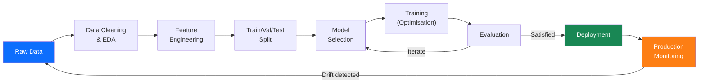
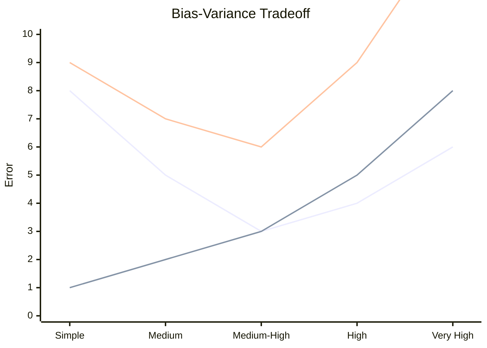

# Chapter 1 — Machine Learning Fundamentals

!!! abstract "Chapter Summary"
    This chapter establishes the conceptual and mathematical scaffolding for everything that follows. You will learn what it formally means for a machine to learn, why the bias–variance tradeoff is the central tension in all of ML, and how to design evaluation pipelines that produce honest estimates of real-world performance.

---

## Learning Objectives

By the end of this chapter you will be able to:

1. State the formal definition of machine learning and map a new problem onto the correct learning paradigm.
2. Derive the bias–variance decomposition and explain what each term implies for model selection.
3. Implement stratified k-fold cross-validation from scratch and verify it against scikit-learn.
4. Identify all four common sources of data leakage and redesign a pipeline to eliminate them.
5. Explain the No Free Lunch theorem and use it to justify empirical algorithm comparison.

---

## 1.1 What Is Machine Learning?

### 1.1.1 Mitchell's Formal Definition

Tom Mitchell's 1997 definition remains the clearest:

> *A computer program is said to learn from experience **E** with respect to some task **T** and performance measure **P**, if its performance at task **T**, as measured by **P**, improves with experience **E**.*

In the language of functions, we seek a mapping:

$$
f: \mathcal{X} \rightarrow \mathcal{Y}
$$

where $\mathcal{X}$ is the input space (features) and $\mathcal{Y}$ is the output space (labels or values). We do not hand-code $f$; instead we *learn* it from data:

$$
\mathcal{D} = \{(x^{(1)}, y^{(1)}), (x^{(2)}, y^{(2)}), \ldots, (x^{(n)}, y^{(n)})\}
$$

### 1.1.2 The Learning Problem

The learner sees $\mathcal{D}$, searches a *hypothesis class* $\mathcal{H}$ for the best $h \in \mathcal{H}$ according to some *loss function* $\mathcal{L}$:

$$
h^* = \arg\min_{h \in \mathcal{H}} \frac{1}{n} \sum_{i=1}^{n} \mathcal{L}(h(x^{(i)}), y^{(i)})
$$

The fundamental challenge: we want $h^*$ to minimise loss on *unseen* data (the true distribution $p(x, y)$), not just the training set $\mathcal{D}$.

!!! note "Key Terminology"
    - **Instance / example**: a single $(x, y)$ pair.
    - **Feature vector**: $x \in \mathbb{R}^d$, where $d$ is the number of features.
    - **Label / target**: $y$, which may be a class, a real value, or a structured object.
    - **Model / hypothesis**: the learned function $h$.
    - **Parameters**: the internal numbers the algorithm adjusts during training (e.g., weights $w$).

---

## 1.2 The ML Workflow



Each arrow represents a decision point where engineering judgement is required. The feedback loops are intentional — ML development is inherently iterative.

---

## 1.3 Three Types of Learning

### 1.3.1 Supervised, Unsupervised, and Reinforcement Learning

| Dimension | Supervised | Unsupervised | Reinforcement |
|-----------|-----------|--------------|---------------|
| **Labels** | Required for every example | None | Scalar reward signal |
| **Goal** | Learn $f: \mathcal{X} \to \mathcal{Y}$ | Discover structure in $\mathcal{X}$ | Learn a policy $\pi: \mathcal{S} \to \mathcal{A}$ |
| **Feedback** | Direct (label error) | Indirect (reconstruction, density) | Delayed (reward after $k$ steps) |
| **Output** | Prediction | Clusters, embeddings, densities | Actions |
| **Example tasks** | Spam detection, price prediction | Customer segmentation, anomaly detection | Game playing, robot control |
| **Common algorithms** | Linear/logistic regression, random forests, SVMs | K-Means, PCA, autoencoders | Q-learning, PPO, SAC |
| **Data efficiency** | Needs labelled data | Can exploit unlabelled data | Needs environment interaction |

### 1.3.2 Semi-supervised and Self-supervised Learning

A fourth paradigm sits between supervised and unsupervised: **semi-supervised learning** uses a small labelled set and a large unlabelled set. **Self-supervised learning** (the basis of large language models) creates synthetic supervision from the data itself — e.g., predicting the next token.

---

## 1.4 The Bias–Variance Tradeoff

### 1.4.1 Formal Decomposition

Consider a regression setting with true function $f(x)$ and a learner $\hat{f}$ trained on dataset $\mathcal{D}$. The expected mean squared error at a point $x$ is:

$$
\mathbb{E}_{\mathcal{D}}\left[(\hat{f}(x) - f(x))^2\right] = \underbrace{\left(\mathbb{E}_{\mathcal{D}}[\hat{f}(x)] - f(x)\right)^2}_{\text{Bias}^2} + \underbrace{\mathbb{E}_{\mathcal{D}}\left[\left(\hat{f}(x) - \mathbb{E}_{\mathcal{D}}[\hat{f}(x)]\right)^2\right]}_{\text{Variance}} + \underbrace{\sigma^2_\varepsilon}_{\text{Irreducible Error}}
$$

**Total Error = Bias² + Variance + Irreducible Error**

### 1.4.2 What Each Term Means

| Term | Definition | Cause | Remedy |
|------|-----------|-------|--------|
| **Bias²** | Systematic error from incorrect assumptions in the model family | Model too simple (underfitting) | Use a more expressive model; add features |
| **Variance** | Sensitivity of $\hat{f}$ to fluctuations in the training set | Model too complex (overfitting) | Regularise; collect more data; ensemble |
| **Irreducible Error** | Inherent noise in $p(y \mid x)$ | Label noise, unobserved features | Cannot be reduced by the algorithm |

### 1.4.3 The Tradeoff Visualised



!!! info "Reading the Chart"
    As model complexity increases: Bias (first line) falls, Variance (second line) rises, and Total Error (third line) traces a U-shape. The sweet spot is the minimum of the U — the optimal complexity for a given dataset size.

### 1.4.4 Practical Implications

- A training error much lower than validation error signals **high variance** → regularise or get more data.
- Both training error and validation error are high signals **high bias** → use a more powerful model or engineer better features.
- The optimal complexity depends on dataset size: with 10× more data you can afford a more complex model.

---

## 1.5 Overfitting and Underfitting

### 1.5.1 Definitions

**Overfitting** occurs when a model memorises the training data, capturing noise rather than the underlying signal. It achieves low training error but high generalisation error.

**Underfitting** occurs when a model is too simple to capture the true pattern. Both training and generalisation errors are high.

### 1.5.2 Detection

| Signal | Overfitting | Underfitting |
|--------|-------------|--------------|
| Training loss | Very low | High |
| Validation loss | High | High |
| Gap ($\text{val} - \text{train}$) | Large | Small |
| Learning curves | Diverge | Converge at high values |

### 1.5.3 Remedies

!!! success "Remedies for Overfitting"
    1. **Regularisation** — add $\ell_1$ or $\ell_2$ penalty to the loss.
    2. **Dropout** (neural networks) — randomly disable units during training.
    3. **More training data** — variance decreases as $n \to \infty$.
    4. **Early stopping** — halt training when validation loss stops improving.
    5. **Ensemble methods** — average many models to cancel variance.
    6. **Simplify the hypothesis class** — fewer parameters, shallower trees.

!!! warning "Remedies for Underfitting"
    1. **More expressive model** — deeper network, higher-degree polynomial.
    2. **Better features** — domain-specific feature engineering.
    3. **Reduce regularisation** — lower $\lambda$.
    4. **Train longer** — ensure the optimiser has converged.

---

## 1.6 The No Free Lunch Theorem

### 1.6.1 Statement

Wolpert and Macready (1997) proved that, averaged over *all possible* data-generating distributions, every learning algorithm performs equally well. No algorithm is universally superior.

$$
\sum_f \mathcal{E}(L \mid f, n) = \sum_f \mathcal{E}(L' \mid f, n) \quad \forall \; L, L'
$$

where $L$ and $L'$ are any two learning algorithms and $f$ ranges over all possible target functions.

### 1.6.2 Practical Implications

!!! important "What NFL Means for Engineers"
    1. **Always compare empirically** — never assume one algorithm dominates another for your specific problem without measuring it.
    2. **Domain knowledge matters** — the assumptions baked into an algorithm (inductive biases) succeed when they match the true data distribution.
    3. **There is no magic algorithm** — linear models beat deep networks on small tabular datasets all the time.
    4. **Benchmark, don't theorise** — establish a simple baseline first; only add complexity when it demonstrably improves metrics on held-out data.

---

## 1.7 Features: Types and Encoding

### 1.7.1 Feature Types

| Type | Description | Example | Raw representation |
|------|-------------|---------|-------------------|
| **Numerical (continuous)** | Arbitrary real values | Age, price, temperature | Float64 |
| **Numerical (discrete)** | Integer counts | Number of children | Int64 |
| **Categorical (nominal)** | No ordering between categories | Country, colour | String |
| **Categorical (ordinal)** | Ordered categories | Education level (High < BSc < MSc < PhD) | String or int with implicit order |
| **Binary** | Two states | Fraud flag, gender | Bool or 0/1 int |
| **Text** | Free-form string | Product review | String |
| **Temporal** | Date/time | Transaction timestamp | datetime64 |

### 1.7.2 Encoding Strategies

**One-Hot Encoding** (nominal categories with small cardinality):

$$
\text{colour} \in \{\text{red}, \text{green}, \text{blue}\} \to [1, 0, 0],\ [0, 1, 0],\ [0, 0, 1]
$$

**Ordinal Encoding** (when order is meaningful):

$$
\text{size} \in \{\text{S}, \text{M}, \text{L}, \text{XL}\} \to [0, 1, 2, 3]
$$

**Target Encoding** (high-cardinality categorical):

$$
\hat{\mu}_c = \frac{\sum_{i: x_i = c} y_i}{|\{i: x_i = c\}|}
$$

!!! warning "Target Encoding Leakage Risk"
    Compute target means only on the training fold, never on the full dataset, to prevent leakage. Use `category_encoders.TargetEncoder` with `smoothing` to handle rare categories.

**Standardisation** (continuous features for distance-based models):

$$
x_{\text{scaled}} = \frac{x - \mu}{\sigma}
$$

**Min-Max Normalisation** (when bounded range is needed):

$$
x_{\text{scaled}} = \frac{x - x_{\min}}{x_{\max} - x_{\min}}
$$

```python
from sklearn.preprocessing import StandardScaler, OneHotEncoder
from sklearn.compose import ColumnTransformer

def build_preprocessor(
    numerical_cols: list[str],
    categorical_cols: list[str],
) -> ColumnTransformer:
    """Build a column-aware preprocessing pipeline."""
    return ColumnTransformer(
        transformers=[
            ("num", StandardScaler(), numerical_cols),
            ("cat", OneHotEncoder(handle_unknown="ignore", sparse_output=False), categorical_cols),
        ],
        remainder="drop",
    )
```

---

## 1.8 Train / Validation / Test Split

### 1.8.1 Why Three Splits?

- **Training set**: the data the model sees and learns from.
- **Validation set**: used during development to tune hyperparameters and make model selection decisions.
- **Test set**: touched *once*, at the very end, to report the final unbiased performance estimate.

Using the test set more than once inflates reported performance because you are implicitly fitting to it. The test set must remain completely sealed until you have committed to a final model.

### 1.8.2 Choosing Ratios

| Dataset Size | Recommended Split |
|--------------|-------------------|
| < 10 k examples | 60 / 20 / 20 |
| 10 k – 1 M examples | 80 / 10 / 10 |
| > 1 M examples | 98 / 1 / 1 |

!!! tip "Large-Data Rationale"
    With 10 M examples, a 1 % test set is 100 k samples — more than enough for stable metric estimates. Wasting 20 % on evaluation is unjustified.

### 1.8.3 Stratification

For classification, always stratify so that class proportions are preserved in every split:

```python
from sklearn.model_selection import train_test_split

X_train, X_temp, y_train, y_temp = train_test_split(
    X, y,
    test_size=0.2,
    stratify=y,   # <-- preserves class ratio
    random_state=42,
)
X_val, X_test, y_val, y_test = train_test_split(
    X_temp, y_temp,
    test_size=0.5,
    stratify=y_temp,
    random_state=42,
)
```

Without stratification on a 5 % minority class, your test set might have 0 % or 10 % minority examples by chance, making metrics unreliable.

---

## 1.9 Cross-Validation

### 1.9.1 Why Cross-Validation?

A single validation split is noisy — different random seeds can swing accuracy by several percentage points on small datasets. Cross-validation uses all data for both training and validation by rotating which fold is held out.

### 1.9.2 K-Fold Cross-Validation

The dataset is partitioned into $k$ equal folds $F_1, F_2, \ldots, F_k$. In round $i$, fold $F_i$ is the validation set and the remaining $k-1$ folds form the training set. The CV score is:

$$
\text{CV}_k = \frac{1}{k} \sum_{i=1}^{k} \text{metric}(h_i, F_i)
$$

```python
import numpy as np
from sklearn.model_selection import KFold, StratifiedKFold, LeaveOneOut
from sklearn.base import BaseEstimator
from sklearn.metrics import accuracy_score


def manual_kfold_cv(
    model: BaseEstimator,
    X: np.ndarray,
    y: np.ndarray,
    n_splits: int = 5,
    random_state: int = 42,
) -> dict[str, float]:
    """Run stratified k-fold CV and return mean ± std accuracy."""
    skf = StratifiedKFold(n_splits=n_splits, shuffle=True, random_state=random_state)
    scores: list[float] = []

    for fold, (train_idx, val_idx) in enumerate(skf.split(X, y)):
        X_tr, X_val = X[train_idx], X[val_idx]
        y_tr, y_val = y[train_idx], y[val_idx]

        model.fit(X_tr, y_tr)
        y_pred = model.predict(X_val)
        fold_score = accuracy_score(y_val, y_pred)
        scores.append(fold_score)
        print(f"  Fold {fold + 1}/{n_splits}: accuracy = {fold_score:.4f}")

    scores_arr = np.array(scores)
    return {"mean": scores_arr.mean(), "std": scores_arr.std()}
```

### 1.9.3 Variants

| Variant | When to Use | Pros | Cons |
|---------|-------------|------|------|
| **K-Fold (k=5 or 10)** | Default choice | Low variance, fast | Ignores class balance |
| **Stratified K-Fold** | Classification | Preserves class ratios | Slight overhead |
| **Leave-One-Out (LOO)** | Very small datasets (n < 50) | Nearly unbiased | Computationally expensive: $n$ models |
| **Time-Series Split** | Temporal data | Respects time order | Less data for early folds |
| **Group K-Fold** | Data with groups (patients, users) | Prevents group leakage | Unequal fold sizes |

```python
from sklearn.model_selection import cross_val_score
from sklearn.ensemble import RandomForestClassifier

rfc = RandomForestClassifier(n_estimators=100, random_state=42)

cv_scores = cross_val_score(
    rfc, X_train, y_train,
    cv=StratifiedKFold(n_splits=5, shuffle=True, random_state=42),
    scoring="f1_macro",
    n_jobs=-1,
)

print(f"F1 Macro: {cv_scores.mean():.4f} ± {cv_scores.std():.4f}")
```

---

## 1.10 Data Leakage

### 1.10.1 Definition

**Data leakage** occurs when information from outside the training boundary flows into the model, causing artificially optimistic performance estimates that collapse at deployment.

!!! danger "The Cost of Leakage"
    Leakage is one of the most common and damaging bugs in ML systems. A model with heavy leakage can report 99 % accuracy on held-out data and achieve 60 % in production — a sudden, embarrassing collapse.

### 1.10.2 The Four Common Sources

#### Source 1: Target Leakage

A feature is computed using the target variable itself, or contains information available only *after* the outcome is known.

**Example**: predicting loan default with a feature `"collections_account_opened"`, which is created *as a consequence* of defaulting.

**Fix**: Audit every feature for temporal causality. Ask: *could this feature value be known at the time a real prediction would be made?*

#### Source 2: Preprocessing on the Full Dataset

Fitting a scaler, imputer, or encoder on the full dataset (including validation/test) leaks statistical information about held-out examples into the training pipeline.

```python
# WRONG — scaler sees test data during fit
scaler = StandardScaler()
X_all_scaled = scaler.fit_transform(X)  # leaks test statistics into training

# CORRECT — fit only on training data
scaler = StandardScaler()
X_train_scaled = scaler.fit_transform(X_train)
X_test_scaled = scaler.transform(X_test)   # use training statistics
```

#### Source 3: Temporal Leakage

In time-series problems, using future data to predict the past. A model trained on data from 2024 predicting 2023 outcomes, or features computed from a rolling window that inadvertently looks forward.

**Fix**: Use `TimeSeriesSplit` from scikit-learn, ensure all feature engineering uses strictly past data.

#### Source 4: Duplicate / Overlapping Rows

If the same (or very similar) rows appear in both training and test sets, the model effectively memorises test examples. Common with oversampling (SMOTE applied before splitting) or with dataset pipelines that don't deduplicate.

**Fix**: Deduplicate before splitting. Apply oversampling inside the training fold only.

### 1.10.3 Leakage Prevention Checklist

```
☑ Every preprocessing step is inside a Pipeline that is fit only on training data.
☑ All features are temporally valid at prediction time.
☑ Oversampling (SMOTE, etc.) is applied after splitting, inside the training fold.
☑ Target encoding uses fold-level statistics only.
☑ No duplicate rows across splits.
☑ No features derived from the target (or from post-outcome data).
```

---

## 1.11 Exercises

!!! question "Exercise 1.1 — Paradigm Classification"
    For each task below, identify whether it is supervised, unsupervised, or reinforcement learning, and justify your answer:

    a. Predicting house prices from bedrooms, location, and square footage.
    b. Grouping news articles by topic without human labels.
    c. Teaching a robot arm to pick objects by rewarding successful grasps.
    d. Flagging credit-card transactions as fraudulent using labelled historical data.
    e. Compressing images to a 64-dimensional embedding.

!!! question "Exercise 1.2 — Bias–Variance Diagnosis"
    A model achieves 62 % training accuracy and 61 % validation accuracy on a binary classification task. A colleague suggests adding more features and increasing model complexity. Assess whether this is the correct prescription. What does the bias–variance decomposition tell you about this model's failure mode?

!!! question "Exercise 1.3 — Cross-Validation Implementation"
    Implement 5-fold cross-validation *without* using `sklearn.model_selection.cross_val_score`. Your implementation must:

    a. Accept any scikit-learn-compatible estimator.
    b. Accept any scikit-learn-compatible scoring function.
    c. Return per-fold scores and aggregate statistics.

    Verify your implementation produces identical results to `cross_val_score`.

!!! question "Exercise 1.4 — Leakage Audit"
    You receive a fraud detection dataset. The preprocessing pipeline is:

    ```python
    scaler.fit_transform(X)          # step 1
    smote.fit_resample(X_scaled, y)  # step 2
    X_train, X_test = train_test_split(X_resampled)  # step 3
    ```

    Identify every leakage source in this pipeline and rewrite it correctly.

!!! question "Exercise 1.5 — No Free Lunch"
    A startup claims their proprietary algorithm is "the best ML algorithm for any tabular dataset." Write a technical rebuttal of at most 200 words, citing the No Free Lunch theorem, and propose an empirical protocol to fairly compare algorithms on a new dataset.

---

## Summary

| Concept | Key Takeaway |
|---------|-------------|
| Formal ML definition | We seek $f: \mathcal{X} \to \mathcal{Y}$ that minimises expected loss on unseen data |
| Three paradigms | Supervised (labels), Unsupervised (structure), Reinforcement (rewards) |
| Bias–Variance | Total error = Bias² + Variance + Irreducible; tuning one worsens the other |
| Overfitting | High gap between training and validation error; remedy with regularisation or more data |
| No Free Lunch | No universally best algorithm; always benchmark empirically |
| Feature types | Numerical, categorical (nominal/ordinal), binary; each requires different encoding |
| Three-split discipline | Train to learn, validation to tune, test to report — once |
| Cross-validation | K-fold reduces evaluation variance; always stratify for classification |
| Data leakage | Four sources: target leakage, preprocessing leakage, temporal leakage, duplicates |

---

*Next: [Chapter 2 — Supervised Learning](../ch02-supervised/index.md)*
