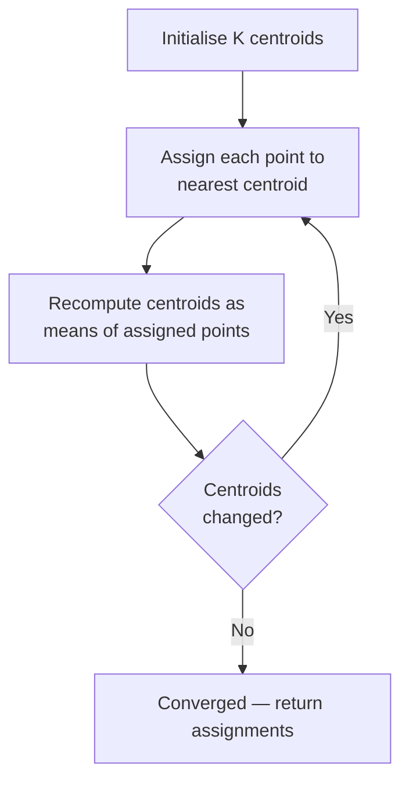
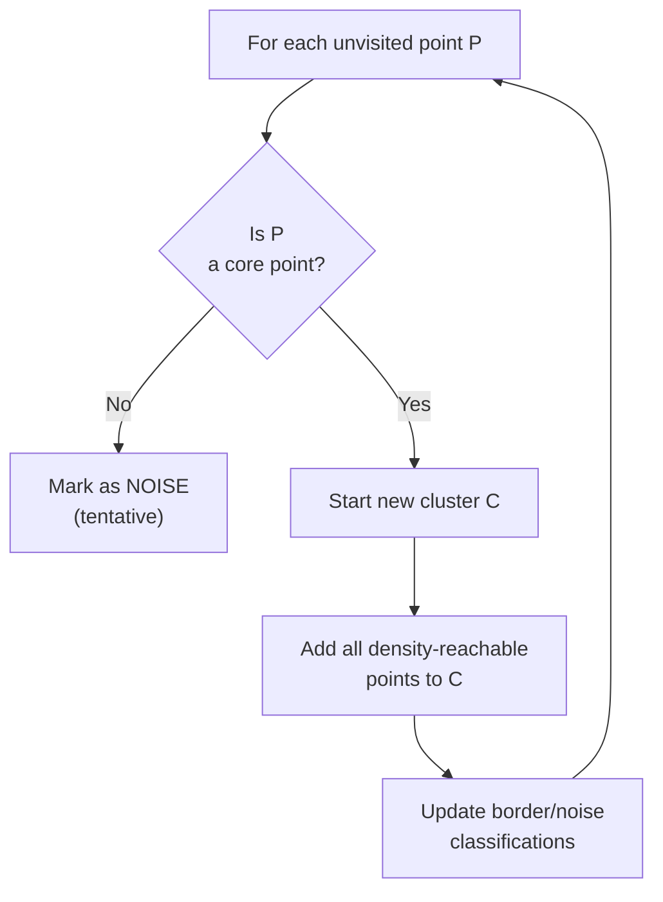
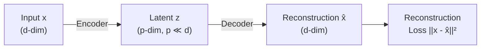

# Chapter 3 — Unsupervised Learning

!!! abstract "Chapter Summary"
    Unsupervised learning extracts structure from data without labels. This chapter covers the full spectrum: clustering algorithms that partition data into groups, dimensionality reduction methods that reveal latent geometry, and anomaly detection techniques that surface rare, deviating instances — all with mathematical derivations and Python implementations.

---

## Learning Objectives

By the end of this chapter you will be able to:

1. Implement K-Means from scratch with k-means++ initialisation and select $K$ using both the elbow method and silhouette analysis.
2. Explain why DBSCAN outperforms K-Means for non-convex clusters and configure its parameters for a new dataset.
3. Derive PCA from the covariance matrix, implement it using NumPy's eigendecomposition, and choose the number of components from explained variance.
4. Articulate the key differences between PCA, t-SNE, and UMAP and prescribe the correct method for a given analysis goal.
5. Build a simple autoencoder for anomaly detection and compare its performance against Isolation Forest.

---

## 3.1 K-Means Clustering

### 3.1.1 Objective Function

K-Means minimises the **within-cluster sum of squares (WCSS)**:

$$
J = \sum_{k=1}^{K} \sum_{x \in C_k} \|x - \mu_k\|^2
$$

where $\mu_k = \frac{1}{|C_k|} \sum_{x \in C_k} x$ is the centroid of cluster $k$.

### 3.1.2 The Algorithm (Lloyd's Algorithm)



K-Means is guaranteed to converge but only to a local minimum. Time complexity per iteration: $O(nKd)$.

### 3.1.3 K-Means++ Initialisation

Random initialisation often leads to poor local minima. K-Means++ initialises centroids sequentially with probability proportional to the squared distance from existing centroids:

$$
P(\text{choose } x) \propto \min_{k} \|x - \mu_k\|^2
$$

This provides an $O(\log K)$ approximation guarantee to the optimal solution.

```python
import numpy as np
from typing import NamedTuple


class KMeansResult(NamedTuple):
    labels: np.ndarray
    centroids: np.ndarray
    inertia: float
    n_iter: int


def kmeans_plusplus_init(X: np.ndarray, K: int, rng: np.random.Generator) -> np.ndarray:
    """K-Means++ centroid initialisation."""
    n = X.shape[0]
    first_idx = rng.integers(n)
    centroids = [X[first_idx]]

    for _ in range(K - 1):
        dists = np.array([min(np.sum((x - c) ** 2) for c in centroids) for x in X])
        probs = dists / dists.sum()
        idx = rng.choice(n, p=probs)
        centroids.append(X[idx])

    return np.array(centroids)


def kmeans(
    X: np.ndarray,
    K: int,
    max_iter: int = 300,
    tol: float = 1e-4,
    random_state: int = 42,
) -> KMeansResult:
    """K-Means with K-Means++ initialisation."""
    rng = np.random.default_rng(random_state)
    centroids = kmeans_plusplus_init(X, K, rng)

    for iteration in range(max_iter):
        # Assignment step
        dists = np.linalg.norm(X[:, None, :] - centroids[None, :, :], axis=2)
        labels = dists.argmin(axis=1)

        # Update step
        new_centroids = np.array([
            X[labels == k].mean(axis=0) if (labels == k).any() else centroids[k]
            for k in range(K)
        ])

        shift = np.linalg.norm(new_centroids - centroids)
        centroids = new_centroids
        if shift < tol:
            break

    inertia = sum(np.sum((X[labels == k] - centroids[k]) ** 2) for k in range(K))
    return KMeansResult(labels=labels, centroids=centroids, inertia=float(inertia), n_iter=iteration + 1)
```

### 3.1.4 Choosing K

**Elbow Method**: plot WCSS vs $K$ and look for the "elbow" where marginal gain diminishes.

**Silhouette Score**: for each point $i$, compute:

$$
s(i) = \frac{b(i) - a(i)}{\max(a(i), b(i))}
$$

where $a(i)$ = mean intra-cluster distance, $b(i)$ = mean distance to the nearest other cluster. $s \in [-1, 1]$; higher is better.

```python
from sklearn.cluster import KMeans
from sklearn.metrics import silhouette_score
import matplotlib.pyplot as plt

K_range = range(2, 15)
inertias: list[float] = []
silhouettes: list[float] = []

for k in K_range:
    km = KMeans(n_clusters=k, init="k-means++", n_init=10, random_state=42)
    labels = km.fit_predict(X)
    inertias.append(km.inertia_)
    silhouettes.append(silhouette_score(X, labels))

best_k_silhouette = K_range[silhouettes.index(max(silhouettes))]
print(f"Best K by silhouette: {best_k_silhouette} (score={max(silhouettes):.4f})")
```

### 3.1.5 Limitations of K-Means

| Limitation | Description | Remedy |
|-----------|-------------|--------|
| Assumes spherical clusters | Cannot handle elongated or irregular shapes | DBSCAN, Gaussian Mixture Models |
| Sensitive to outliers | Outliers shift centroids | K-Medoids, trimmed K-Means |
| Fixed $K$ | Must specify cluster count a priori | Silhouette analysis, DBSCAN |
| Scale-sensitive | Euclidean distance is not scale-invariant | Standardise features first |
| Converges to local optima | Different initialisations give different results | Run `n_init=10`; use K-Means++ |

---

## 3.2 DBSCAN

### 3.2.1 Core Concepts

DBSCAN (Density-Based Spatial Clustering of Applications with Noise) classifies each point as:

- **Core point**: has at least `min_samples` points within radius $\varepsilon$.
- **Border point**: within $\varepsilon$ of a core point but fewer than `min_samples` neighbours.
- **Noise point**: neither core nor border.

Two parameters control the algorithm:
- $\varepsilon$ (`eps`): neighbourhood radius.
- `min_samples`: minimum points for a core point (including itself).

### 3.2.2 The Algorithm



### 3.2.3 DBSCAN vs K-Means

| Criterion | K-Means | DBSCAN |
|-----------|---------|--------|
| Number of clusters | Must specify | Discovered automatically |
| Cluster shape | Convex, spherical | Arbitrary |
| Outlier handling | Assigns all points | Marks noise explicitly |
| Scalability | $O(nKd)$ | $O(n \log n)$ with index |
| Parameter sensitivity | $K$ | $\varepsilon$, `min_samples` |
| Empty cluster problem | Can occur | Not applicable |

```python
from sklearn.cluster import DBSCAN
from sklearn.preprocessing import StandardScaler

scaler = StandardScaler()
X_scaled = scaler.fit_transform(X)

dbscan = DBSCAN(eps=0.5, min_samples=5)
labels = dbscan.fit_predict(X_scaled)

n_clusters = len(set(labels)) - (1 if -1 in labels else 0)
n_noise = (labels == -1).sum()
print(f"Clusters: {n_clusters}, Noise points: {n_noise} ({100*n_noise/len(labels):.1f}%)")
```

!!! tip "Choosing DBSCAN Parameters"
    1. Standardise features first (DBSCAN uses Euclidean distance).
    2. Plot the $k$-distance graph: sort distances to the $k$-th nearest neighbour; the "knee" suggests $\varepsilon$.
    3. Set `min_samples` = $2d$ as a starting heuristic (where $d$ = feature dimension).

---

## 3.3 Hierarchical Clustering

### 3.3.1 Agglomerative Clustering

Agglomerative (bottom-up) clustering starts with each point as its own cluster and iteratively merges the two closest clusters. The result is a tree (dendrogram) encoding the full merge history.

### 3.3.2 Linkage Methods

The choice of linkage determines how inter-cluster distance is measured:

| Linkage | Distance Definition | Properties |
|---------|---------------------|-----------|
| **Single** | $\min_{x \in A, y \in B} d(x, y)$ | Tends to create elongated chains |
| **Complete** | $\max_{x \in A, y \in B} d(x, y)$ | Creates compact, roughly equal-size clusters |
| **Average** | $\frac{1}{|A||B|} \sum_{x \in A} \sum_{y \in B} d(x, y)$ | Good compromise |
| **Ward** | Minimises increase in WCSS after merge | Most commonly effective; produces compact spherical clusters |

```python
from sklearn.cluster import AgglomerativeClustering
from scipy.cluster.hierarchy import dendrogram, linkage
import matplotlib.pyplot as plt

# Compute full linkage matrix for dendrogram
Z = linkage(X_scaled, method="ward")

fig, ax = plt.subplots(figsize=(12, 5))
dendrogram(Z, ax=ax, truncate_mode="level", p=5, leaf_font_size=10)
ax.set_title("Dendrogram (Ward linkage, top 5 levels)")
ax.set_xlabel("Sample index or cluster size")
ax.set_ylabel("Ward distance")
plt.tight_layout()

# Cut the tree to get cluster labels
agg = AgglomerativeClustering(n_clusters=4, linkage="ward")
labels = agg.fit_predict(X_scaled)
```

---

## 3.4 Principal Component Analysis (PCA)

### 3.4.1 The Covariance Matrix

Given a mean-centred data matrix $X \in \mathbb{R}^{n \times d}$ (each column has zero mean), the empirical covariance matrix is:

$$
\Sigma = \frac{1}{n} X^\top X \in \mathbb{R}^{d \times d}
$$

$\Sigma_{ij}$ captures how features $i$ and $j$ co-vary. The diagonal entries are variances.

### 3.4.2 Principal Components as Eigenvectors

PCA finds the orthonormal directions of maximum variance. The $k$-th principal component $u_k$ is the eigenvector corresponding to the $k$-th largest eigenvalue $\lambda_k$ of $\Sigma$:

$$
\Sigma u_k = \lambda_k u_k
$$

The variance explained by component $k$ is $\lambda_k$, and the fraction of total variance explained by the first $p$ components is:

$$
\text{Explained Variance Ratio}_p = \frac{\sum_{k=1}^{p} \lambda_k}{\sum_{k=1}^{d} \lambda_k}
$$

### 3.4.3 From-Scratch PCA Implementation

```python
import numpy as np


class PCAFromScratch:
    """PCA implemented via eigendecomposition of the covariance matrix."""

    def __init__(self, n_components: int) -> None:
        self.n_components = n_components
        self.components_: np.ndarray | None = None       # shape (n_components, d)
        self.explained_variance_: np.ndarray | None = None
        self.explained_variance_ratio_: np.ndarray | None = None
        self.mean_: np.ndarray | None = None

    def fit(self, X: np.ndarray) -> "PCAFromScratch":
        self.mean_ = X.mean(axis=0)
        X_centered = X - self.mean_

        cov = X_centered.T @ X_centered / (X.shape[0] - 1)  # unbiased estimate
        eigenvalues, eigenvectors = np.linalg.eigh(cov)

        # eigh returns ascending order; reverse for descending
        idx = np.argsort(eigenvalues)[::-1]
        eigenvalues = eigenvalues[idx]
        eigenvectors = eigenvectors[:, idx]

        self.components_ = eigenvectors[:, : self.n_components].T
        self.explained_variance_ = eigenvalues[: self.n_components]
        self.explained_variance_ratio_ = self.explained_variance_ / eigenvalues.sum()
        return self

    def transform(self, X: np.ndarray) -> np.ndarray:
        return (X - self.mean_) @ self.components_.T

    def fit_transform(self, X: np.ndarray) -> np.ndarray:
        return self.fit(X).transform(X)
```

### 3.4.4 Choosing the Number of Components

```python
from sklearn.decomposition import PCA
import numpy as np

pca_full = PCA(n_components=None)
pca_full.fit(X_scaled)

cumulative_variance = np.cumsum(pca_full.explained_variance_ratio_)
n_components_95 = np.searchsorted(cumulative_variance, 0.95) + 1
print(f"Components for 95% variance: {n_components_95}")

# Apply PCA
pca = PCA(n_components=n_components_95, random_state=42)
X_reduced = pca.fit_transform(X_scaled)
print(f"Original shape: {X_scaled.shape} → Reduced shape: {X_reduced.shape}")
```

!!! note "PCA Assumptions"
    PCA assumes linear relationships and that variance equals importance. If the meaningful structure is non-linear (e.g., a Swiss-roll manifold), t-SNE or UMAP will reveal more structure.

---

## 3.5 t-SNE

### 3.5.1 How t-SNE Works

t-SNE (t-Distributed Stochastic Neighbour Embedding) is a non-linear dimensionality reduction method that:

1. Computes pairwise affinities in the high-dimensional space using a Gaussian kernel, calibrated by the `perplexity` parameter.
2. Initialises a low-dimensional embedding (2D or 3D).
3. Minimises the KL divergence between high-dimensional and low-dimensional affinity distributions using the Student-t kernel in 2D (heavier tails solve the crowding problem).

$$
\text{KL}(P \| Q) = \sum_{i \neq j} p_{ij} \log \frac{p_{ij}}{q_{ij}}
$$

### 3.5.2 Key Parameters

- **`perplexity`**: loosely, the number of effective nearest neighbours. Typical range: 5–50. Larger datasets need larger perplexity.
- **`n_iter`**: should be at least 1000; more is better.
- **`learning_rate`**: usually auto-configured; set to "auto" in sklearn.

### 3.5.3 The Crowding Problem

In high dimensions, a point can have many equidistant neighbours. When mapping to 2D, there is insufficient area to faithfully represent all these neighbours at the correct distances — they get "crowded" into the centre. The Student-t kernel's heavy tails in 2D place moderately-close points further apart, resolving the crowding.

### 3.5.4 When to Use t-SNE vs PCA

| Criterion | PCA | t-SNE |
|-----------|-----|-------|
| **Goal** | Compression, preprocessing | Visualisation |
| **Output** | Can be any dimension | 2D or 3D only |
| **Linear?** | Yes | No |
| **Reproducible** | Yes | No (stochastic; set `random_state`) |
| **Interpretable axes** | Yes (loading vectors) | No (axes are meaningless) |
| **Distance-preserving globally** | Global structure preserved | Only local structure preserved |
| **Scalability** | $O(nd^2)$ or $O(nd)$ (SVD) | $O(n^2)$ naive; $O(n \log n)$ Barnes-Hut |

```python
from sklearn.manifold import TSNE

tsne = TSNE(n_components=2, perplexity=30, n_iter=1000, learning_rate="auto",
            init="pca", random_state=42)
X_tsne = tsne.fit_transform(X_scaled)
```

!!! warning "t-SNE Pitfalls"
    - Cluster sizes and inter-cluster distances in t-SNE plots are **not** meaningful — do not interpret them.
    - Different perplexity values can dramatically change the apparent structure. Always try several.
    - t-SNE is not deterministic. Run with a fixed `random_state` for reproducibility.

---

## 3.6 UMAP

### 3.6.1 Topology-Preserving Dimensionality Reduction

UMAP (Uniform Manifold Approximation and Projection) is built on Riemannian geometry and algebraic topology. Like t-SNE it is non-linear and designed for visualisation, but it additionally preserves more of the global structure and is significantly faster.

UMAP constructs a weighted $k$-nearest-neighbour graph in high-dimensional space, then optimises a low-dimensional layout to have a similar fuzzy topological structure, minimising the cross-entropy between the two fuzzy simplicial sets.

### 3.6.2 UMAP vs t-SNE

| Criterion | t-SNE | UMAP |
|-----------|-------|------|
| **Speed** | Slow ($O(n \log n)$) | Fast ($O(n^{1.14})$ empirically) |
| **Global structure** | Poor | Better preserved |
| **Reproducibility** | Stochastic | Stochastic (`random_state` fixes it) |
| **Transform new points** | Not supported | Supported (`transform()`) |
| **Hyperparameters** | `perplexity`, `learning_rate` | `n_neighbors`, `min_dist` |

```python
import umap

reducer = umap.UMAP(
    n_components=2,
    n_neighbors=15,     # controls local vs global balance
    min_dist=0.1,       # controls cluster compactness
    metric="euclidean",
    random_state=42,
)
X_umap = reducer.fit_transform(X_scaled)

# UMAP supports transforming new points (t-SNE does not)
X_new_umap = reducer.transform(X_new_scaled)
```

!!! tip "UMAP Parameter Guidance"
    - `n_neighbors`: increase for more global structure (15–50 is typical); decrease for more local detail.
    - `min_dist`: decrease (→ 0) for tighter clusters; increase (→ 0.5) for more uniform spread.
    - `metric`: can be any valid distance; `"cosine"` works well for text embeddings.

---

## 3.7 Autoencoders

### 3.7.1 Encoder–Decoder Structure

An autoencoder is a neural network that learns a compressed representation (latent code) by training to reconstruct its own input:



**Reconstruction loss** (for continuous inputs):

$$
\mathcal{L}_{\text{recon}} = \frac{1}{n} \sum_{i=1}^{n} \|x^{(i)} - \hat{x}^{(i)}\|^2
$$

### 3.7.2 Simple Autoencoder in PyTorch

```python
import torch
import torch.nn as nn
from torch.utils.data import DataLoader, TensorDataset


class Autoencoder(nn.Module):
    """Simple fully-connected autoencoder."""

    def __init__(self, input_dim: int, latent_dim: int, hidden_dim: int = 128) -> None:
        super().__init__()
        self.encoder = nn.Sequential(
            nn.Linear(input_dim, hidden_dim),
            nn.ReLU(),
            nn.Linear(hidden_dim, latent_dim),
        )
        self.decoder = nn.Sequential(
            nn.Linear(latent_dim, hidden_dim),
            nn.ReLU(),
            nn.Linear(hidden_dim, input_dim),
        )

    def forward(self, x: torch.Tensor) -> tuple[torch.Tensor, torch.Tensor]:
        z = self.encoder(x)
        x_hat = self.decoder(z)
        return x_hat, z


def train_autoencoder(
    model: Autoencoder,
    X_train: torch.Tensor,
    n_epochs: int = 50,
    lr: float = 1e-3,
    batch_size: int = 256,
) -> list[float]:
    """Train autoencoder and return per-epoch reconstruction losses."""
    loader = DataLoader(TensorDataset(X_train), batch_size=batch_size, shuffle=True)
    optimiser = torch.optim.Adam(model.parameters(), lr=lr)
    criterion = nn.MSELoss()
    epoch_losses: list[float] = []

    model.train()
    for epoch in range(n_epochs):
        batch_losses: list[float] = []
        for (x_batch,) in loader:
            x_hat, _ = model(x_batch)
            loss = criterion(x_hat, x_batch)
            optimiser.zero_grad()
            loss.backward()
            optimiser.step()
            batch_losses.append(loss.item())
        epoch_loss = sum(batch_losses) / len(batch_losses)
        epoch_losses.append(epoch_loss)
        if (epoch + 1) % 10 == 0:
            print(f"Epoch {epoch+1}/{n_epochs}: loss = {epoch_loss:.6f}")

    return epoch_losses
```

### 3.7.3 Latent Space and Interpolation

The latent space $z$ learned by a well-trained autoencoder is a compressed, structured manifold. Points close in latent space produce similar reconstructions. This latent representation can be used directly as features for downstream supervised tasks.

---

## 3.8 Anomaly Detection

### 3.8.1 Problem Definition

Anomaly detection finds samples that deviate significantly from the majority of the data. Labels are typically unavailable — most data is "normal" and anomalies are rare.

### 3.8.2 Isolation Forest

Isolation Forest isolates anomalies by randomly selecting a feature and a random split value. Anomalies require fewer splits to isolate (shorter path length in the tree):

$$
s(x, n) = 2^{-\frac{E[h(x)]}{c(n)}}
$$

where $E[h(x)]$ is the expected path length and $c(n)$ is the average path length for a random dataset of size $n$.

```python
from sklearn.ensemble import IsolationForest

iso_forest = IsolationForest(
    n_estimators=200,
    contamination=0.05,   # expected fraction of anomalies
    random_state=42,
    n_jobs=-1,
)
anomaly_labels = iso_forest.fit_predict(X_scaled)   # -1 = anomaly, 1 = normal
anomaly_scores = iso_forest.score_samples(X_scaled) # lower = more anomalous

print(f"Anomalies detected: {(anomaly_labels == -1).sum()}")
```

### 3.8.3 One-Class SVM

One-Class SVM learns a hypersphere in kernel space that contains the "normal" data, classifying points outside as anomalies. It is more sensitive to the kernel and hyperparameters than Isolation Forest, and scales as $O(n^2)$.

```python
from sklearn.svm import OneClassSVM

oc_svm = OneClassSVM(kernel="rbf", nu=0.05, gamma="scale")
oc_svm.fit(X_train_normal)
labels = oc_svm.predict(X_test)  # 1 = normal, -1 = anomaly
```

### 3.8.4 Reconstruction-Error Anomaly Detection

A well-trained autoencoder reconstructs "normal" data well but struggles with anomalies, producing high reconstruction error:

```python
import torch
import numpy as np


def detect_anomalies_autoencoder(
    model: Autoencoder,
    X: torch.Tensor,
    threshold_percentile: float = 95.0,
) -> tuple[np.ndarray, np.ndarray]:
    """Detect anomalies using autoencoder reconstruction error."""
    model.eval()
    with torch.no_grad():
        X_hat, _ = model(X)
        errors = ((X - X_hat) ** 2).mean(dim=1).cpu().numpy()

    threshold = np.percentile(errors, threshold_percentile)
    is_anomaly = errors > threshold
    return is_anomaly, errors
```

### 3.8.5 Method Comparison

| Method | Strengths | Weaknesses | Best for |
|--------|-----------|------------|----------|
| **Isolation Forest** | Fast, scalable, no assumptions | May miss contextual anomalies | Tabular data, many features |
| **One-Class SVM** | Kernel flexibility | Slow ($O(n^2)$), sensitive to `nu` and `gamma` | Low-dimensional, clean data |
| **Autoencoder** | Learns complex normal manifold | Requires training, GPU helps | High-dimensional, sequential data |
| **Statistical (Z-score, IQR)** | Simple, interpretable | Only univariate | Single-feature outlier removal |

---

## 3.9 Exercises

!!! question "Exercise 3.1 — K-Means Convergence"
    Generate a synthetic dataset with `make_blobs(n_samples=500, centers=5, random_state=42)`.

    a. Run your `kmeans()` implementation 10 times with different random seeds and report the range of inertia values. Explain why values differ.
    b. Add k-means++ initialisation and repeat. Does it reduce inertia variability?
    c. Plot the elbow curve and silhouette scores for $K = 2, \ldots, 12$ and identify the optimal $K$.

!!! question "Exercise 3.2 — DBSCAN Parameter Sensitivity"
    Using the `make_moons` dataset (which K-Means cannot cluster correctly):

    a. Show that K-Means with $K=2$ fails on this dataset (visualise the result).
    b. Run DBSCAN with 5 different $(\varepsilon, \texttt{min\_samples})$ pairs and visualise cluster assignments.
    c. Plot the 5-distance graph and identify the $\varepsilon$ suggested by the "knee."

!!! question "Exercise 3.3 — PCA from Scratch"
    On the `digits` dataset (1797 × 64):

    a. Implement PCA from scratch using NumPy's `eigh`. Verify that your `explained_variance_ratio_` matches sklearn's.
    b. Determine how many components are needed to retain 95 % of variance.
    c. Reduce to 2 components and plot a scatter coloured by digit class. Comment on what structure is visible.
    d. Apply your PCA as preprocessing for a KNN classifier. Compare accuracy with and without PCA.

!!! question "Exercise 3.4 — t-SNE vs UMAP"
    On the `MNIST` subset (10 classes, first 5000 samples):

    a. Apply PCA to 50 components, then t-SNE to 2 components. Time the full pipeline.
    b. Apply UMAP directly to the 50-component PCA output. Time the pipeline.
    c. For both plots, colour by class label and compute a qualitative cluster separation score (mean silhouette score in 2D).
    d. Run UMAP with `n_neighbors` ∈ {5, 15, 50} and discuss how global vs local structure changes.

!!! question "Exercise 3.5 — Autoencoder for Anomaly Detection"
    Using the `credit_card_fraud` dataset (or a synthetic imbalanced dataset):

    a. Train an autoencoder only on normal transactions.
    b. Plot the reconstruction error distribution for normal vs fraudulent transactions.
    c. Select a threshold at the 95th percentile of normal reconstruction errors.
    d. Compare precision, recall, and F1 at this threshold against an Isolation Forest with `contamination=0.002`.

---

## Summary

| Algorithm | Type | Key Hyperparameters | When to Use |
|-----------|------|---------------------|-------------|
| **K-Means** | Clustering | $K$, `n_init` | Well-separated, spherical clusters |
| **DBSCAN** | Clustering | $\varepsilon$, `min_samples` | Arbitrary shapes, noise detection |
| **Agglomerative** | Clustering | `n_clusters`, `linkage` | Hierarchical structure, dendrograms |
| **PCA** | Dim. reduction | `n_components` | Compression, linear preprocessing |
| **t-SNE** | Dim. reduction | `perplexity`, `n_iter` | 2D/3D visualisation |
| **UMAP** | Dim. reduction | `n_neighbors`, `min_dist` | Visualisation + preserves global structure |
| **Autoencoder** | Dim. red. / Anomaly | `latent_dim`, architecture | Non-linear compression, anomaly detection |
| **Isolation Forest** | Anomaly detection | `n_estimators`, `contamination` | General anomaly detection on tabular data |
| **One-Class SVM** | Anomaly detection | `nu`, `gamma` | Small, clean datasets |

---

*Next: [Chapter 4 — Model Evaluation](../ch04-evaluation/index.md)*
