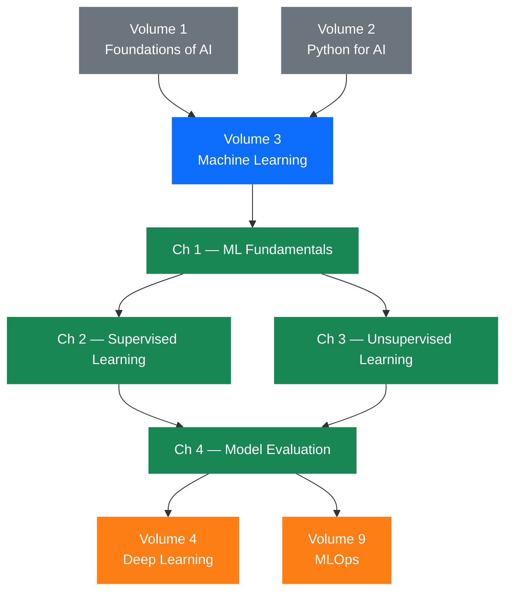
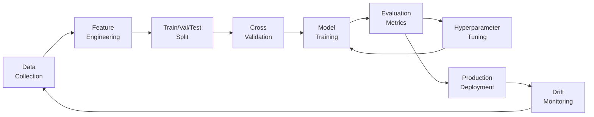

# Volume 3 — Machine Learning

!!! abstract "Volume Overview"
    This volume builds a rigorous, practical foundation in classical machine learning. You will move from first principles — what it means for a machine to *learn* — through supervised and unsupervised algorithms, to the craft of honest model evaluation. Every concept is grounded in working Python code and real-world engineering trade-offs.

---

## Why Machine Learning?

Software engineers have long written explicit rules: `if price > threshold: flag_fraud`. Machine learning inverts this paradigm. Instead of specifying the rules, we specify the *goal* and let an algorithm discover the rules from data. This shift unlocks capabilities that are otherwise impractical or impossible to hand-code — recognising faces, predicting equipment failures, or personalising content at scale.

This volume treats machine learning as an *engineering discipline*, not a collection of magic boxes. Every algorithm is presented with its mathematical underpinnings, its computational properties, its failure modes, and the situations in which another algorithm would be a better choice.

---

## Volume Learning Outcomes

By the end of this volume you will be able to:

1. Formally define the machine learning problem and identify which learning paradigm applies to a given task.
2. Implement, train, and interpret the canonical supervised-learning algorithms from scratch and via scikit-learn.
3. Apply unsupervised methods — clustering, dimensionality reduction, anomaly detection — to unlabelled data.
4. Select, compute, and correctly interpret a full suite of evaluation metrics for both classification and regression tasks.
5. Diagnose and remediate common engineering failures: data leakage, overfitting, distribution shift, and metric–objective mismatch.

---

## Chapter Map

| # | Chapter | Core Topics | Difficulty |
|---|---------|-------------|------------|
| 1 | [ML Fundamentals](ch01-fundamentals/index.md) | Learning paradigms, bias–variance, cross-validation, data leakage | ★★☆☆☆ |
| 2 | [Supervised Learning](ch02-supervised/index.md) | Linear/logistic regression, trees, forests, boosting, SVMs, KNN, hyperparameter tuning | ★★★☆☆ |
| 3 | [Unsupervised Learning](ch03-unsupervised/index.md) | K-Means, DBSCAN, hierarchical, PCA, t-SNE, UMAP, autoencoders, anomaly detection | ★★★☆☆ |
| 4 | [Model Evaluation](ch04-evaluation/index.md) | Classification & regression metrics, ROC/AUC, calibration, drift, failure analysis | ★★★★☆ |

---

## Prerequisite Knowledge Graph



---

## Conceptual Dependency Graph



---

## How to Use This Volume

!!! tip "Recommended Study Path"
    - **First pass**: Read each chapter sequentially. Run every code cell in your own environment.
    - **Second pass**: Attempt all exercises *before* looking at solutions.
    - **Projects**: Each chapter feeds a capstone project in the `/projects/` directory.
    - **Lab notebooks**: Interactive Jupyter notebooks in `/notebooks/volume03/` complement each chapter.

!!! warning "Mathematics Level"
    This volume uses undergraduate linear algebra and calculus. Appendix A provides a self-contained refresher. All formulas are rendered via MathJax — ensure your MkDocs build has the MathJax extension enabled.

---

## Tools & Libraries

```python
# Core libraries used throughout this volume
import numpy as np          # 1.26+
import pandas as pd         # 2.1+
import sklearn              # 1.4+
import matplotlib.pyplot as plt
import seaborn as sns
import xgboost as xgb       # 2.0+
import lightgbm as lgb      # 4.0+
import optuna               # 3.5+
import umap                 # 0.5+
```

All notebooks include a `requirements.txt` pinned to compatible versions. Use `pip install -r requirements.txt` inside a fresh virtual environment.

---

*Next: [Chapter 1 — ML Fundamentals](ch01-fundamentals/index.md)*
