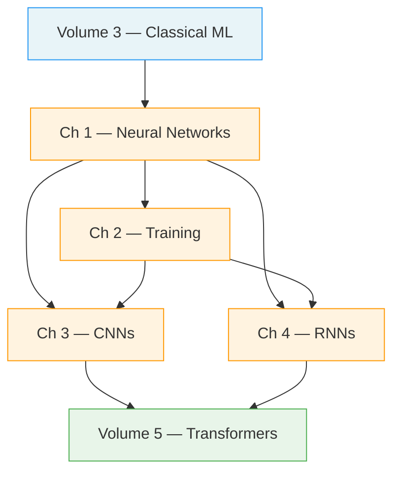

# Volume 4 — Deep Learning

Deep learning is the engine behind modern AI. By stacking layers of simple parametric transformations, deep networks learn hierarchical representations directly from raw data — pixels become edges become objects; characters become tokens become meaning. This volume builds that understanding from first principles, deriving every equation before touching a line of code, then translating theory into clean, production-ready PyTorch.

We begin with the biological motivation for artificial neurons and build up to full multi-layer perceptrons trained via backpropagation. We then explore the engineering machinery that makes deep networks trainable at scale: optimisers, normalisation, regularisation, and mixed-precision arithmetic. The final two chapters cover the two most important architectural families before the Transformer era — Convolutional Neural Networks for structured spatial data and Recurrent Networks for sequential data — setting the stage for Volume 5.

---

## Chapter Map

| # | Chapter | Core Topics | Estimated Time |
|---|---------|-------------|---------------|
| 1 | [Neural Networks from Scratch](ch01-neural-networks/index.md) | Perceptron, MLP, backpropagation, NumPy & PyTorch | 4 h |
| 2 | [Training Deep Networks](ch02-training/index.md) | Optimisers, schedulers, BatchNorm, dropout, mixed precision | 3 h |
| 3 | [Convolutional Neural Networks](ch03-cnn/index.md) | Convolution, pooling, ResNet, transfer learning, augmentation | 3.5 h |
| 4 | [Recurrent Networks & LSTMs](ch04-rnn/index.md) | RNN, BPTT, LSTM, GRU, seq2seq, attention | 3 h |

---

## Dependency Graph

---

## Prerequisites

!!! info "What You Should Already Know"
    - **Linear algebra**: matrix multiplication, transpose, eigenvalues (Volume 1, Chapter 2)
    - **Calculus**: partial derivatives, chain rule (Volume 1, Chapter 3)
    - **Probability**: distributions, MLE, cross-entropy (Volume 1, Chapter 4)
    - **Classical ML**: regression, gradient descent, overfitting (Volume 3)
    - **Python & NumPy**: array operations, broadcasting (Volume 2)

---

## Learning Outcomes

By completing this volume you will be able to:

1. **Derive and implement** forward and backward passes for a multi-layer perceptron entirely from scratch in NumPy, without relying on automatic differentiation.
2. **Select and configure** optimisers, learning-rate schedules, and regularisation strategies appropriate for a given training regime.
3. **Design CNN architectures** using convolutions, pooling, skip connections, and transfer learning for computer vision tasks.
4. **Build and train** LSTM-based sequence models and explain why they outperform vanilla RNNs on long-range dependencies.
5. **Connect the historical thread** from RNNs with attention to the motivation for the Transformer, and articulate the key limitations that drove each transition.

---

## Notation Reference

| Symbol | Meaning |
|--------|---------|
| $x \in \mathbb{R}^n$ | Input feature vector |
| $W^{(l)} \in \mathbb{R}^{d_l \times d_{l-1}}$ | Weight matrix at layer $l$ |
| $b^{(l)} \in \mathbb{R}^{d_l}$ | Bias vector at layer $l$ |
| $h^{(l)}$ | Post-activation at layer $l$ |
| $z^{(l)}$ | Pre-activation (logit) at layer $l$ |
| $\sigma(\cdot)$ | Activation function (context-specific) |
| $\mathcal{L}$ | Scalar loss |
| $\odot$ | Element-wise (Hadamard) product |
| $\nabla_\theta \mathcal{L}$ | Gradient of loss w.r.t. parameters $\theta$ |

---

!!! tip "How to Use This Volume"
    Each chapter is self-contained with derivations, code, and exercises. Read the derivations before running the code — the NumPy implementations are intentional: they force you to think in matrix shapes rather than relying on autograd magic. The PyTorch versions follow immediately so you can compare.
