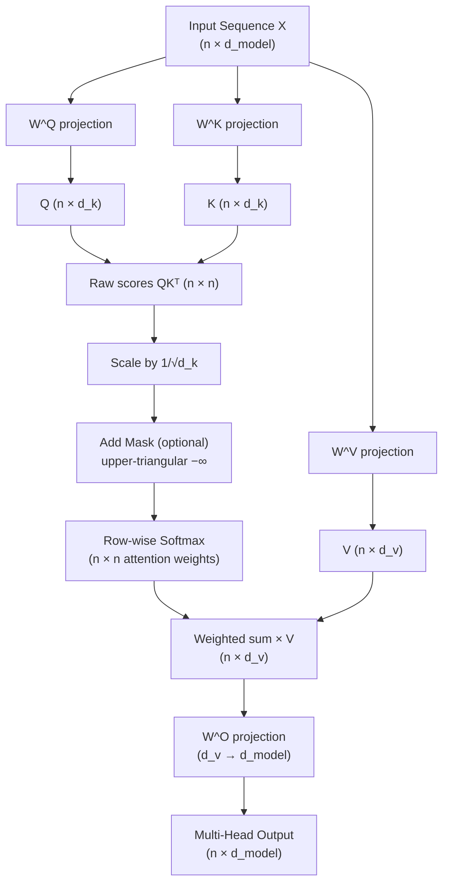

# Ch 1 — The Attention Mechanism

<div class="chapter-meta" markdown>
| | |
|---|---|
| **Difficulty** | Advanced |
| **Reading time** | 90 min |
| **Prerequisites** | Vol 4 Ch 1 (Neural Networks), Vol 4 Ch 4 (RNNs & LSTMs) |
</div>

---

## Learning Objectives

By the end of this chapter you will be able to:

1. **Explain** the fixed-size bottleneck problem in seq2seq models and articulate precisely why a single context vector cannot represent long sequences adequately.
2. **Derive** scaled dot-product attention from Bahdanau additive attention, justifying the $1/\sqrt{d_k}$ scaling factor using the expected variance of the dot product.
3. **Distinguish** self-attention, cross-attention, and causal (masked) attention — explain when each is used and why the upper-triangular mask is filled with $-\infty$ rather than zero.
4. **Implement** a complete multi-head attention module in PyTorch (`nn.Module`), including optional causal masking, and explain the parameter count formula $4 d_{\text{model}}^2$.
5. **Describe** the time and space complexity of standard attention ($O(n^2 d)$, $O(n^2)$) and explain how Flash Attention reduces the memory footprint without changing the output.

---

## 1.1 Motivation: The Fixed-Size Bottleneck

### 1.1.1 Seq2Seq Recap

The encoder-decoder architecture (Sutskever et al., 2014) uses an LSTM encoder to process source sequence $x_1, \ldots, x_T$ and compress it into a single fixed-size context vector $c = h_T$ (the final hidden state). The decoder then generates the target sequence $y_1, \ldots, y_{T'}$ conditioned solely on $c$.

This works reasonably well for short sequences but has a fundamental problem for longer ones.

### 1.1.2 The Alignment Problem

For a source sentence of 50 words compressed into a 512-dimensional vector, every word must share the same 512 numbers regardless of its individual complexity. More critically, when the decoder generates output word $y_t$, it must extract all the relevant source information from the same static vector $c$ — regardless of whether $y_t$ is aligned to the beginning, middle, or end of the source.

This is the **alignment problem**: the model cannot explicitly decide which source positions are most relevant when generating each target position.

Empirically, Bahdanau et al. (2015) showed that the vanilla seq2seq model's BLEU score degrades sharply for source sentences longer than ~20 words, while attention-augmented models maintain quality across much longer sequences.

!!! warning "The information bottleneck"
    Forcing an entire sequence's information through a fixed-size vector is equivalent to asking someone to memorise an entire book on a fixed-capacity notepad, then answer questions without looking at the book again. The notepad must be large enough to represent every book equally — an impossible constraint.

---

## 1.2 Bahdanau Additive Attention

Bahdanau et al. (2015) broke the bottleneck by allowing the decoder to **attend to all encoder hidden states** $\bar{h}_1, \ldots, \bar{h}_{T_x}$ at each decoding step.

**Alignment score** — how relevant encoder position $j$ is for decoder step $t$:

$$e_{tj} = v_a^T \tanh\!\left(W_a\, s_{t-1} + U_a\, \bar{h}_j\right)$$

where $s_{t-1}$ is the previous decoder hidden state, and $W_a$, $U_a$, $v_a$ are learned parameters.

**Attention weights** (softmax-normalised):

$$\alpha_{tj} = \frac{\exp(e_{tj})}{\sum_{k=1}^{T_x} \exp(e_{tk})}$$

**Context vector** — a weighted sum of all encoder hidden states:

$$c_t = \sum_{j=1}^{T_x} \alpha_{tj}\, \bar{h}_j$$

The $\alpha_{tj}$ matrix serves as a **soft alignment**: it can be visualised to show which source words the model attends to when generating each target word. For German-to-English translation, this recovers near-monotonic alignment with well-known syntactic reorderings (e.g., German verbs appearing at clause-end).

**Computational cost**: computing all $T_x \times T_y$ alignment scores requires $O(T_x \cdot T_y)$ forward passes through the alignment MLP — expensive. Luong et al. (2015) simplified this with multiplicative (dot-product) attention, which became the direct precursor to the Transformer's formulation.

---

## 1.3 Scaled Dot-Product Attention

### 1.3.1 Queries, Keys, and Values

The Transformer (Vaswani et al., 2017) reformulates attention using a retrieval metaphor. Given an input sequence $X \in \mathbb{R}^{n \times d_{\text{model}}}$, three linear projections produce:

- **Queries** $Q = XW^Q$ — what each position is "looking for"
- **Keys** $K = XW^K$ — what each position "offers" as a retrieval key
- **Values** $V = XW^V$ — what each position "contributes" when selected

where $W^Q, W^K \in \mathbb{R}^{d_{\text{model}} \times d_k}$ and $W^V \in \mathbb{R}^{d_{\text{model}} \times d_v}$.

In matrix form:

$$Q = XW^Q \in \mathbb{R}^{n \times d_k}, \quad K = XW^K \in \mathbb{R}^{n \times d_k}, \quad V = XW^V \in \mathbb{R}^{n \times d_v}$$

### 1.3.2 Computing Attention Scores

Raw attention scores between all pairs of positions:

$$A = QK^T \in \mathbb{R}^{n \times n}$$

Element $A_{ij}$ measures how much position $i$ should attend to position $j$. This is $O(n^2 d_k)$ to compute.

### 1.3.3 Why Divide by $\sqrt{d_k}$?

Without scaling, dot products $q_i \cdot k_j$ grow in magnitude as $d_k$ increases, pushing softmax into saturation where gradients become vanishingly small.

**Proof by variance analysis**: Let $q, k \in \mathbb{R}^{d_k}$ have independent components drawn from $\mathcal{N}(0, 1)$. The dot product $q \cdot k = \sum_{l=1}^{d_k} q_l k_l$.

By linearity of expectation:
$$\mathbb{E}[q \cdot k] = \sum_{l=1}^{d_k} \mathbb{E}[q_l]\,\mathbb{E}[k_l] = 0$$

By independence and unit variance:
$$\text{Var}[q \cdot k] = \sum_{l=1}^{d_k} \text{Var}[q_l k_l] = \sum_{l=1}^{d_k} \mathbb{E}[q_l^2]\,\mathbb{E}[k_l^2] = d_k$$

Therefore $\text{std}(q \cdot k) = \sqrt{d_k}$. Dividing by $\sqrt{d_k}$ restores unit variance, keeping softmax inputs in a useful gradient-flowing range regardless of $d_k$.

### 1.3.4 Full Formula

$$\text{Attention}(Q, K, V) = \text{softmax}\!\left(\frac{QK^T}{\sqrt{d_k}}\right) V$$

The softmax is applied **row-wise**: each query position independently normalises its attention weights over all key positions, producing a probability distribution. The output is the weighted sum of values under that distribution.

---

## 1.4 Self-Attention vs. Cross-Attention

**Self-attention**: Q, K, and V all derive from the **same** sequence. Each position attends to all other positions in the same sequence, enabling rich intra-sequence relationships.

$$\text{Self-Attention}(X) = \text{Attention}(XW^Q,\; XW^K,\; XW^V)$$

Used in: Transformer encoder (every token attends to every other token), and Transformer decoder's first sublayer (attends over the generated prefix with causal masking).

**Cross-attention**: Q comes from the **decoder** (the target sequence prefix), while K and V come from the **encoder** output (the source sequence representations).

$$\text{Cross-Attention}(X_{\text{dec}}, X_{\text{enc}}) = \text{Attention}(X_{\text{dec}} W^Q,\; X_{\text{enc}} W^K,\; X_{\text{enc}} W^V)$$

This is the Transformer's analogue of Bahdanau attention — each decoder position decides which encoder positions to draw from.

---

## 1.5 Causal (Masked) Attention

In autoregressive generation, the model predicts $y_t$ given only $y_1, \ldots, y_{t-1}$. Standard self-attention would allow position $t$ to attend to future positions $t+1, \ldots, n$, causing information leakage during training (the model could "see the answer").

**Causal masking** prevents this by adding $-\infty$ to attention scores at future positions before the softmax:

$$M_{ij} = \begin{cases} 0 & j \leq i \\ -\infty & j > i \end{cases}$$

$$\text{CausalAttention}(Q, K, V) = \text{softmax}\!\left(\frac{QK^T}{\sqrt{d_k}} + M\right) V$$

The mask $M$ is upper-triangular (strictly above the main diagonal). Adding $-\infty$ before softmax is correct because $\exp(-\infty) = 0$, so masked positions contribute exactly zero to the weighted sum with no renormalisation step needed.

!!! note "Why not zero the weights directly after softmax?"
    Setting scores to zero after softmax would not sum to 1 — renormalisation would be required as an additional operation. Adding $-\infty$ before softmax is cleaner and fully differentiable. In float32 practice, $-10^9$ is used since float32 does not overflow gracefully with $-\infty$ in all CUDA kernels.

The full attention matrix for a sequence of length $n$ has shape $(n \times n)$, requiring $O(n^2)$ memory — the dominant cost for long contexts.

---

## 1.6 Multi-Head Attention

### 1.6.1 Motivation

A single attention function computes one weighted combination of values per query. Different linguistic phenomena — syntactic agreement, coreference, local adjacency, long-range semantic dependency — require different kinds of relationships to be tracked simultaneously in the same layer.

**Multi-head attention** runs $h$ independent attention functions in parallel, each with its own learned projections:

$$\text{head}_i = \text{Attention}(QW_i^Q,\; KW_i^K,\; VW_i^V)$$

where $W_i^Q, W_i^K \in \mathbb{R}^{d_{\text{model}} \times d_k}$, $W_i^V \in \mathbb{R}^{d_{\text{model}} \times d_v}$, typically $d_k = d_v = d_{\text{model}} / h$.

### 1.6.2 Concatenation and Output Projection

The $h$ head outputs are concatenated and projected back to $d_{\text{model}}$:

$$\text{MultiHead}(Q, K, V) = \text{Concat}(\text{head}_1, \ldots, \text{head}_h)\, W^O$$

where $W^O \in \mathbb{R}^{h d_v \times d_{\text{model}}}$.

### 1.6.3 Parameter Count

| Component | Shape | Parameters |
|---|---|---|
| $W_i^Q$ per head × $h$ heads | $d_{\text{model}} \times d_k$ | $h \times d_{\text{model}}^2/h = d_{\text{model}}^2$ |
| $W_i^K$ per head × $h$ heads | $d_{\text{model}} \times d_k$ | $d_{\text{model}}^2$ |
| $W_i^V$ per head × $h$ heads | $d_{\text{model}} \times d_v$ | $d_{\text{model}}^2$ |
| $W^O$ | $d_{\text{model}} \times d_{\text{model}}$ | $d_{\text{model}}^2$ |
| **Total** | | $\mathbf{4\, d_{\text{model}}^2}$ |

The total parameter count is **independent of $h$** — more heads reorganise the same parameters into different subspaces, they do not add parameters.

### 1.6.4 What Do Heads Learn?

Empirical analysis (Voita et al., 2019; Clark et al., 2019) of trained BERT models reveals spontaneous specialisation:

- **Syntactic heads**: attend from verbs to direct objects; from adjectives to modified nouns.
- **Coreference heads**: link pronouns to their antecedents across sentences.
- **Local heads**: attend to immediately adjacent tokens (acting as learned bigram/trigram detectors).
- **Broad context heads**: diffuse attention across the full sequence without clear syntactic pattern.

This specialisation emerges purely from gradient descent on the language modelling objective — no explicit supervision is required.

---

## 1.7 Attention Computation Flow



---

## 1.8 PyTorch Implementation: Multi-Head Attention

=== "Python"

    ```python
    from __future__ import annotations

    import math

    import torch
    import torch.nn as nn
    import torch.nn.functional as F
    from torch import Tensor


    class MultiHeadAttention(nn.Module):
        """
        Scaled dot-product multi-head attention (Vaswani et al., 2017).

        Parameters
        ----------
        d_model  : Model (embedding) dimension. Must be divisible by n_heads.
        n_heads  : Number of parallel attention heads.
        dropout  : Dropout probability applied to attention weights during training.
        bias     : Whether to include bias terms in the Q/K/V/O linear projections.
        """

        def __init__(
            self,
            d_model: int,
            n_heads: int,
            dropout: float = 0.0,
            bias:    bool  = True,
        ) -> None:
            super().__init__()
            if d_model % n_heads != 0:
                raise ValueError(
                    f"d_model ({d_model}) must be divisible by n_heads ({n_heads})"
                )
            self.d_model = d_model
            self.n_heads = n_heads
            self.d_k     = d_model // n_heads   # dimension per head

            # Fused projections: equivalent to h separate (d_model → d_k) matrices
            self.W_q = nn.Linear(d_model, d_model, bias=bias)
            self.W_k = nn.Linear(d_model, d_model, bias=bias)
            self.W_v = nn.Linear(d_model, d_model, bias=bias)
            self.W_o = nn.Linear(d_model, d_model, bias=bias)

            self.attn_dropout = nn.Dropout(dropout)
            self._scale = math.sqrt(self.d_k)

        def _split_heads(self, x: Tensor) -> Tensor:
            """Reshape (B, S, d_model) → (B, H, S, d_k)."""
            B, S, _ = x.shape
            return (
                x.view(B, S, self.n_heads, self.d_k)
                 .transpose(1, 2)      # (B, H, S, d_k)
            )

        def _merge_heads(self, x: Tensor) -> Tensor:
            """Reshape (B, H, S, d_k) → (B, S, d_model)."""
            B, _, S, _ = x.shape
            return (
                x.transpose(1, 2)     # (B, S, H, d_k)
                 .contiguous()
                 .view(B, S, self.d_model)
            )

        def forward(
            self,
            query: Tensor,
            key:   Tensor,
            value: Tensor,
            mask:  Tensor | None = None,
        ) -> tuple[Tensor, Tensor]:
            """
            Compute multi-head attention.

            Parameters
            ----------
            query : (B, S_q, d_model) — query sequence.
            key   : (B, S_k, d_model) — key sequence.
            value : (B, S_k, d_model) — value sequence.
            mask  : (B, 1, S_q, S_k) boolean — True where attention IS permitted.
                    Use `make_causal_mask` for autoregressive masking.

            Returns
            -------
            output  : (B, S_q, d_model)
            weights : (B, H, S_q, S_k) — attention probabilities (for inspection).
            """
            Q = self._split_heads(self.W_q(query))   # (B, H, S_q, d_k)
            K = self._split_heads(self.W_k(key))     # (B, H, S_k, d_k)
            V = self._split_heads(self.W_v(value))   # (B, H, S_k, d_k)

            # Scaled dot-product scores: (B, H, S_q, S_k)
            scores = torch.matmul(Q, K.transpose(-2, -1)) / self._scale

            # Apply mask: positions where mask=False get −inf → softmax → 0
            if mask is not None:
                scores = scores.masked_fill(~mask, float("-inf"))

            weights = F.softmax(scores, dim=-1)
            weights = self.attn_dropout(weights)

            context = torch.matmul(weights, V)       # (B, H, S_q, d_k)
            output  = self.W_o(self._merge_heads(context))  # (B, S_q, d_model)
            return output, weights


    def make_causal_mask(seq_len: int, device: torch.device) -> Tensor:
        """
        Create a lower-triangular causal mask.

        Returns
        -------
        Tensor of shape (1, 1, seq_len, seq_len) where True = attending permitted.
        """
        return (
            torch.tril(torch.ones(seq_len, seq_len, device=device, dtype=torch.bool))
            .unsqueeze(0)
            .unsqueeze(0)
        )


    # ---------------------------------------------------------------------------
    # Verification
    # ---------------------------------------------------------------------------
    if __name__ == "__main__":
        torch.manual_seed(42)
        B, S, d_model, H = 2, 16, 256, 8

        mha  = MultiHeadAttention(d_model=d_model, n_heads=H, dropout=0.1)
        x    = torch.randn(B, S, d_model)
        mask = make_causal_mask(S, device=torch.device("cpu"))

        out, w = mha(x, x, x, mask=mask)
        print(f"Output : {out.shape}")        # (2, 16, 256)
        print(f"Weights: {w.shape}")          # (2, 8, 16, 16)

        # Upper triangle of attention weights should be exactly zero
        upper_max = w[0, 0].triu(diagonal=1).max().item()
        print(f"Max upper-triangle weight: {upper_max:.2e}")   # ~0.0
    ```

---

## 1.9 Complexity Analysis

| Operation | Time complexity | Space complexity |
|---|---|---|
| Q, K, V projections | $O(n d_{\text{model}}^2)$ | $O(n d_{\text{model}})$ |
| Score matrix $QK^T$ | $O(n^2 d_k)$ | $O(n^2)$ |
| Row-wise softmax | $O(n^2)$ | $O(n^2)$ |
| Weighted sum $\text{Attn} \cdot V$ | $O(n^2 d_v)$ | $O(n d_v)$ |
| Output projection | $O(n d_{\text{model}}^2)$ | $O(n d_{\text{model}})$ |
| **Bottleneck** | $O(n^2 d)$ | $\mathbf{O(n^2)}$ |

The $O(n^2)$ **attention matrix** dominates memory. For $n = 32{,}768$ tokens with float32, the full attention matrix per head is approximately $32768^2 \times 4 \approx 4\,\text{GB}$ — prohibitive for long-context models with standard implementations.

---

## 1.10 Flash Attention: IO-Aware Efficient Attention

**Flash Attention** (Dao et al., 2022) computes the exact same output as standard attention without materialising the full $n \times n$ attention matrix in GPU High Bandwidth Memory (HBM).

**Core idea — tiling**: the algorithm tiles $Q$, $K$, $V$ into blocks small enough to fit in the GPU's on-chip SRAM. For each pair of Q-block and K/V-block, it computes the partial attention output using an *online softmax* algorithm that maintains running maximum and normalisation statistics, accumulating the final output block-by-block.

**Why this is IO-efficient**: GPU HBM access is the performance bottleneck, not arithmetic. Standard attention writes the full $n \times n$ matrix to HBM, then reads it back for the softmax, then again for the value multiplication. Flash Attention never writes the attention matrix to HBM — everything stays in SRAM within a block.

| Property | Standard Attention | Flash Attention |
|---|---|---|
| Time complexity | $O(n^2 d)$ | $O(n^2 d)$ |
| Memory complexity | $O(n^2)$ | $O(n)$ |
| HBM read/write | $O(n^2)$ | $O(n)$ |
| Practical speedup | 1× | 2–4× |
| Output equivalence | — | Exact |

!!! tip "Flash Attention in PyTorch"
    PyTorch 2.0+ ships Flash Attention via `F.scaled_dot_product_attention`:

    ```python
    import torch.nn.functional as F

    # Causal self-attention (CUDA ≥ 8.0 uses Flash Attention kernel automatically)
    output = F.scaled_dot_product_attention(Q, K, V, is_causal=True)
    ```

    This is the production path for all major LLMs and is preferred over a hand-rolled implementation for performance.

---

## 1.11 Exercises

**Exercise 1.1 — Attention by Hand**  
Given $Q = \begin{bmatrix}1 & 0 \\ 0 & 1\end{bmatrix}$, $K = \begin{bmatrix}1 & 0 \\ 0 & 1 \\ 1 & 1\end{bmatrix}$, $V = \begin{bmatrix}1 & 2 \\ 3 & 4 \\ 5 & 6\end{bmatrix}$ with $d_k = 2$, compute the attention output without and with the $\sqrt{d_k}$ scaling. Show the full $2 \times 3$ attention weight matrix for each case and explain how scaling changes the distribution's concentration.

**Exercise 1.2 — Causal Mask Verification**  
Instantiate `MultiHeadAttention(d_model=64, n_heads=4)` and run a forward pass on a sequence of length 12 with the causal mask applied. Extract the attention weights for head 0 and assert that every entry above the main diagonal is numerically zero (to within float32 precision). Then run the same forward pass *without* the mask and visualise the difference in weight matrices.

**Exercise 1.3 — NumPy Attention Implementation**  
Implement scaled dot-product attention from scratch in NumPy with no PyTorch:

```python
import numpy as np

def scaled_dot_product_attention(
    Q:    np.ndarray,           # (S_q, d_k)
    K:    np.ndarray,           # (S_k, d_k)
    V:    np.ndarray,           # (S_k, d_v)
    mask: np.ndarray | None = None,  # (S_q, S_k) bool, True = attend
) -> tuple[np.ndarray, np.ndarray]:
    """Return (output of shape (S_q, d_v), attention weights (S_q, S_k))."""
    ...
```

Verify your output against `F.scaled_dot_product_attention` for a random $(S_q=5, S_k=7, d_k=4, d_v=6)$ case to within tolerance `1e-5`.

**Exercise 1.4 — Attention Head Visualisation**  
Train a small 2-layer, 4-head Transformer encoder ($d_{\text{model}}=64$) on a synthetic sequence copying task. After training, extract and plot the attention weight heatmaps for all 4 heads in layer 1 for 5 example sequences of length 20. Identify heads that appear to specialise in: (a) attending to adjacent positions, (b) attending to all positions uniformly, and (c) attending to specific position relationships.

**Exercise 1.5 — Complexity Profiling**  
Profile GPU memory (using `torch.cuda.max_memory_allocated`) and wall-clock time of your `MultiHeadAttention` implementation versus `F.scaled_dot_product_attention` for sequence lengths $n \in \{512, 1024, 2048, 4096, 8192\}$ with $d_{\text{model}} = 512$, $H = 8$, batch size 4. Plot both metrics as functions of $n$ on log-log axes. Fit the empirical memory curve to verify $O(n^2)$ scaling for the naive implementation and $O(n)$ for Flash Attention.

---

## Summary

Attention solves the fixed-size bottleneck in seq2seq models by allowing each decoder position to **directly query** all encoder positions and combine their representations through a learned, input-dependent weighting.

**Bahdanau additive attention** introduced the core idea: alignment scores, softmax normalisation, context vector as weighted sum. **Scaled dot-product attention** replaces the alignment MLP with a simple matrix product scaled by $1/\sqrt{d_k}$ — the scaling is essential to prevent softmax saturation as the key dimension grows.

**Multi-head attention** runs $h$ independent attention functions in parallel at zero extra parameter cost, allowing the model to simultaneously specialise different heads for different linguistic relationships.

**Causal masking** restricts self-attention to previous positions only via an upper-triangular $-\infty$ mask, enabling autoregressive generation with correct gradient flow.

**Flash Attention** eliminates the $O(n^2)$ memory bottleneck through block-tiled IO-aware computation, maintaining exact numerical equivalence to the standard formula while reducing memory to $O(n)$.

| Concept | Formula |
|---|---|
| Scaled dot-product attention | $\text{softmax}(QK^T/\sqrt{d_k})\,V$ |
| Multi-head attention | $\text{Concat}(\text{head}_1,\ldots,\text{head}_h)\,W^O$ |
| MHA parameter count | $4 d_{\text{model}}^2$ |
| Attention time complexity | $O(n^2 d)$ |
| Standard space complexity | $O(n^2)$ |
| Flash Attention space | $O(n)$ |

!!! tip "Next steps"
    Chapter 2 assembles the complete Transformer architecture around the attention mechanism: positional encoding, encoder and decoder blocks with residual connections and layer normalisation, and a full PyTorch encoder-decoder implementation trained on a toy translation task.
