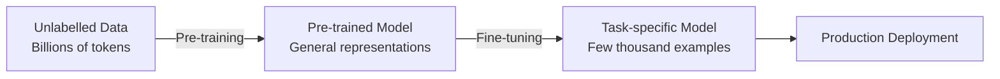

# Ch 3 — Pre-trained Models & Transfer Learning

<div class="chapter-meta">
  <span>📚 Volume 5 — Transformers</span>
  <span>⏱ Reading time: 90 min</span>
  <span>📊 Difficulty: Advanced</span>
  <span>🔗 Prerequisites: Ch 1 (Attention), Ch 2 (Transformer Architecture)</span>
</div>

## Learning Objectives

By the end of this chapter you will be able to:

1. Explain the pre-training and fine-tuning paradigm and why it works.
2. Distinguish encoder-only, decoder-only, and encoder-decoder architectures and choose correctly for a task.
3. Fine-tune a BERT model for text classification using Hugging Face Transformers.
4. Apply parameter-efficient fine-tuning (PEFT) methods including LoRA and prompt tuning.
5. Evaluate fine-tuned models correctly and avoid common evaluation pitfalls.

---

## 3.1 The Pre-train → Fine-tune Paradigm

Pre-training on large unlabelled corpora and fine-tuning on small labelled datasets represents a fundamental shift in how NLP systems are built.

**Why pre-training works:**

- The model learns general linguistic structure: syntax, semantics, world knowledge, and reasoning patterns.
- Fine-tuning requires far fewer labelled examples than training from scratch.
- The representations transfer across tasks.



---

## 3.2 Architecture Families

| Architecture | Attention | Pre-training Objective | Best For |
|---|---|---|---|
| Encoder-only (BERT) | Bidirectional | Masked LM + NSP | Classification, NER, QA (extractive) |
| Decoder-only (GPT) | Causal | Causal LM | Text generation, reasoning, agents |
| Encoder-decoder (T5, BART) | Cross-attention | Span corruption / denoising | Translation, summarisation, abstractive QA |

### BERT (Encoder-only)

BERT uses **masked language modelling** (MLM): randomly mask 15% of tokens and predict them.

\[
\mathcal{L}_\text{MLM} = -\sum_{i \in \mathcal{M}} \log P(x_i | x_{\backslash \mathcal{M}})
\]

The bidirectional attention allows each token to attend to all other tokens — powerful for understanding tasks, but cannot generate autoregressively.

### GPT (Decoder-only)

Trained with causal language modelling:

\[
\mathcal{L}_\text{CLM} = -\sum_{t=1}^{T} \log P(x_t | x_1, \ldots, x_{t-1})
\]

The causal mask restricts each token to attend only to previous tokens. GPT models scale to become LLMs.

### T5 (Encoder-Decoder)

Frames every task as text-to-text. Pre-trained with span corruption: replace random contiguous spans with sentinel tokens and train the decoder to reconstruct them.

---

## 3.3 Fine-Tuning Strategies

### Full Fine-Tuning

All model parameters are updated. Most powerful but requires significant compute and risks catastrophic forgetting on small datasets.

```python
from transformers import AutoModelForSequenceClassification, AutoTokenizer, TrainingArguments, Trainer
import torch

model_name = "bert-base-uncased"
tokenizer = AutoTokenizer.from_pretrained(model_name)
model = AutoModelForSequenceClassification.from_pretrained(model_name, num_labels=2)

training_args = TrainingArguments(
    output_dir="./fine-tuned-bert",
    num_train_epochs=3,
    per_device_train_batch_size=16,
    per_device_eval_batch_size=64,
    learning_rate=2e-5,
    weight_decay=0.01,
    evaluation_strategy="epoch",
    save_strategy="epoch",
    load_best_model_at_end=True,
    warmup_ratio=0.1,
    fp16=torch.cuda.is_available(),
)

trainer = Trainer(
    model=model,
    args=training_args,
    train_dataset=tokenized_train,
    eval_dataset=tokenized_val,
    tokenizer=tokenizer,
)
trainer.train()
```

### Feature Extraction

Freeze all model weights; only train a classification head. Fast and memory-efficient but less accurate than full fine-tuning.

```python
# Freeze all backbone parameters
for param in model.bert.parameters():
    param.requires_grad = False

# Only the classifier head is trainable
print(f"Trainable params: {sum(p.numel() for p in model.parameters() if p.requires_grad):,}")
```

### LoRA (Low-Rank Adaptation)

LoRA freezes pre-trained weights and injects trainable low-rank matrices into each attention layer:

\[
W' = W + \Delta W = W + BA \quad \text{where } B \in \mathbb{R}^{d \times r},\ A \in \mathbb{R}^{r \times k},\ r \ll \min(d, k)
\]

Trainable parameters: \(r(d + k)\) vs \(dk\) for full fine-tuning — typically a 1000× reduction at rank 8.

```python
from peft import get_peft_model, LoraConfig, TaskType

lora_config = LoraConfig(
    task_type=TaskType.SEQ_CLS,
    r=8,                     # rank
    lora_alpha=16,           # scaling factor
    target_modules=["query", "value"],
    lora_dropout=0.1,
    bias="none",
)

peft_model = get_peft_model(model, lora_config)
peft_model.print_trainable_parameters()
# trainable params: 294,912 || all params: 109,777,410 || trainable%: 0.27
```

---

## 3.4 Evaluating Fine-Tuned Models

!!! warning "Evaluation Pitfall"
    Always evaluate on examples the model has never seen. If the same tokenizer vocabulary was used to create your fine-tuning dataset, ensure no test set contamination from pre-training data.

### Text Classification Metrics

```python
from sklearn.metrics import classification_report
import numpy as np

def compute_metrics(eval_pred):
    logits, labels = eval_pred
    predictions = np.argmax(logits, axis=-1)
    return {
        "accuracy": (predictions == labels).mean(),
        "f1": f1_score(labels, predictions, average="macro"),
    }
```

### Common Fine-Tuning Pitfalls

1. **Learning rate too high** — catastrophic forgetting. Use 1e-5 to 5e-5 for BERT-scale models.
2. **Too many epochs** — overfitting on small datasets. Use early stopping.
3. **Forgetting the warmup** — gradients are unstable at the start; always use a warmup period.
4. **Not shuffling training data** — the model sees class imbalance in temporal order.
5. **Evaluating on the training set** — always use a held-out evaluation set.

---

## 3.5 Prominent Pre-trained Models

| Model | Params | Architecture | Key Innovation |
|---|---|---|---|
| BERT-base | 110M | Encoder | Bidirectional pre-training |
| RoBERTa | 125M | Encoder | Better BERT training (more data, no NSP) |
| DeBERTa | 140M | Encoder | Disentangled attention + enhanced mask decoder |
| T5-base | 220M | Enc-Dec | Unified text-to-text framework |
| GPT-2 | 1.5B | Decoder | Open-source large generative model |
| LLaMA-2 7B | 7B | Decoder | Open instruction-tuned LLM |
| Mistral 7B | 7B | Decoder | SWA + GQA; beats LLaMA-2 13B |

---

## Exercises

1. Fine-tune `distilbert-base-uncased` on the IMDB sentiment dataset (HuggingFace `datasets`) and report accuracy, F1, and confusion matrix.
2. Compare full fine-tuning vs LoRA (r=8) on IMDB: trainable parameter counts, training time, and final F1.
3. Implement a text classification pipeline using T5-base in a text-to-text format (output the label word "positive" or "negative").
4. For a 500-sample dataset, which fine-tuning strategy would you choose and why? Justify your answer quantitatively.
5. Research question: What is catastrophic forgetting? Describe one technique from the continual learning literature that addresses it.

---

## Summary

- Pre-training on large unlabelled data followed by fine-tuning on small labelled datasets is the dominant NLP paradigm.
- **Encoder-only** (BERT): best for understanding tasks. **Decoder-only** (GPT): best for generation. **Encoder-decoder** (T5): best for sequence transformation.
- Fine-tuning strategies range from full fine-tuning (most compute) to feature extraction (least compute) to LoRA (best tradeoff).
- LoRA reduces trainable parameters by 100-1000× with minimal accuracy loss.
- Always use a held-out test set and report multiple metrics; accuracy alone is misleading on imbalanced classes.
