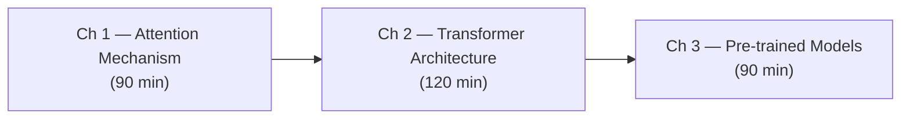

# Volume 5 — Transformers

The Transformer architecture (Vaswani et al., "Attention Is All You Need", 2017) is the most consequential development in the history of modern AI. By replacing recurrence with self-attention, Transformers unlocked full sequence parallelism — all positions are processed simultaneously rather than one step at a time — enabling models to be trained on orders of magnitude more data than was feasible with RNNs. Every frontier model in production today — GPT-4, Claude, Gemini, LLaMA, BERT, T5 — is a Transformer or a direct descendant, demonstrating the architecture's generality across language, vision, audio, protein structure, and scientific reasoning.

---

## Volume Overview

This volume builds the Transformer from first principles. We begin with the attention mechanism itself — the single primitive that makes everything else work — deriving it from the fixed-size bottleneck problem in seq2seq models and justifying every design choice (the scaling factor, multi-headedness, the $O(n^2)$ attention matrix) mathematically. We then assemble the complete encoder-decoder architecture: positional encoding, multi-head attention sublayers, position-wise feed-forward networks, residual connections, and layer normalisation. A decoder-only variant with causal masking reveals the architecture behind language generation. The final chapter covers the pre-training era: BERT's masked language modelling, GPT's autoregressive pre-training, the scaling laws that explain why bigger models keep improving, and the practical mechanics of fine-tuning for downstream tasks.

---

## Dependency Graph

---

## Chapter Overview

| Chapter | Title | Duration | Key Topics |
|---|---|---|---|
| **Ch 1** | Attention Mechanism | 90 min | Bahdanau attention, scaled dot-product, multi-head, Flash Attention |
| **Ch 2** | Transformer Architecture | 120 min | Positional encoding, encoder/decoder blocks, Pre-LN, full implementation |
| **Ch 3** | Pre-trained Models | 90 min | BERT, GPT, scaling laws, fine-tuning, RLHF overview |

---

## Prerequisites

!!! prerequisite "Before starting this volume"
    Complete **Volume 4 — Deep Learning** in full, with particular emphasis on:

    - **Ch 1 (Neural Networks)**: feedforward networks, activation functions, backpropagation
    - **Ch 2 (Training Deep Networks)**: optimisers, regularisation, batch normalisation, residual connections
    - **Ch 4 (Recurrent Networks & LSTMs)**: the vanishing gradient problem, the motivation for attention, seq2seq models

    Familiarity with PyTorch `nn.Module` and tensor broadcasting is assumed throughout.

---

## Volume-Level Learning Outcomes

By completing all three chapters you will be able to:

1. **Derive** scaled dot-product attention from the fixed-size bottleneck and the Bahdanau precursor, explaining every component including the $\sqrt{d_k}$ scaling factor.
2. **Implement** a complete multi-head self-attention module in PyTorch from scratch, including optional causal masking, and verify its output against `nn.MultiheadAttention`.
3. **Assemble** a full Transformer encoder-decoder in PyTorch with correct positional encoding, residual connections, and layer normalisation, then train it on a toy translation task.
4. **Distinguish** encoder-only (BERT), decoder-only (GPT), and encoder-decoder (T5) architectures and explain which is appropriate for classification, generation, and seq2seq tasks respectively.
5. **Explain** the neural scaling laws (Kaplan et al., 2020) — the power-law relationships between model size, dataset size, compute budget, and validation loss — and use them to predict the optimal model size for a given compute budget.
6. **Apply** parameter-efficient fine-tuning methods (LoRA, prefix tuning) to adapt a pre-trained Transformer to a downstream task with a fraction of the computational cost of full fine-tuning.

---

!!! note "Read the original paper"
    Vaswani, A., Shazeer, N., Parmar, N., Uszkoreit, J., Jones, L., Gomez, A. N., ... & Polosukhin, I. (2017). **Attention Is All You Need**. *Advances in Neural Information Processing Systems*, 30.

    Available at: [https://arxiv.org/abs/1706.03762](https://arxiv.org/abs/1706.03762)

    The paper is eight pages and remarkably readable. Read Sections 3 (Model Architecture) and 4 (Attention) before starting Ch 1. Many details that seem arbitrary in isolation become natural once you see the original derivation and the ablation study results in Table 3.
