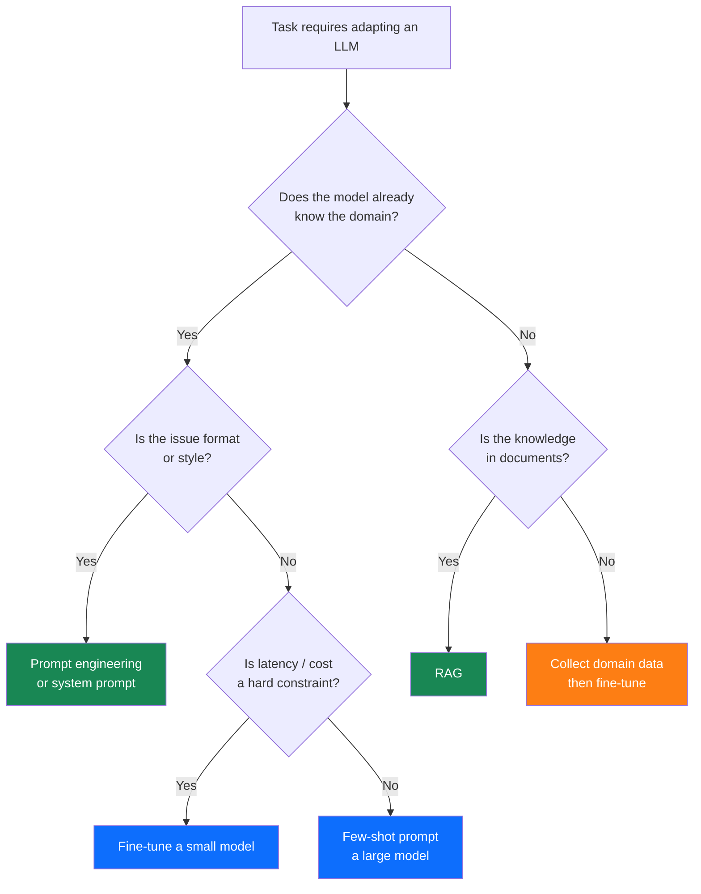

# Ch 3 — Fine-Tuning LLMs

!!! abstract
    Prompting unlocks the general capabilities of a pre-trained model, but it cannot alter the model's
    internal knowledge, change its default tone, or teach it highly specialised formatting conventions.
    Fine-tuning addresses these limitations. This chapter covers the full spectrum — from
    compute-intensive full fine-tuning to LoRA adapters that fit on a single consumer GPU — and
    closes with the preference-optimisation techniques that are reshaping how we train helpful models.

---

## Learning Objectives

By the end of this chapter you will be able to:

1. Apply the fine-tune vs prompt vs RAG decision framework to a given real-world use case.
2. Explain the LoRA reparameterisation mathematically and calculate trainable parameter counts.
3. Configure a QLoRA training run for a 7 B parameter model on a single 24 GB GPU.
4. Prepare an instruction fine-tuning dataset in Alpaca format and apply quality-filtering heuristics.
5. Evaluate a fine-tuned model using perplexity, ROUGE, and LLM-as-judge, and interpret the results.

---

## 3.1 When to Fine-Tune vs Prompt vs RAG

Choosing the right adaptation strategy is a consequential engineering decision. The following
decision framework captures the most important axes.



| Strategy | Pros | Cons | Best for |
|----------|------|------|----------|
| Prompt engineering | No training; instant iteration | Limited by context window; costly at high volume | Prototypes; general tasks |
| RAG | Fresh knowledge; no retraining | Retrieval adds latency; retrieval can fail | Large knowledge bases; frequently updated facts |
| Full fine-tune | Maximum expressiveness | Huge compute; catastrophic forgetting risk | Small specialised models; style transfer |
| LoRA / QLoRA | Cheap; composable; reversible | Smaller capacity gain than full FT | Most production fine-tuning |

---

## 3.2 Full Fine-Tuning

In full fine-tuning **all** model parameters \(\theta\) are updated via gradient descent on the
task-specific loss. For an instruction-following dataset with pairs \((x_i, y_i)\):

$$
\mathcal{L}_{FT} = -\frac{1}{|\mathcal{D}|} \sum_{(x, y) \in \mathcal{D}} \sum_{t=1}^{|y|} \log P_\theta(y_t \mid x, y_{<t})
$$

Note: loss is only computed on the **response tokens** \(y\), not the instruction tokens \(x\).

**Compute requirements (rough rule of thumb):**

| Model size | Training precision | Approx. GPU memory | GPU recommendation |
|-----------|-------------------|--------------------|--------------------|
| 7 B | bfloat16 | ~120 GB | 2–4× A100-80GB |
| 13 B | bfloat16 | ~220 GB | 4–8× A100-80GB |
| 70 B | bfloat16 | ~1.4 TB | 16–32× A100-80GB |

Full fine-tuning at this scale requires distributed training (FSDP or DeepSpeed ZeRO-3). In most
production scenarios, LoRA is preferred.

---

## 3.3 LoRA — Low-Rank Adaptation

LoRA (Hu et al., 2022) freezes the pre-trained weights and injects small **trainable rank-\(r\)
matrices** into the attention projection layers.

### 3.3.1 The Mathematical Reparameterisation

For a pre-trained weight matrix \(W_0 \in \mathbb{R}^{d \times k}\), LoRA adds:

$$
W = W_0 + \Delta W = W_0 + BA
$$

where \(B \in \mathbb{R}^{d \times r}\) and \(A \in \mathbb{R}^{r \times k}\) with rank
\(r \ll \min(d, k)\). Only \(A\) and \(B\) are trained; \(W_0\) is frozen.

During initialisation: \(A\) is random Gaussian, \(B = 0\), so \(\Delta W = 0\) at the start
of training (no disruption to the pre-trained model).

The effective weight during forward pass:

$$
h = W_0 x + \frac{\alpha}{r} BA x
$$

where \(\alpha\) is a scaling hyperparameter (typically set to `r` so the ratio \(\alpha / r = 1\)).

### 3.3.2 Trainable Parameter Calculation

For a single linear projection \(W_0 \in \mathbb{R}^{4096 \times 4096}\) with \(r = 16\):

$$
\text{LoRA params} = d \cdot r + r \cdot k = 4096 \times 16 + 16 \times 4096 = 131{,}072
$$

Compare to the frozen matrix: \(4096 \times 4096 = 16{,}777{,}216\) parameters. LoRA trains
**0.78 %** of the original matrix parameters.

For a 7 B model applying LoRA to all Q, K, V, and Output projections in all 32 layers:

$$
\text{Total LoRA params} = 4 \times 32 \times 2 \times (4096 \times 16) \approx 17 \text{ M} \approx 0.24\%
$$

### 3.3.3 LoRA Hyperparameters

| Hyperparameter | Typical range | Effect |
|---------------|--------------|--------|
| Rank \(r\) | 4 – 128 | Higher = more capacity; more memory |
| Alpha \(\alpha\) | = \(r\) or \(2r\) | Scaling of LoRA output |
| Target modules | q_proj, v_proj (min); all linear (max) | Coverage vs memory |
| Dropout | 0.05 – 0.1 | Regularisation |

---

## 3.4 QLoRA

QLoRA (Dettmers et al., 2023) combines two innovations:

1. **4-bit NormalFloat (NF4) quantisation** of the frozen base model — reduces base model memory
   by ~4× vs bfloat16.
2. **Double quantisation** — quantises the quantisation constants themselves for a further ~0.4 bits
   per parameter saving.
3. **Paged optimisers** — use NVIDIA unified memory to handle optimizer state spikes without OOM.

LoRA adapters remain in bfloat16 and receive full-precision gradients even though the base model
is frozen and quantised.

**Memory comparison for LLaMA-3-8B:**

| Configuration | GPU memory (model) | Trainable params |
|---------------|--------------------|-----------------|
| Full fine-tune (bf16) | ~128 GB | 8 B |
| LoRA r=16 (bf16) | ~64 GB | ~17 M |
| QLoRA r=16 (NF4) | **~10 GB** | ~17 M |

QLoRA makes fine-tuning a 7–13 B model feasible on a **single consumer GPU** (RTX 3090/4090, 24 GB).

---

## 3.5 Instruction Fine-Tuning

**Instruction fine-tuning** adapts a base model to follow natural-language instructions. The training
data consists of `(instruction, input, output)` triples.

### 3.5.1 Alpaca Format

Stanford Alpaca (Taori et al., 2023) standardised a widely adopted format:

```json
[
  {
    "instruction": "Translate the following sentence to French.",
    "input": "The quick brown fox jumps over the lazy dog.",
    "output": "Le renard brun rapide saute par-dessus le chien paresseux."
  },
  {
    "instruction": "Summarise the following paragraph in one sentence.",
    "input": "Large language models are trained on vast datasets...",
    "output": "LLMs are trained on large text corpora to predict next tokens."
  }
]
```

When `input` is empty the prompt collapses to instruction-only format:

```
Below is an instruction that describes a task. Write a response that
appropriately completes the request.

### Instruction:
{instruction}

### Response:
{output}
```

### 3.5.2 Chat / ShareGPT Format

Modern models use a multi-turn conversation format (often called ShareGPT format) that supports
system prompts and alternating human/assistant turns:

```json
{
  "conversations": [
    {"from": "system", "value": "You are a helpful coding assistant."},
    {"from": "human", "value": "How do I reverse a list in Python?"},
    {"from": "gpt", "value": "You can reverse a list using `lst.reverse()` (in-place) or `lst[::-1]` (new list)."}
  ]
}
```

---

## 3.6 DPO — Direct Preference Optimisation

DPO (Rafailov et al., 2023) is an alternative to RLHF that trains directly on preference pairs
without requiring a separate reward model or the complexity of PPO.

### 3.6.1 Preference Data

For each prompt \(x\), human annotators provide a **chosen** response \(y_w\) (preferred) and a
**rejected** response \(y_l\):

```json
{
  "prompt": "Explain quantum entanglement simply.",
  "chosen": "Quantum entanglement means two particles share a quantum state...",
  "rejected": "Quantum entanglement is a complex physics phenomenon..."
}
```

### 3.6.2 DPO Objective

DPO derives from the RLHF objective analytically and collapses reward modelling + RL into a single
supervised loss:

$$
\mathcal{L}_{DPO}(\pi_\theta; \pi_\text{ref}) =
  -\mathbb{E}_{(x, y_w, y_l) \sim \mathcal{D}} \!\left[
    \log \sigma\!\left(
      \beta \log \frac{\pi_\theta(y_w \mid x)}{\pi_\text{ref}(y_w \mid x)}
      - \beta \log \frac{\pi_\theta(y_l \mid x)}{\pi_\text{ref}(y_l \mid x)}
    \right)
  \right]
$$

where:

- \(\pi_\theta\) is the model being trained.
- \(\pi_\text{ref}\) is the frozen reference model (the SFT checkpoint).
- \(\beta > 0\) controls the KL divergence penalty (typically 0.1 – 0.5).
- \(\sigma\) is the sigmoid function.

Intuitively, DPO increases the log-probability ratio of the chosen response over the reference
model while decreasing the same ratio for the rejected response — and the \(\beta\) term prevents
the policy from moving too far from the reference.

---

## 3.7 Dataset Preparation

The quality of training data is the dominant factor in fine-tuning success.

### 3.7.1 Data Cleaning Pipeline

```python
import re
from typing import Generator

def is_valid_example(example: dict) -> bool:
    """Heuristic quality filter for instruction-following examples."""
    instruction = example.get("instruction", "")
    output = example.get("output", "")

    if len(instruction.split()) < 3:          # Too short
        return False
    if len(output.split()) < 5:               # Too short
        return False
    if len(output.split()) > 2000:            # Truncated / too long
        return False
    if output.strip() == instruction.strip(): # Copy-paste failure
        return False
    if re.search(r"<\|.*?\|>", output):       # Leaked special tokens
        return False
    return True

def clean_dataset(
    raw: list[dict],
) -> Generator[dict, None, None]:
    for ex in raw:
        ex["instruction"] = ex["instruction"].strip()
        ex["output"] = ex["output"].strip()
        if is_valid_example(ex):
            yield ex
```

### 3.7.2 Deduplication

Near-duplicate training examples harm generalisation and inflate effective dataset size metrics.
Use MinHash LSH for fuzzy deduplication:

```python
from datasketch import MinHash, MinHashLSH

def build_minhash(text: str, num_perm: int = 128) -> MinHash:
    m = MinHash(num_perm=num_perm)
    for word in text.lower().split():
        m.update(word.encode("utf8"))
    return m

def deduplicate(examples: list[dict], threshold: float = 0.85) -> list[dict]:
    lsh = MinHashLSH(threshold=threshold, num_perm=128)
    unique: list[dict] = []
    for i, ex in enumerate(examples):
        m = build_minhash(ex["instruction"] + " " + ex["output"])
        if not lsh.query(m):
            lsh.insert(str(i), m)
            unique.append(ex)
    return unique
```

---

## 3.8 Evaluation

### 3.8.1 Intrinsic Metrics

| Metric | Formula | Measures | Limitations |
|--------|---------|---------|------------|
| Perplexity | \(\exp\!\left(-\frac{1}{N}\sum \log P(w_i)\right)\) | Language model fit | Not task quality |
| BLEU | n-gram precision (clipped) | Translation quality | Penalises paraphrase |
| ROUGE-L | Longest common subsequence F1 | Summarisation recall | Surface-level |

### 3.8.2 LLM-as-Judge for Fine-Tuning Evaluation

```python
import anthropic
import json

client = anthropic.Anthropic()

EVAL_PROMPT = """
Compare two AI responses to the following instruction. Decide which is better
and explain why. Then output JSON: {{"winner": "A" or "B", "reason": "..."}}

Instruction: {instruction}

Response A (baseline):
{response_a}

Response B (fine-tuned):
{response_b}
""".strip()

def pairwise_judge(instruction: str, response_a: str, response_b: str) -> dict:
    msg = client.messages.create(
        model="claude-opus-4-5",
        max_tokens=512,
        messages=[{"role": "user", "content": EVAL_PROMPT.format(
            instruction=instruction,
            response_a=response_a,
            response_b=response_b,
        )}]
    )
    return json.loads(msg.content[0].text)
```

### 3.8.3 Standard Benchmarks

| Benchmark | Focus | Metric |
|-----------|-------|--------|
| MMLU | World knowledge | Accuracy (57 subjects) |
| HellaSwag | Commonsense reasoning | Accuracy |
| ARC-Challenge | Grade-school science | Accuracy |
| TruthfulQA | Factuality | MC accuracy + generation |
| MT-Bench | Instruction following | GPT-4 score (1–10) |

Run benchmarks with `lm-evaluation-harness` (EleutherAI):

```bash
lm_eval --model hf \
    --model_args pretrained=./my-finetuned-model \
    --tasks mmlu,hellaswag,arc_challenge \
    --device cuda \
    --batch_size 8
```

---

## 3.9 Training with Hugging Face TRL

The TRL (Transformer Reinforcement Learning) library provides high-level trainers for SFT, DPO,
and PPO.

### 3.9.1 QLoRA + SFT with TRL

```python
from datasets import load_dataset
from peft import LoraConfig, get_peft_model, prepare_model_for_kbit_training
from transformers import AutoModelForCausalLM, AutoTokenizer, BitsAndBytesConfig
from trl import SFTConfig, SFTTrainer
import torch

MODEL_ID = "meta-llama/Meta-Llama-3-8B"

# 1. Load tokeniser
tokenizer = AutoTokenizer.from_pretrained(MODEL_ID)
tokenizer.pad_token = tokenizer.eos_token

# 2. Load model in 4-bit (QLoRA)
bnb_config = BitsAndBytesConfig(
    load_in_4bit=True,
    bnb_4bit_quant_type="nf4",
    bnb_4bit_compute_dtype=torch.bfloat16,
    bnb_4bit_use_double_quant=True,
)
model = AutoModelForCausalLM.from_pretrained(
    MODEL_ID,
    quantization_config=bnb_config,
    device_map="auto",
)
model = prepare_model_for_kbit_training(model)

# 3. Configure LoRA
lora_config = LoraConfig(
    r=16,
    lora_alpha=16,
    target_modules=["q_proj", "k_proj", "v_proj", "o_proj"],
    lora_dropout=0.05,
    bias="none",
    task_type="CAUSAL_LM",
)
model = get_peft_model(model, lora_config)
model.print_trainable_parameters()
# trainable params: 17,825,792 || all params: 8,048,467,968 || trainable%: 0.2215

# 4. Load dataset (Alpaca format)
dataset = load_dataset("tatsu-lab/alpaca", split="train")

def format_alpaca(example: dict) -> dict:
    """Format to a single text string for SFTTrainer."""
    if example["input"]:
        text = (
            f"### Instruction:\n{example['instruction']}\n\n"
            f"### Input:\n{example['input']}\n\n"
            f"### Response:\n{example['output']}"
        )
    else:
        text = (
            f"### Instruction:\n{example['instruction']}\n\n"
            f"### Response:\n{example['output']}"
        )
    return {"text": text}

dataset = dataset.map(format_alpaca, remove_columns=dataset.column_names)

# 5. Train
sft_config = SFTConfig(
    output_dir="./llama3-8b-alpaca-qlora",
    num_train_epochs=3,
    per_device_train_batch_size=4,
    gradient_accumulation_steps=4,
    learning_rate=2e-4,
    bf16=True,
    logging_steps=10,
    save_steps=500,
    warmup_ratio=0.03,
    lr_scheduler_type="cosine",
    dataset_text_field="text",
    max_seq_length=2048,
)

trainer = SFTTrainer(
    model=model,
    args=sft_config,
    train_dataset=dataset,
    tokenizer=tokenizer,
)
trainer.train()
trainer.save_model()
```

---

## 3.10 Preventing Catastrophic Forgetting

Fine-tuning on a narrow task can degrade general capabilities — a phenomenon called **catastrophic
forgetting**.

### 3.10.1 Rehearsal (Experience Replay)

Mix a fraction (5 – 20 %) of general-purpose pre-training data into the fine-tuning dataset. This
acts as a regulariser that prevents the model from over-specialising.

### 3.10.2 Elastic Weight Consolidation (EWC)

EWC (Kirkpatrick et al., 2017) adds a regularisation term that penalises changes to weights that
are important for the previous task:

$$
\mathcal{L}_{EWC} = \mathcal{L}_{FT} + \frac{\lambda}{2} \sum_i F_i (\theta_i - \theta_i^*)^2
$$

where \(F_i\) is the diagonal of the Fisher information matrix for parameter \(i\) (importance
weight), \(\theta_i^*\) is the pre-fine-tuning parameter value, and \(\lambda\) controls the
strength of the regularisation.

### 3.10.3 LoRA as a Forgetting Mitigation

Because LoRA keeps the base weights frozen, **catastrophic forgetting is structurally prevented** at
the cost of slightly lower ceiling performance compared to full fine-tuning. This is one of the
strongest practical arguments for LoRA over full FT.

---

## 3.11 Summary

- Fine-tuning is justified when prompting cannot achieve the required style, format, or domain
  accuracy, or when per-token cost at scale makes large-model prompting uneconomical.
- LoRA reparameterises weight updates as \(BA\) with rank \(r \ll d\), training < 1 % of parameters.
- QLoRA adds 4-bit NF4 quantisation of the base model, enabling fine-tuning of 7 B models on a
  single 24 GB GPU.
- Instruction fine-tuning uses `(instruction, output)` pairs; loss is computed only on output tokens.
- DPO trains directly on preference pairs without a reward model, providing a simpler and more
  stable alternative to RLHF.
- Dataset quality dominates fine-tuning outcomes: clean, deduplicate, and filter before training.
- Evaluate with intrinsic metrics (perplexity, ROUGE), task benchmarks (MMLU, MT-Bench), and
  LLM-as-judge pairwise comparison.

---

## Exercises

1. **LoRA parameter count.** For a model with hidden size \(d = 8192\) and \(k = 8192\) that applies
   LoRA to Q, K, V, and O projections across 64 layers at rank \(r = 64\), calculate the total
   number of LoRA trainable parameters and express it as a percentage of the ~70 B parameter base
   model.

2. **QLoRA setup.** Using the TRL + PEFT code from Section 3.9.1 as a starting point, adapt the
   script to fine-tune `google/gemma-2-2b-it` on the `HuggingFaceH4/ultrachat_200k` dataset.
   Log training loss to Weights & Biases. Report the GPU memory high-water mark and final training
   loss.

3. **DPO dataset.** Write a Python script that (a) calls the Anthropic API to generate two responses
   to each of 50 prompts from `tatsu-lab/alpaca` — one at temperature 0 (chosen) and one at
   temperature 1.5 (rejected); (b) formats the output as a Hugging Face dataset in the standard DPO
   schema (`prompt`, `chosen`, `rejected`).

4. **Benchmark regression.** Fine-tune a base model for 500 steps on a domain-specific task, then
   evaluate it on HellaSwag and ARC-Challenge before and after fine-tuning using `lm-evaluation-harness`.
   Quantify the degree of catastrophic forgetting. Repeat with 10 % rehearsal data in the fine-tuning
   mix and compare.

5. **LLM-as-judge win rate.** Run `pairwise_judge` from Section 3.8.2 to compare 30 responses
   from the base model versus your fine-tuned model. Report win rate, tie rate, and loss rate.
   Identify the failure mode most common for the fine-tuned model.
