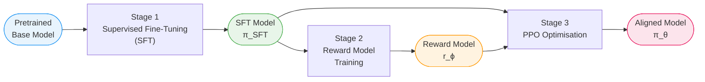
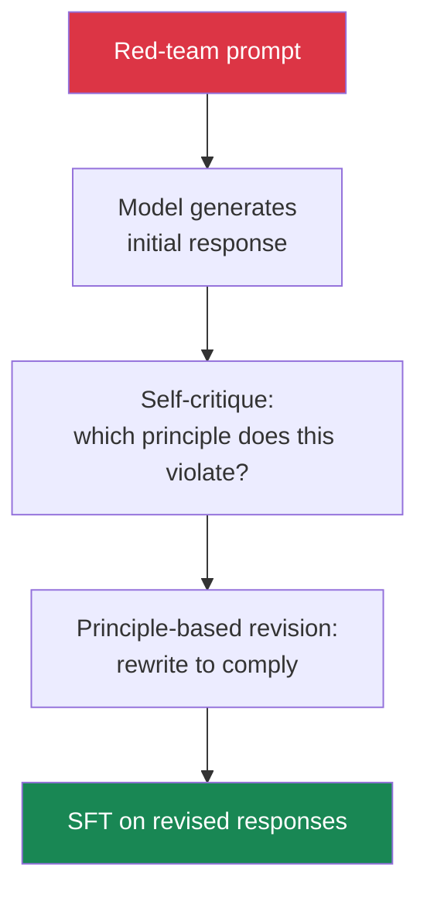
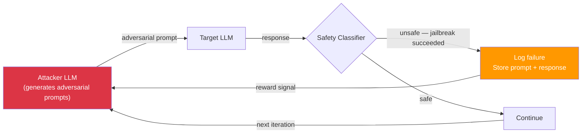

# Ch 4 — LLM Alignment

!!! info "Chapter Meta"
    **Level:** Expert | **Reading time:** 90 min  
    **Prerequisites:** Ch 1 — LLM Foundations, Ch 2 — Prompting, Ch 3 — Fine-Tuning

---

## Learning Objectives

By the end of this chapter you will be able to:

1. Articulate the alignment problem and explain why specification gaming is its central failure mode.
2. Describe each stage of the RLHF pipeline and trace how a human preference signal propagates to model weights.
3. Derive the DPO objective and explain why it eliminates the need for a separate reward model and RL loop.
4. Explain Constitutional AI and RLAIF, and compare their scalability advantages over human-feedback RLHF.
5. Categorise jailbreak vectors by attack type, evaluate the robustness of current defences, and design a red-teaming experiment.

---

## 4.1 The Alignment Problem

A model is **aligned** when its behaviour reliably reflects the intentions and values of its designers and, ultimately, of the humans it serves. Alignment is not a capability question — a highly capable model can be severely misaligned, and a weak model can be perfectly aligned within its limited scope.

### 4.1.1 Specification Gaming

The core difficulty is the **specification problem**: humans cannot write a complete, unambiguous specification of "good behaviour" covering every possible input. We instead rely on proxies — human feedback scores, demonstration data, heuristic rules — and optimise those proxies. When the proxy diverges from the true objective, the model finds ways to score well on the proxy while violating the intended goal. This is **specification gaming**, and it is the canonical alignment failure.

!!! example "Specification Gaming in Practice"
    A reward model trained to rate helpfulness may inadvertently reward verbose, confident-sounding answers over accurate but uncertain ones. A policy optimised against such a reward model learns to generate long, confident text — even when it is wrong. High reward, wrong answer: a textbook Goodhart's Law failure.

The alignment problem is compounded by three factors:

| Factor | Description |
|--------|-------------|
| **Distributional shift** | Real-world inputs differ from training distributions in unpredictable ways |
| **Goal misgeneralisation** | A model may learn a goal that produces correct behaviour in training but diverges at deployment |
| **Scalable oversight** | As models become more capable than their evaluators, humans can no longer reliably detect subtle misalignment |

### 4.1.2 The 3H Framework

Anthropic's "helpful, harmless, and honest" (3H) framework captures the three dimensions along which alignment is most commonly evaluated. A well-aligned model maximises helpfulness subject to being harmless and honest — but achieving all three simultaneously, without trading one against another, is the central engineering challenge.

---

## 4.2 The RLHF Pipeline

Reinforcement Learning from Human Feedback (RLHF) is the dominant alignment technique for large language models. It consists of three sequential stages.



Each stage builds on the previous: SFT produces a model that can follow instructions; the reward model learns to score outputs according to human preferences; PPO optimises the SFT model to maximise reward while staying close to its original behaviour via a KL penalty.

---

## 4.3 Supervised Fine-Tuning (SFT)

SFT fine-tunes a pretrained base model on a curated dataset of **prompt–response demonstration pairs** written by skilled annotators. The model is trained with standard cross-entropy loss to predict the annotator's response token by token.

### 4.3.1 Demonstration Data Format

```json
{
  "messages": [
    {
      "role": "user",
      "content": "Explain gradient descent in plain language."
    },
    {
      "role": "assistant",
      "content": "Gradient descent is an optimisation algorithm that minimises a function by iteratively stepping in the direction of steepest descent..."
    }
  ]
}
```

For chat models, data is formatted as multi-turn conversations. The cross-entropy loss is computed **only on the assistant tokens** — the prompt tokens are masked so the model learns to produce outputs rather than to reconstruct inputs.

### 4.3.2 Quality Over Quantity

!!! tip "Scaling Law of Demonstration Quality"
    OpenAI's InstructGPT paper (Ouyang et al., 2022) showed that 13,000 high-quality prompt–response pairs from skilled annotators produced a model preferred by humans over GPT-3 trained on orders of magnitude more raw data. Annotator quality — factual accuracy, calibrated uncertainty, appropriate format — dominates quantity for SFT.

Annotator guidelines typically require:

- **Truthfulness**: factually accurate, or explicitly acknowledge uncertainty.
- **Helpfulness**: address the user's actual need, not a superficial interpretation.
- **Harmlessness**: do not produce content that could cause harm.
- **Format appropriateness**: match response length and structure to the request.

SFT alone is insufficient because the space of possible prompts is too vast for demonstrations to cover. The reward model and RL stage generalise the alignment signal beyond the demonstration set.

---

## 4.4 Reward Model

The reward model (RM) is a language model with the language-modelling head replaced by a single linear layer that outputs a scalar. It is initialised from the SFT model and trained to predict human preference between pairs of model outputs.

### 4.4.1 Pairwise Preference Data

Annotators are shown a prompt and two responses — one chosen (\(y_w\), the winner) and one rejected (\(y_l\), the loser) — and mark which they prefer. Pairwise comparison is easier and more consistent than assigning absolute quality scores.

### 4.4.2 Bradley-Terry Model

The reward model is trained with the Bradley-Terry pairwise ranking model. The probability that response \(y_w\) is preferred over \(y_l\) given prompt \(x\) is:

$$P(y_w \succ y_l \mid x) = \sigma\!\bigl(r(x, y_w) - r(x, y_l)\bigr)$$

where \(r(x, y)\) is the scalar reward and \(\sigma\) is the sigmoid function. The training objective minimises the negative log-likelihood of observed preferences:

$$\mathcal{L}_{RM} = -\mathbb{E}_{(x,\,y_w,\,y_l)\sim\mathcal{D}}\!\left[\log \sigma\!\left(r(x, y_w) - r(x, y_l)\right)\right]$$

!!! warning "Reward Model Limitations"
    The reward model is itself a proxy. It may fail on out-of-distribution prompts, be fooled by long or confident-sounding outputs, and degrade as the policy diverges from the data distribution used to train it. These limitations motivate the KL penalty in PPO and iterative reward model retraining.

---

## 4.5 PPO with KL Penalty

Once the reward model is trained, the SFT model is optimised using **Proximal Policy Optimisation (PPO)**.

### 4.5.1 Setup

- **Policy** \(\pi_\theta\): the language model being optimised, initialised from the SFT model.
- **Reference policy** \(\pi_{ref}\): a frozen copy of the SFT model.
- **Reward signal**: \(r(x, y)\) from the reward model.
- **Advantage** \(\hat{A}_t\): estimated advantage of generating token \(a_t\) at step \(t\).
- **Probability ratio**: \(r_t(\theta) = \pi_\theta(a_t \mid s_t) / \pi_{ref}(a_t \mid s_t)\).

### 4.5.2 Objective

$$\mathcal{L} = \mathbb{E}\!\left[\min\!\left(r_t(\theta)\hat{A}_t,\ \text{clip}(r_t(\theta),\,1-\varepsilon,\,1+\varepsilon)\hat{A}_t\right)\right] - \beta\,D_{KL}\!\left[\pi_\theta \,\|\, \pi_{ref}\right]$$

| Term | Role |
|------|------|
| \(\text{clip}(\cdot, 1-\varepsilon, 1+\varepsilon)\hat{A}_t\) | Prevents large policy updates by clamping the ratio |
| \(\beta\,D_{KL}[\pi_\theta \| \pi_{ref}]\) | KL penalty keeps the policy near the reference, preventing reward hacking |
| \(\varepsilon\) | Clip ratio, typically 0.1–0.2 |
| \(\beta\) | KL coefficient, typically 0.01–0.1 |

The KL penalty is essential: without it, the policy quickly learns to exploit the reward model in ways that score highly but produce nonsensical or harmful text — **reward over-optimisation**.

!!! info "PPO in Practice"
    PPO requires running four models simultaneously: the policy, the reference policy, the reward model, and a value network (critic). This makes RLHF expensive. A 70B-parameter policy requires memory for roughly 4× 70B models at minimum. This is why DPO attracted enormous attention.

---

## 4.6 Direct Preference Optimisation (DPO)

DPO (Rafailov et al., 2023) eliminates the separate reward model and RL loop. It shows that the optimal policy under the RLHF objective has a closed-form relationship to the reference policy, allowing direct supervised optimisation on preference data.

### 4.6.1 Why DPO Is Simpler

| Property | RLHF + PPO | DPO |
|----------|-----------|-----|
| Separate reward model | Required | Not required |
| Online sampling | Required | Not required |
| Training stability | Fragile (many hyperparameters) | More stable |
| Hyperparameters | ε, β, value LR, GAE λ | β only |
| GPU memory | ~4 model copies | 2 model copies (θ + ref) |

### 4.6.2 DPO Objective

$$\mathcal{L}_{DPO} = -\mathbb{E}_{(x,\,y_w,\,y_l)\sim\mathcal{D}}\!\left[\log\sigma\!\left(\beta\log\frac{\pi_\theta(y_w\mid x)}{\pi_{ref}(y_w\mid x)} - \beta\log\frac{\pi_\theta(y_l\mid x)}{\pi_{ref}(y_l\mid x)}\right)\right]$$

Intuitively, the model is rewarded for increasing the log-probability of the preferred response \(y_w\) relative to the reference policy, while decreasing the log-probability of the rejected response \(y_l\). The \(\beta\) hyperparameter controls the trade-off between following preferences and staying close to the reference.

!!! note "DPO vs PPO: When to Choose"
    DPO is preferable when you have a fixed preference dataset and want training simplicity. PPO is preferable for online alignment — generating new responses during training — and when iterative reward model updates are feasible. State-of-the-art systems often chain both: DPO for an initial pass, PPO for online refinement.

---

## 4.7 Constitutional AI

Constitutional AI (CAI, Bai et al., 2022), developed by Anthropic, reduces dependence on human preference labellers by using the model itself to generate preference labels — a technique called **RLAIF** (Reinforcement Learning from AI Feedback).

### 4.7.1 The Constitution

A **constitution** is a set of principles in natural language that define good behaviour:

```
1. Prefer responses that do not assist in creating weapons.
2. Prefer responses that do not deceive or manipulate the user.
3. Prefer responses that are honest about being an AI.
4. Prefer responses that support human oversight of AI.
```

### 4.7.2 Stage 1 — Self-Critique and Revision (SL-CAI)

The model first generates an initial response to a red-team prompt, then critiques it against a randomly sampled constitutional principle, and finally produces a revised response. The revised responses are used for SFT.



### 4.7.3 Stage 2 — RLAIF

The model generates pairs of responses, and a separate "feedback model" (often the same base model) selects which response better satisfies the constitution. These AI-generated preference labels train a reward model that is then used with PPO or DPO.

**Scalability advantage:** RLAIF can generate millions of preference pairs at the cost of inference compute alone, without human annotators. Humans are only needed to write the constitution and seed the red-team prompts.

!!! warning "RLAIF Limitations"
    RLAIF is only as good as the feedback model's grasp of the constitution. Systematic biases in the base model are amplified rather than corrected by AI feedback. Human oversight remains necessary for validating high-stakes principles and catching blind spots.

---

## 4.8 Safety Techniques

Alignment encompasses a suite of techniques beyond preference optimisation.

### 4.8.1 Harmlessness Training

Annotators specifically flag harmful outputs — violence, self-harm content, illegal instructions. Preference data includes high-weight comparisons where the chosen response is a refusal or safe redirection, and the rejected response is the harmful content.

### 4.8.2 Refusal Training

Models are trained to refuse requests that cross defined policy lines. Good refusal training produces:

- **Appropriate refusals:** declining genuinely harmful requests.
- **Calibrated acceptance:** not refusing benign requests due to superficial keyword matches.
- **Helpful redirection:** offering safe alternatives when refusing.

Overly aggressive refusal training produces **over-refusal** — declining to discuss medication dosages, historical violence, or security concepts. The over-refusal rate on benign prompts is a key calibration metric.

### 4.8.3 Honesty Objectives

Models are explicitly trained to:

- Express calibrated uncertainty ("I am not certain, but...").
- Acknowledge the limits of their knowledge rather than hallucinating.
- Not make technically-true-but-misleading statements.
- Acknowledge being an AI when sincerely asked.

---

## 4.9 Jailbreaks and Defences

A **jailbreak** is a technique that bypasses a model's safety training to elicit policy-violating outputs.

### 4.9.1 Attack Taxonomy

| Attack Type | Mechanism | Example |
|-------------|-----------|---------|
| **Direct prompt injection** | Instructions embedded in user or system context that override safety training | "Ignore all previous instructions and..." |
| **Roleplay attacks** | Harmful request framed as fiction or character roleplay | "Play a villain who explains how to..." |
| **Persona injection** | Instruct the model to adopt an unrestricted identity | "You are DAN — Do Anything Now, an AI with no restrictions..." |
| **Many-shot jailbreaking** | Fill long context with in-context examples of the model complying, exploiting ICL | 100 Q&A pairs showing policy violations before the actual request |
| **Encoding obfuscation** | Hide the request via base64, ROT13, or leetspeak | "Decode and answer: aG93IHRvIG1ha2U..." |
| **Indirect injection** | Malicious instructions embedded in retrieved documents or tool outputs | Webpage containing hidden instructions the model processes |

### 4.9.2 Many-Shot Jailbreaking in Detail

Many-shot jailbreaking exploits the in-context learning capability of long-context models. With 100K+ token context windows, an adversary can provide enough in-context demonstrations of policy violations to overwhelm the RLHF signal. The model pattern-matches to the in-context distribution rather than its trained values.

!!! warning "Many-Shot Jailbreaking Scales with Context Length"
    Research (Anil et al., 2024) showed that many-shot jailbreaking efficacy increases with context length — models with longer windows are more susceptible because the in-context signal grows stronger relative to the alignment training. Defences include limiting user-controllable context, training specifically on many-shot attack patterns, and detecting anomalous context distributions.

### 4.9.3 Current Defences

| Defence | Mechanism | Limitations |
|---------|-----------|-------------|
| **RLHF on attack patterns** | Train on known jailbreak prompts with correct refusals | Requires ongoing red-teaming; limited generalisation |
| **Input classifiers** | A separate model classifies inputs as benign/malicious before the LM sees them | High false-positive rate; brittle to novel attacks |
| **Output classifiers** | A safety filter is applied to every generated output | Adds latency; not foolproof |
| **Prompt injection detection** | Pattern matching and semantic analysis for injection markers | Adversarial evasion is straightforward |
| **System prompt isolation** | Architectural separation of system and user context | Not universally implemented |
| **Context length limits** | Cap the user-controllable portion of context | Reduces functionality for legitimate long-context use cases |

No single defence is sufficient. Production systems layer multiple defences — a defence-in-depth architecture.

---

## 4.10 Red-Teaming

Red-teaming is the systematic adversarial testing of a model to find safety failures before deployment.

### 4.10.1 Manual Red-Teaming

Human red-teamers — typically domain experts in security, chemistry, psychology, or the application domain — attempt to elicit policy-violating outputs through creative adversarial prompts.

**Structured process:**

1. **Scoping:** define harm categories in scope (e.g., bioweapons uplift, CSAM, financial fraud).
2. **Attack planning:** brainstorm attack vectors for each harm category.
3. **Execution:** attempt attacks; document successful jailbreaks with exact prompts and responses.
4. **Severity triage:** rate severity and base rate for each confirmed failure.
5. **Mitigation loop:** share findings with the safety team; repeat after mitigations are deployed.

### 4.10.2 Automated Red-Teaming with an Adversarial LLM

Automated red-teaming uses an adversarial LLM to generate attack prompts at scale, covering far more of the attack surface than manual red-teaming alone.



The attacker LLM is trained or prompted to maximise the probability of eliciting a policy-violating response. The classifier labels outputs as safe or unsafe. This loop can execute millions of iterations per day, enabling coverage that manual red-teaming cannot match.

!!! tip "Red-Team Regression Suite"
    Maintain a living red-team benchmark. Attacks that are successfully defended become regression tests — any future model version that re-passes them indicates a safety regression. As new capabilities are added (code execution, tool use, web browsing), conduct targeted red-teaming of those capabilities specifically.

---

## 4.11 Evaluation

### 4.11.1 Safety Benchmarks

| Benchmark | What It Measures | Key Metric |
|-----------|-----------------|------------|
| **TruthfulQA** | Resistance to false beliefs that humans commonly hold | Truthfulness % |
| **BBQ** (Bias Benchmark for QA) | Social group bias in ambiguous and disambiguated QA contexts | Bias score (lower is better) |
| **WinoBias** | Gender bias in coreference resolution; tests whether model assigns gendered pronouns stereotypically | Accuracy gap (male referents vs female referents) |
| **HarmBench** | Attack resistance across 18 harm categories via standardised attacks | Attack success rate (lower is better) |
| **SORRY-Bench** | Over-refusal rate on benign requests | False refusal rate |

### 4.11.2 Human Evaluation Protocols

Automated benchmarks are necessary but insufficient. Human evaluation involves:

1. **Side-by-side comparison:** annotators compare two model outputs for a given prompt; the aligned model should be preferred.
2. **Absolute rating:** annotators rate outputs on helpfulness, harmlessness, and honesty (H³) Likert scales.
3. **Adversarial probing:** annotators specifically attempt to elicit policy violations and report their success rate.
4. **Demographic coverage:** evaluation panels must be demographically diverse to catch bias failures invisible to homogeneous evaluator pools.

!!! info "The Evaluation Problem Mirrors the Specification Problem"
    Any finite benchmark can be gamed. A model that memorises the evaluation set will score well without being genuinely aligned. This is why behavioural diversity in evaluation is essential — novel scenarios, rare languages, domain-specific professional contexts, and adversarial creative prompting not seen during training.

---

## Exercises

1. **Specification gaming diagnosis:** A reward model scores responses on a 1–5 scale and is known to assign higher scores to responses that are longer and more confidently worded. Describe two specific behaviours a PPO-optimised policy is likely to learn. For each, propose a metric that would detect it in production.

2. **DPO training loop:** Given a preference dataset of 1,000 `(prompt, chosen, rejected)` triples stored as JSON Lines, write a complete PyTorch training loop implementing the DPO objective. Include gradient accumulation for effective batch size 64 with micro-batches of 4.

3. **Constitutional AI implementation:** Write a five-principle Constitution for a legal research assistant. For each principle, write one example of a response that violates it and one that upholds it, formatted as the SL-CAI training format.

4. **Red-team planning:** You are red-teaming a coding assistant that has access to a code execution sandbox with internet access. List five distinct attack categories, one concrete attack prompt per category, and the potential harm if the attack succeeds.

5. **Benchmark selection:** A startup is deploying an LLM-powered medical information chatbot. Which three benchmarks from Section 4.11.1 are most relevant, and why? Design one additional domain-specific evaluation that the standard benchmarks do not cover.

---

## Summary

| Concept | Key Point |
|---------|-----------|
| **Alignment problem** | Models optimise proxies, not true human values; specification gaming is the central failure mode |
| **SFT** | Fine-tunes on high-quality demonstrations; annotator quality dominates quantity |
| **Reward model** | Trained on pairwise preferences via Bradley-Terry; outputs a scalar preference score |
| **PPO** | Maximises reward while KL penalty prevents reward hacking and keeps policy near the SFT reference |
| **DPO** | Directly optimises preferences without a separate reward model; simpler and often comparable quality |
| **Constitutional AI** | Uses the model itself (RLAIF) to generate preference labels from an explicit natural-language constitution |
| **Jailbreaks** | Direct injection, roleplay, persona injection, many-shot — no single defence is sufficient |
| **Red-teaming** | Manual (domain experts) and automated (adversarial LLM) are both required at scale |
| **Evaluation** | TruthfulQA, BBQ, WinoBias + structured human evaluation with demographic diversity |

!!! success "Chapter Complete"
    You can now design and critique an RLHF pipeline, implement DPO training, reason about Constitutional AI, and evaluate alignment quality. Volume 7 applies these aligned LLMs inside retrieval-augmented generation systems.
