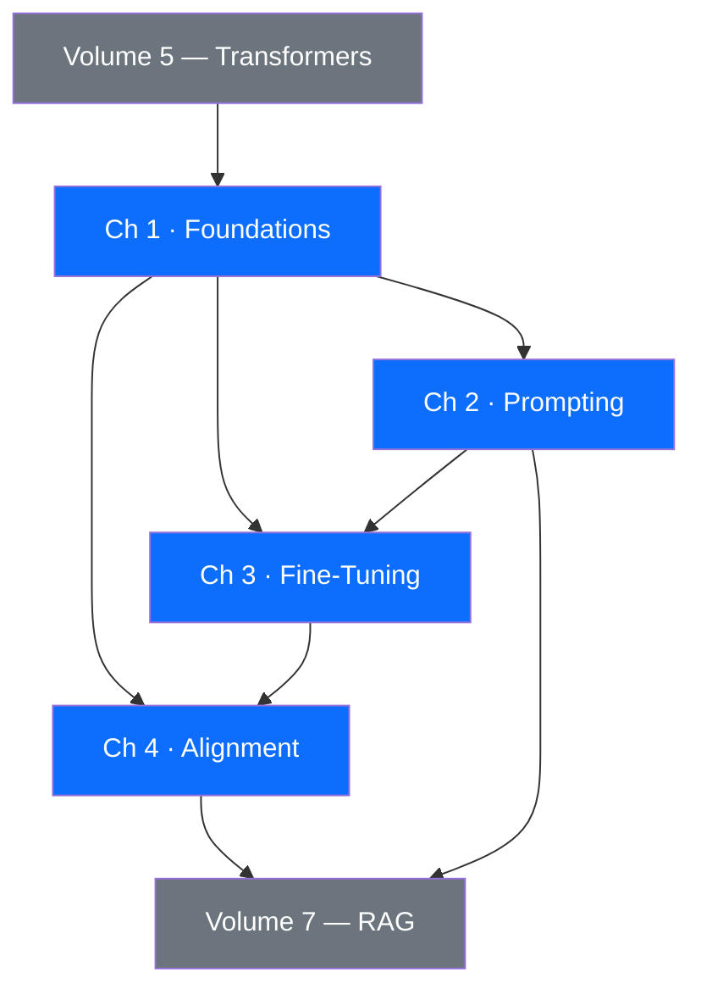

# Volume 6 — Large Language Models

!!! abstract "Volume Overview"
    Large Language Models (LLMs) have fundamentally reshaped what software can do. This volume builds your
    engineering intuition from first principles — how language models are trained, how to elicit their
    capabilities through careful prompting, how to adapt them to specialised tasks, and how to ensure
    they behave safely and helpfully. Every chapter combines rigorous theory with production-grade code
    you can run today.

---

## Why This Volume Matters

Since the release of GPT-3 in 2020, practitioners have realised that a single pretrained model, accessed
through a natural-language interface, can replace entire traditional ML pipelines. That power comes with
nuance: LLMs hallucinate, drift from user intent, and can be manipulated. This volume gives you the
mental models and practical tools to harness LLMs effectively and responsibly.

By the end of Volume 6 you will be able to:

- Explain the architecture, training, and scaling properties of modern decoder-only transformers.
- Design, evaluate, and iterate on prompts for a wide range of production tasks.
- Fine-tune open-weight models with LoRA/QLoRA on a single GPU and evaluate the result rigorously.
- Understand the RLHF and DPO alignment pipelines that make models safe and helpful.

---

## Chapter Map

| # | Chapter | Key Topics | Estimated Time |
|---|---------|-----------|----------------|
| 1 | [LLM Foundations](ch01-foundations/index.md) | Autoregressive modelling, tokenisation, GPT architecture, scaling laws, KV cache, sampling | 4 h |
| 2 | [Prompt Engineering](ch02-prompting/index.md) | Zero/few-shot, CoT, ToT, system prompts, structured output, prompt injection, ReAct | 3 h |
| 3 | [Fine-Tuning LLMs](ch03-finetuning/index.md) | Full fine-tune, LoRA, QLoRA, instruction tuning, DPO, evaluation, TRL | 5 h |
| 4 | [LLM Alignment](ch04-alignment/index.md) | RLHF, reward models, PPO, Constitutional AI, safety techniques, red-teaming | 4 h |

---

## Dependency Graph

---

## Volume Learning Outcomes

After completing this volume a student will be able to:

1. **Explain** the autoregressive factorisation and its computational implications for training and inference.
2. **Compare** tokenisation schemes (BPE, WordPiece, SentencePiece) and justify vocabulary-size choices.
3. **Apply** scaling law predictions to estimate compute budgets for a target loss.
4. **Design** production prompt pipelines incorporating chain-of-thought, output structuring, and injection defences.
5. **Fine-tune** a pretrained open-weight model with LoRA, evaluate it on standard benchmarks, and measure the
   tradeoff between adaptor rank and performance.
6. **Explain** the full RLHF pipeline and contrast it with DPO at the mathematical level.
7. **Conduct** basic red-teaming and apply Constitutional AI principles to harden a model's safety profile.

---

## Prerequisites

| Requirement | Where covered |
|-------------|---------------|
| Transformer self-attention mechanism | Volume 5, Ch 2 |
| Python fluency + PyTorch basics | Volume 2, Ch 4 |
| Basic probability and information theory | Volume 1, Ch 3 |
| Gradient descent and backpropagation | Volume 3, Ch 1 |

---

!!! tip "Recommended Reading Order"
    Read Chapter 1 fully before branching. Chapters 2 and 3 can be studied in parallel once Ch 1 is
    complete. Chapter 4 depends on understanding the training objective from Ch 3.

---

*Next: [Chapter 1 — LLM Foundations](ch01-foundations/index.md)*
