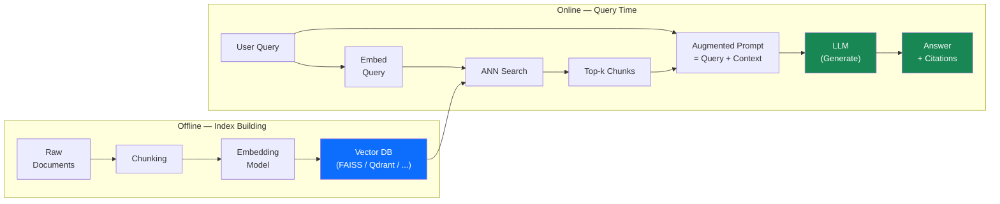

# Ch 1 — RAG Fundamentals

!!! info "Chapter Meta"
    **Level:** Advanced | **Reading time:** 90 min  
    **Prerequisites:** Volume 6 — LLMs (Ch 1 Foundations, Ch 2 Prompting)

---

## Learning Objectives

By the end of this chapter you will be able to:

1. Articulate the three core problems that RAG solves and identify when fine-tuning is a better alternative.
2. Trace data through both the offline indexing pipeline and the online query pipeline of a RAG system.
3. Compare fixed-size, sentence, paragraph, and semantic chunking strategies and choose appropriately for a given corpus.
4. Select an embedding model based on MTEB benchmark performance, dimensionality, and latency requirements.
5. Build a complete end-to-end naive RAG pipeline in Python using sentence-transformers, FAISS, and the Anthropic API, and measure its retrieval quality with Recall@k and MRR.

---

## 1.1 What Is RAG?

**Retrieval-Augmented Generation** (Lewis et al., 2020) augments a language model's generation with relevant passages retrieved from an external knowledge base at inference time. The model receives both the user's query and the retrieved context, grounding its answer in source documents rather than relying solely on parametric memory encoded in its weights.

### 1.1.1 The Three Problems RAG Solves

| Problem | Root cause | RAG solution |
|---------|-----------|-------------|
| **Stale knowledge cutoff** | Model weights are frozen at the training cutoff date | Retrieve from a live or continuously updated corpus |
| **Hallucination on private data** | Pre-training corpus is public internet; private enterprise data is absent | Index private documents and retrieve at query time |
| **Context-length limitations** | Entire knowledge bases cannot fit in a single context window | Retrieve only the most relevant chunks per query |

A fourth benefit: **verifiability**. Retrieved passages can be shown to users as citations, making the model's reasoning auditable in a way that pure parametric recall cannot be.

### 1.1.2 When Fine-Tuning Is the Better Choice

| Scenario | Better approach |
|----------|----------------|
| Task requires a style or tone not achievable with prompting alone | Fine-tuning |
| No retrievable documents exist for the required knowledge | Fine-tuning on domain data |
| Latency budget < 200 ms and the corpus is small enough to fit in context | Few-shot prompting with corpus inline |
| Knowledge is highly structured (SQL tables, property graphs) | Structured retrieval (NL2SQL, GraphRAG) |

---

## 1.2 RAG Architecture

The RAG pipeline has two phases: an **offline indexing pipeline** that runs once (or periodically) and an **online query pipeline** that runs per request.



**Indexing pipeline:** Documents → Chunk → Embed → Store in Vector DB  
**Query pipeline:** Query → Embed → Vector Search → Retrieve Top-k → Augment Prompt → LLM → Response + Citations

---

## 1.3 Text Chunking Strategies

Documents must be split into pieces before embedding. Chunk size and overlap are the most impactful hyperparameters in a RAG system: chunks too large dilute relevance; chunks too small lose the context needed to answer questions.

### 1.3.1 Fixed-Size Chunking

Split on a fixed token or character window with a configurable overlap:

```python
from langchain.text_splitter import RecursiveCharacterTextSplitter

splitter = RecursiveCharacterTextSplitter(
    chunk_size=512,     # target size in characters/tokens
    chunk_overlap=64,   # overlap between consecutive chunks
    separators=["\n\n", "\n", ". ", " ", ""],  # try longer separators first
)
chunks: list[str] = splitter.split_text(document_text)
```

`RecursiveCharacterTextSplitter` tries longer separators first (paragraphs, then sentences, then words), producing cleaner splits than a naive fixed-index cut.

### 1.3.2 Sentence Chunking

Use a sentence tokeniser and group sentences into windows of desired length:

```python
import nltk

nltk.download("punkt_tab", quiet=True)


def sentence_chunk(text: str, max_sentences: int = 5) -> list[str]:
    """Group `max_sentences` sentences per chunk with a 1-sentence overlap."""
    sentences: list[str] = nltk.sent_tokenize(text)
    chunks: list[str] = []
    step = max(1, max_sentences - 1)  # 1-sentence overlap
    for i in range(0, len(sentences), step):
        chunk = " ".join(sentences[i : i + max_sentences])
        if chunk.strip():
            chunks.append(chunk.strip())
    return chunks
```

Better boundary detection than fixed-size at the cost of variable chunk length.

### 1.3.3 Paragraph Chunking

Split on double newlines. Preserves natural rhetorical units but produces highly variable chunk sizes — some paragraphs are a single sentence, others are ten.

### 1.3.4 Semantic Chunking

Group consecutive sentences until the cosine similarity between the current group's embedding and the next sentence drops below a threshold, signalling a topic shift:

```python
import numpy as np
from sentence_transformers import SentenceTransformer


def semantic_chunk(
    sentences: list[str],
    model_name: str = "all-MiniLM-L6-v2",
    similarity_threshold: float = 0.75,
) -> list[str]:
    """Split sentences into topically coherent chunks."""
    model = SentenceTransformer(model_name)
    embeddings: np.ndarray = model.encode(sentences, normalize_embeddings=True)
    chunks: list[str] = []
    current: list[str] = [sentences[0]]

    for i in range(1, len(sentences)):
        sim = float(np.dot(embeddings[i - 1], embeddings[i]))  # cosine (normalised)
        if sim >= similarity_threshold:
            current.append(sentences[i])
        else:
            chunks.append(" ".join(current))
            current = [sentences[i]]

    if current:
        chunks.append(" ".join(current))
    return chunks
```

### 1.3.5 Chunking Strategy Comparison

| Strategy | Chunk size control | Semantic coherence | Compute cost | Best for |
|----------|-------------------|--------------------|-------------|----------|
| Fixed-size | Precise | Low | Minimal | Large homogeneous corpora, fast prototyping |
| Sentence | Moderate (group N) | Moderate | Low | News articles, reports |
| Paragraph | Low (variable) | High | Minimal | Long-form prose with clear paragraph structure |
| Semantic | Low (topic-driven) | Highest | Embedding per sentence | Mixed-topic documents, long PDFs |

!!! tip "Practical Starting Point"
    Begin with `RecursiveCharacterTextSplitter` at 512 tokens with 64-token overlap. Switch to semantic chunking when retrieval quality plateaus and your corpus contains diverse topics within single documents.

---

## 1.4 Embedding Models

An **embedding model** maps a text chunk to a dense vector \(\mathbf{v} \in \mathbb{R}^d\) such that semantically similar texts map to nearby vectors.

### 1.4.1 What an Embedding Captures

Embedding models (e.g., SBERT, E5, BGE) are trained with contrastive objectives on large text corpora. The resulting vector encodes:

- Semantic meaning, independent of exact wording.
- Domain terminology (especially if the model was fine-tuned on domain data).
- Cross-lingual relationships (for multilingual models like BGE-M3).

Crucially, embeddings do **not** preserve lexical structure — two sentences with identical words in different orders may have similar embeddings if they mean the same thing.

### 1.4.2 Embedding Model Comparison

| Model | Dimensions | MTEB avg | Max tokens | Usage cost | Notes |
|-------|-----------|---------|-----------|-----------|-------|
| `all-MiniLM-L6-v2` | 384 | 56.3 | 256 | Free (local) | Tiny; extremely fast; good for prototyping |
| `BAAI/bge-large-en-v1.5` | 1 024 | 63.5 | 512 | Free (local) | Strong local default; near-API quality |
| `text-embedding-3-small` (OpenAI) | 1 536 | 62.3 | 8 191 | $0.02 / M tokens | Good API baseline |
| `text-embedding-3-large` (OpenAI) | 3 072 | 64.6 | 8 191 | $0.13 / M tokens | Best OpenAI quality |
| `BAAI/bge-m3` | 1 024 | 64.4 | 8 192 | Free (local) | Multilingual; supports hybrid (dense + sparse) |

MTEB (Massive Text Embedding Benchmark) is the standard evaluation suite covering retrieval, classification, clustering, and semantic similarity across 56 datasets.

---

## 1.5 Cosine Similarity

Cosine similarity measures the angle between two vectors, ignoring magnitude:

$$\text{sim}(A, B) = \frac{A \cdot B}{\|A\| \cdot \|B\|} = \frac{\displaystyle\sum_i A_i B_i}{\displaystyle\sqrt{\sum_i A_i^2} \cdot \sqrt{\sum_i B_i^2}}$$

Range: \([-1, 1]\), where 1 means identical direction and 0 means orthogonal.

**Why cosine over Euclidean distance for high dimensions:**

- Euclidean distance is affected by vector magnitude. Two identical documents embedded with different tokenisation schemes may have different magnitudes but near-identical directions.
- In high-dimensional spaces, Euclidean distances become dominated by the curse of dimensionality — distances between random vectors concentrate around a narrow band, making discrimination hard.
- Cosine similarity is invariant to magnitude, which is the property we actually want: two semantically identical texts should have similarity 1 regardless of how they were chunked.

For L2-normalised vectors (\(\|A\| = \|B\| = 1\)), cosine similarity reduces to the dot product:

$$\text{sim}(A, B) = A \cdot B \quad \text{(when } \|A\| = \|B\| = 1\text{)}$$

This is why passing `normalize_embeddings=True` to sentence-transformers allows fast dot-product search in FAISS instead of computing full cosine similarity per pair.

---

## 1.6 Retrieval Evaluation Metrics

### 1.6.1 Recall@k

The fraction of relevant documents that appear in the top-\(k\) retrieved results:

$$\text{Recall@}k = \frac{|\text{relevant} \cap \text{retrieved}_k|}{|\text{relevant}|}$$

**Recall@k is the most important retrieval metric for RAG**: if the answer is not in the retrieved context, the LLM cannot answer correctly regardless of its capability.

### 1.6.2 Mean Reciprocal Rank (MRR)

Measures how highly the first relevant document is ranked:

$$\text{MRR} = \frac{1}{|Q|} \sum_{q=1}^{|Q|} \frac{1}{\text{rank}_q}$$

where \(\text{rank}_q\) is the rank position of the first relevant document for query \(q\). MRR rewards systems that surface the most relevant document at the very top.

### 1.6.3 Normalised Discounted Cumulative Gain (NDCG)

NDCG accounts for graded relevance and position, penalising relevant documents placed lower in the ranking:

$$\text{DCG}_k = \sum_{i=1}^{k} \frac{\text{rel}_i}{\log_2(i+1)}, \qquad \text{NDCG}_k = \frac{\text{DCG}_k}{\text{IDCG}_k}$$

where IDCG is the DCG of the ideal (perfect) ranking. NDCG@10 is the standard benchmark metric on BEIR and MTEB retrieval tasks.

---

## 1.7 End-to-End Naive RAG Pipeline

A complete, runnable naive RAG implementation using `sentence-transformers`, `faiss-cpu`, and the Anthropic API.

```python
"""
naive_rag.py — Complete RAG pipeline: chunk → embed → index → retrieve → generate.

Install:
    pip install sentence-transformers faiss-cpu anthropic nltk
"""

from __future__ import annotations

import textwrap

import anthropic
import faiss
import nltk
import numpy as np
from sentence_transformers import SentenceTransformer

nltk.download("punkt_tab", quiet=True)

# ---------------------------------------------------------------------------
# Configuration
# ---------------------------------------------------------------------------
EMBED_MODEL: str = "BAAI/bge-large-en-v1.5"
LLM_MODEL: str = "claude-opus-4-5"
CHUNK_SENTENCES: int = 4
TOP_K: int = 5
RELEVANCE_THRESHOLD: float = 0.35

# ---------------------------------------------------------------------------
# Step 1: Chunking
# ---------------------------------------------------------------------------


def chunk_by_sentences(text: str, window: int = CHUNK_SENTENCES) -> list[str]:
    """Split text into overlapping sentence-window chunks."""
    sentences: list[str] = nltk.sent_tokenize(text)
    chunks: list[str] = []
    step = max(1, window - 1)
    for i in range(0, len(sentences), step):
        chunk = " ".join(sentences[i : i + window]).strip()
        if chunk:
            chunks.append(chunk)
    return chunks


# ---------------------------------------------------------------------------
# Step 2: Embedding and indexing
# ---------------------------------------------------------------------------


class VectorIndex:
    """FAISS-backed inner-product index for cosine similarity retrieval."""

    def __init__(self, model_name: str = EMBED_MODEL) -> None:
        self.model: SentenceTransformer = SentenceTransformer(model_name)
        self.index: faiss.IndexFlatIP | None = None
        self.chunks: list[str] = []

    def build(self, chunks: list[str]) -> None:
        """Embed chunks and build a FAISS inner-product (cosine) index."""
        self.chunks = chunks
        embeddings: np.ndarray = self.model.encode(
            chunks,
            normalize_embeddings=True,  # L2-normalise → inner product = cosine
            show_progress_bar=True,
            convert_to_numpy=True,
        )
        dim: int = embeddings.shape[1]
        self.index = faiss.IndexFlatIP(dim)
        self.index.add(embeddings.astype(np.float32))

    def search(self, query: str, k: int = TOP_K) -> list[tuple[float, str]]:
        """Return top-k (cosine_score, chunk) pairs for a query string."""
        if self.index is None:
            raise RuntimeError("Index not built — call build() first.")
        q_emb: np.ndarray = self.model.encode(
            [query], normalize_embeddings=True, convert_to_numpy=True
        )
        scores, indices = self.index.search(q_emb.astype(np.float32), k)
        return [
            (float(scores[0][i]), self.chunks[int(indices[0][i])])
            for i in range(k)
            if indices[0][i] >= 0
        ]


# ---------------------------------------------------------------------------
# Step 3: Augment and generate
# ---------------------------------------------------------------------------


def rag_answer(
    query: str,
    index: VectorIndex,
    *,
    k: int = TOP_K,
    relevance_threshold: float = RELEVANCE_THRESHOLD,
) -> str:
    """Retrieve relevant chunks and generate a grounded, cited answer."""
    results: list[tuple[float, str]] = index.search(query, k=k)
    relevant = [(score, chunk) for score, chunk in results if score >= relevance_threshold]

    if not relevant:
        return (
            "I could not find relevant information in the knowledge base "
            "to answer your question."
        )

    context_block = "\n\n---\n\n".join(
        f"[Source {i + 1}, relevance={score:.3f}]\n{chunk}"
        for i, (score, chunk) in enumerate(relevant)
    )

    system_prompt = textwrap.dedent("""
        You are a precise research assistant. Answer the user's question using ONLY
        the provided context passages. If the context does not contain sufficient
        information to answer fully, say so explicitly — do not speculate.
        Cite source numbers inline (e.g. [Source 1]).
    """).strip()

    user_message = f"Context:\n\n{context_block}\n\nQuestion: {query}"

    client = anthropic.Anthropic()
    message = client.messages.create(
        model=LLM_MODEL,
        max_tokens=1024,
        system=system_prompt,
        messages=[{"role": "user", "content": user_message}],
    )
    return message.content[0].text  # type: ignore[union-attr]


# ---------------------------------------------------------------------------
# Demo
# ---------------------------------------------------------------------------

if __name__ == "__main__":
    documents: list[str] = [
        """Transformer models use self-attention to process all tokens in parallel.
        The key innovation is replacing recurrence with attention, allowing every
        token to directly attend to every other token in the sequence. This enables
        efficient training on modern GPU hardware with near-linear memory scaling
        when using flash attention.""",

        """Retrieval-Augmented Generation (RAG) combines a retrieval system with a
        generative language model. The retrieval component fetches relevant documents
        from a knowledge base; the generative component synthesises them into a
        coherent answer. RAG reduces hallucinations by grounding generation in
        retrieved evidence rather than relying on parametric memory.""",

        """FAISS (Facebook AI Similarity Search) is an open-source library for
        efficient similarity search over dense vector collections. It supports
        exact and approximate nearest-neighbour search and is optimised for
        billion-scale datasets with GPU acceleration.""",
    ]

    all_chunks: list[str] = []
    for doc in documents:
        all_chunks.extend(chunk_by_sentences(doc))

    idx = VectorIndex()
    idx.build(all_chunks)

    answer = rag_answer("What is FAISS and why is it useful for RAG?", idx)
    print(answer)
```

---

## 1.8 Context Window Management

### 1.8.1 How Much to Retrieve

Retrieving more chunks increases recall but:

- Dilutes relevance — the LLM may be distracted by tangentially related passages.
- Increases prompt length, raising latency and cost.
- Triggers the **lost-in-the-middle** effect (Liu et al., 2023): LLMs pay less attention to context placed in the middle of a long prompt than at the beginning or end.

**Practical rule:** retrieve \(k_\text{initial} = 10\) chunks, then prune to \(k_\text{final} \leq 5\) using a relevance threshold (0.35–0.5 cosine similarity). Re-rank if latency permits (Chapter 3).

### 1.8.2 Relevance Threshold Heuristics

| Cosine similarity | Interpretation |
|------------------|----------------|
| 0.8 – 1.0 | Near-duplicate or highly specific match |
| 0.5 – 0.8 | Semantically relevant |
| 0.35 – 0.5 | Tangentially related — include only if context budget allows |
| 0.0 – 0.35 | Likely irrelevant noise |

---

## 1.9 Common RAG Failure Modes

| Failure Mode | Symptoms | Diagnosis | Fix |
|-------------|----------|-----------|-----|
| **Missing retrieval** | Answer not in context; LLM says "I don't know" even though the doc exists | Recall@10 < 0.7 on test set | Better embedding; hybrid search; query rewriting |
| **Wrong chunk** | Context retrieved but doesn't contain the specific fact needed | Recall@10 is high, answer accuracy low | Smaller chunks with overlap; improve chunking strategy |
| **Lost-in-middle** | Answer is in context but ignored; LLM contradicts the context | Accuracy varies by source position | Re-order context (most relevant first and last); reduce context length |
| **Answer in context but ignored** | LLM uses parametric memory despite contrary evidence in context | Automated faithfulness check fails | Strengthen system prompt; use chain-of-thought citation |

!!! warning "Diagnosis Before Optimisation"
    Compute Recall@10 on a test set of known question–answer pairs before tuning anything else. If Recall@10 < 0.7, fix retrieval first. If Recall@10 is high but answer accuracy is low, the problem is in the augmentation or generation stage.

---

## Exercises

1. **Chunking comparison.** Take a 10-page Wikipedia article. Chunk it with (a) fixed-size 256 characters / 32 overlap and (b) semantic chunking at threshold 0.75. Report: total chunk count, mean length, min and max length. Which strategy produces cleaner topical boundaries?

2. **Embedding model benchmark.** Index the same 50-document corpus with `all-MiniLM-L6-v2`, `all-mpnet-base-v2`, and `BAAI/bge-large-en-v1.5`. For 20 test questions with known source paragraphs, compute Recall@5. How much does model choice affect results?

3. **Relevance threshold tuning.** Using the pipeline from Section 1.7, vary `relevance_threshold` from 0.1 to 0.7 in steps of 0.1. For each threshold, report (a) mean chunks passed to the LLM and (b) answer accuracy on 20 questions. Plot the tradeoff.

4. **Lost-in-the-middle reproduction.** Build a 10-chunk context where the answer is placed at position 1, 5, or 10 (hold all other chunks constant). Ask the same question for each position and measure whether accuracy degrades for the middle position.

5. **Full pipeline evaluation.** Build a RAG system over the BEIR FIQA dataset (financial Q&A). Measure Recall@5, MRR@10, and end-to-end answer accuracy (using LLM-as-judge against ground-truth answers). Identify the dominant failure mode.

---

## Summary

- RAG solves three problems: stale knowledge cutoff, hallucination on private data, and context-length limitations — without retraining.
- The pipeline has two phases: offline indexing (chunk → embed → store) and online query processing (embed query → ANN search → augment prompt → generate).
- Chunking strategy is the most impactful hyperparameter: fixed-size with overlap is the robust default; semantic chunking improves coherence for mixed-topic documents.
- Embedding model quality (MTEB) is the primary driver of retrieval quality; `BAAI/bge-large-en-v1.5` provides near-API quality locally.
- Cosine similarity is preferred over Euclidean distance in high dimensions; for L2-normalised vectors it reduces to a fast dot product.
- Evaluate with Recall@k (retrieval quality) and MRR (ranking quality); diagnose the dominant failure mode before tuning generation.
