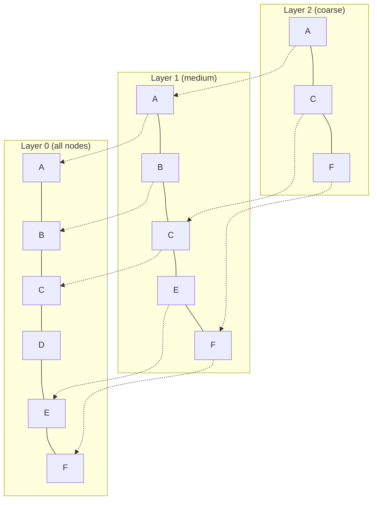

# Ch 2 — Vector Databases

!!! info "Chapter Meta"
    **Level:** Advanced | **Reading time:** 75 min  
    **Prerequisites:** Ch 1 — RAG Fundamentals

---

## Learning Objectives

By the end of this chapter you will be able to:

1. Explain why brute-force exact nearest-neighbour search is impractical at scale and quantify the cost in memory and query latency.
2. Describe the HNSW layered graph structure and explain how `ef_construction` and `ef_search` control the recall-speed tradeoff.
3. Explain IVF clustering-based search and Product Quantisation vector compression, and identify when to use each.
4. Select and configure an appropriate vector database (Qdrant, Pinecone, Weaviate, Chroma, pgvector, Milvus) for a given scale and operational context.
5. Implement hybrid search (dense + BM25) using Reciprocal Rank Fusion and apply pre-filter and post-filter metadata strategies correctly.

---

## 2.1 Why a Dedicated Vector Store?

### 2.1.1 The Curse of Dimensionality in Exact Search

Exact nearest-neighbour search (brute-force cosine) over a corpus of \(N\) vectors in \(\mathbb{R}^d\)
costs \(O(N \cdot d)\) per query. For a production corpus:

| Corpus size | Dimensions | Vectors | Brute-force time (GPU) |
|-------------|-----------|---------|----------------------|
| 1 M chunks | 768 | 1 M | ~10 ms |
| 100 M chunks | 768 | 100 M | ~1 s |
| 1 B chunks | 1 536 | 1 B | ~20 s |

At 100 M+ chunks, even GPU-accelerated exact search is too slow for real-time queries. Approximate
Nearest Neighbour (ANN) algorithms trade a small recall penalty for orders-of-magnitude speed
improvements.

### 2.1.2 What a Vector Database Adds

Beyond ANN indexing, production vector databases provide:

- **Persistence and replication** (crash-safe storage, multi-replica reads).
- **Metadata filtering** (filter by category, date, user, etc. alongside vector similarity).
- **Hybrid search** (combine dense vector search with sparse keyword search).
- **Horizontal scaling** (sharding across nodes for multi-billion-vector corpora).
- **Managed infrastructure** (cloud-hosted options with SLAs, backups, monitoring).

---

## 2.2 Approximate Nearest Neighbour Algorithms

### 2.2.1 HNSW — Hierarchical Navigable Small World

HNSW (Malkov & Yashunin, 2020) is the dominant ANN algorithm for in-memory vector search. It
builds a multi-layer proximity graph where:

- **Layer 0** contains all vectors, connected to their nearest neighbours in the original space.
- **Higher layers** contain progressively fewer vectors (sampled probabilistically), connected
  with longer-range edges, forming a "highway" network for fast traversal.



**Search algorithm:**
1. Enter the graph at the top layer's entry point.
2. Greedily traverse towards the query vector (following edges to the nearest neighbour).
3. Drop to the next layer and repeat from the best node found.
4. At Layer 0, perform a beam search over `ef_search` candidates to find the top-k results.

**Key parameters:**

| Parameter | Role | Typical value | Tradeoff |
|-----------|------|--------------|----------|
| `M` | Max connections per node per layer | 16 – 64 | Higher M → better recall, more memory |
| `ef_construction` | Beam width during index build | 100 – 400 | Higher → better index quality, slower build |
| `ef_search` | Beam width during query | 50 – 200 | Higher → better recall, slower query |

**Complexity:** \(O(\log N)\) search, \(O(N \log N)\) index build, \(O(N \cdot M)\) memory.

### 2.2.2 IVF — Inverted File Index

IVF (Jégou et al., 2011) clusters the vector space into `n_lists` Voronoi cells using k-means.
At query time, only the nearest `n_probe` cells are searched:

1. Train a k-means clustering with `n_lists` centroids.
2. Assign each vector to its nearest centroid (its "list").
3. At query time, find the `n_probe` nearest centroids to the query.
4. Perform exact search within those `n_probe` lists.

**Key parameters:**

| Parameter | Role | Tradeoff |
|-----------|------|----------|
| `n_lists` | Number of clusters | ~\(\sqrt{N}\) is a common rule |
| `n_probe` | Lists searched per query | Higher → better recall, slower |

IVF requires a training phase (k-means) before indexing and does not update well incrementally
(requires index rebuild to add new vectors). Best suited for static corpora.

### 2.2.3 Product Quantisation (PQ)

**Product Quantisation** compresses vectors to reduce memory requirements, enabling billion-scale indexes to fit in RAM.

**How it works:**

1. Split each \(d\)-dimensional vector into \(m\) sub-vectors of dimension \(d/m\).
2. Train a codebook of \(k^*\) centroids for each sub-vector space using k-means.
3. Replace each sub-vector with the index of its nearest centroid (1 byte if \(k^* = 256\)).
4. At query time, precompute distances from the query to all centroids, then look up and accumulate.

**Compression ratio:** A 1024-dim float32 vector (4 096 bytes) split into 32 sub-vectors of 32 dimensions, each quantised to 256 centroids, becomes 32 bytes — a **128× compression ratio** at the cost of a small, tunable recall penalty.

| PQ Config | Original size | Compressed size | Compression ratio |
|-----------|-------------|----------------|-----------------|
| 768-dim, m=8, k*=256 | 3 072 bytes | 8 bytes | 384× |
| 1024-dim, m=32, k*=256 | 4 096 bytes | 32 bytes | 128× |
| 1536-dim, m=48, k*=256 | 6 144 bytes | 48 bytes | 128× |

PQ is almost always combined with IVF as **IVF-PQ** — the standard index for billion-scale search. HNSW with PQ (HNSWPQ) is used when dynamic inserts are required.

### 2.2.4 ScaNN — Scalable Nearest Neighbours

Google's ScaNN (Guo et al., 2020) uses anisotropic vector quantisation that prioritises accurate
inner-product computation for vectors that are close to the query, yielding higher recall at
similar query latency compared to standard product quantisation. It is the retrieval backbone
behind Google Search embeddings.

### 2.2.4 ANN Algorithm Comparison

| Algorithm | Build time | Query latency | Memory | Recall | Dynamic updates |
|-----------|-----------|--------------|--------|--------|----------------|
| Brute-force (FAISS Flat) | \(O(N)\) | \(O(Nd)\) | \(O(Nd)\) | 100 % | Yes |
| HNSW | \(O(N \log N)\) | \(O(\log N)\) | \(O(NM)\) | 95 – 99 % | Yes (limited) |
| IVF | \(O(N)\) after train | \(O(n\_probe \cdot N/n\_lists)\) | \(O(Nd)\) | 90 – 98 % | No (rebuild) |
| ScaNN | \(O(N)\) + quantise | Very fast | Compressed | 97 – 99 % | No |

---

## 2.3 Vector Database Comparison

| Database | License | Scalability | Filtering | Hybrid search | Cloud support |
|----------|---------|------------|-----------|--------------|--------------|
| **Qdrant** | Apache 2.0 | ~100M single node; sharded for billions | Rich payload filter DSL; filtered HNSW | Dense + BM25 sparse | Qdrant Cloud (managed) |
| **Pinecone** | Proprietary SaaS | Billions (serverless auto-scale) | Metadata namespace filters | Dense + Pinecone sparse | AWS / GCP (managed-only) |
| **Weaviate** | BSD-3 / Enterprise | ~50M single node; horizontal sharding | GraphQL filter; RBAC | Dense + BM25 (hybrid) | Weaviate Cloud; self-host |
| **Chroma** | Apache 2.0 | ~1M (in-memory/local) | Document metadata dict filter | BM25 (planned) | No (self-host only) |
| **pgvector** | PostgreSQL OSS | ~5M without partitioning; more with pg_partman | Full SQL WHERE clause | SQL full-text search | AWS RDS, Supabase, Neon |
| **Milvus** | Apache 2.0 | Billions (distributed, Kubernetes-native) | Scalar attribute filter | Dense + sparse | Zilliz Cloud; self-host |

!!! note "Choosing a vector database"
    - **Prototyping / local development:** Chroma (zero setup) or FAISS (no server).
    - **Production, self-hosted, < 100 M vectors:** Qdrant (best balance of features and performance).
    - **Production, fully managed:** Pinecone (enterprise) or Weaviate Cloud.
    - **Existing PostgreSQL infra:** pgvector (co-locate with relational data; simpler stack).

---

## 2.4 Metadata Filtering

Real corpora are heterogeneous. A support knowledge base might contain articles for multiple
products, languages, and dates. Metadata filters restrict the search space before or after vector
similarity scoring.

### 2.4.1 Pre-filtering

Filter the candidate set to matching documents **before** ANN search. Only vectors satisfying the
filter predicate are searched:

- **Pros:** search space is small → very fast.
- **Cons:** the filtered subset may not have a good HNSW index representation → recall degrades
  significantly when the filtered set is < 5 % of the total corpus.

### 2.4.2 Post-filtering

Perform ANN search over the full index, then discard results that do not match the filter:

- **Pros:** recall is unaffected by filter selectivity.
- **Cons:** if the filter removes most results, fewer than \(k\) results are returned; requires
  over-fetching (retrieve \(k \times \text{filter\_rejection\_rate}\)).

### 2.4.3 Qdrant Payload Filtering

Qdrant supports a rich pre-filter DSL that is efficiently integrated into HNSW traversal:

```python
from qdrant_client import QdrantClient
from qdrant_client.models import Filter, FieldCondition, MatchValue, Range

client = QdrantClient(url="https://your-cluster.cloud.qdrant.io", api_key="YOUR_KEY")

results = client.search(
    collection_name="knowledge_base",
    query_vector=query_embedding.tolist(),
    query_filter=Filter(
        must=[
            FieldCondition(key="language", match=MatchValue(value="en")),
            FieldCondition(key="product", match=MatchValue(value="billing")),
            FieldCondition(
                key="created_at",
                range=Range(gte=1_700_000_000),  # Unix timestamp
            ),
        ]
    ),
    limit=10,
    with_payload=True,
)
```

---

## 2.5 Hybrid Search

Pure dense (semantic) retrieval misses **exact keyword matches** that are critical for proper nouns,
product codes, technical terms, and rare entities. Hybrid search combines:

- **Dense retrieval** (embedding similarity) for semantic understanding.
- **Sparse retrieval** (BM25 / TF-IDF) for exact term matching.

### 2.5.1 BM25 — Sparse Retrieval

BM25 (Robertson et al., 1994) is the gold-standard sparse ranking function:

$$
\text{BM25}(D, Q) = \sum_{t \in Q} \text{IDF}(t) \cdot
  \frac{f(t, D) \cdot (k_1 + 1)}{f(t, D) + k_1 \cdot \left(1 - b + b \cdot \frac{|D|}{\text{avgdl}}\right)}
$$

where \(f(t, D)\) is the term frequency in document \(D\), \(\text{IDF}(t)\) is inverse document
frequency, \(|D|\) is document length, avgdl is average document length, \(k_1 \approx 1.5\), and
\(b \approx 0.75\).

### 2.5.2 Reciprocal Rank Fusion (RRF)

RRF (Cormack et al., 2009) is a simple, robust score-agnostic fusion formula that merges ranked
lists from multiple retrieval systems:

$$
\text{RRF}(d) = \sum_{r \in \text{rankers}} \frac{1}{k + \text{rank}_r(d)}
$$

where \(k = 60\) is the standard constant and \(\text{rank}_r(d)\) is the rank of document \(d\)
in ranker \(r\) (or \(\infty\) if not present).

```python
from collections import defaultdict

def reciprocal_rank_fusion(
    ranked_lists: list[list[str]],
    k: int = 60,
) -> list[tuple[str, float]]:
    """
    Fuse multiple ranked lists of document IDs using RRF.

    Args:
        ranked_lists: Each inner list is a ranked list of document IDs (best first).
        k: RRF constant (default 60).

    Returns:
        List of (doc_id, rrf_score) sorted descending by score.
    """
    scores: dict[str, float] = defaultdict(float)
    for ranked in ranked_lists:
        for rank, doc_id in enumerate(ranked, start=1):
            scores[doc_id] += 1.0 / (k + rank)
    return sorted(scores.items(), key=lambda x: x[1], reverse=True)
```

### 2.5.3 Hybrid Search in Qdrant

Qdrant natively supports hybrid search via sparse vectors (stored as named vectors):

```python
from qdrant_client.models import NamedSparseVector, SparseVector

# Index time: store both dense and sparse vectors per chunk
client.upsert(
    collection_name="hybrid_index",
    points=[
        {
            "id": chunk_id,
            "vector": {
                "dense": dense_embedding.tolist(),
                "sparse": SparseVector(
                    indices=bm25_indices,   # list[int]: non-zero token positions
                    values=bm25_values,     # list[float]: BM25 weights
                ),
            },
            "payload": {"text": chunk_text, "source": source_url},
        }
    ],
)

# Query time: search both and fuse
dense_results = client.search(
    collection_name="hybrid_index",
    query_vector=("dense", query_dense_embedding.tolist()),
    limit=20,
)
sparse_results = client.search(
    collection_name="hybrid_index",
    query_vector=NamedSparseVector(
        name="sparse",
        vector=SparseVector(indices=query_indices, values=query_values),
    ),
    limit=20,
)

# Fuse with RRF
dense_ids = [str(r.id) for r in dense_results]
sparse_ids = [str(r.id) for r in sparse_results]
fused = reciprocal_rank_fusion([dense_ids, sparse_ids])
```

### 2.5.4 Hybrid vs Dense-Only Recall

On BEIR benchmarks, hybrid retrieval (dense + BM25 + RRF) outperforms pure dense retrieval by
2 – 8 % NDCG@10 depending on the dataset, with the largest gains on datasets with rare terms
(TREC-COVID, SciFact).

---

## 2.6 Indexing Strategies

### 2.6.1 Batch Indexing (Rebuild)

For static or infrequently updated corpora: embed all documents, then build the HNSW index from
scratch. Fastest build time; produces the highest-quality index.

### 2.6.2 Incremental Indexing

Add new vectors to an existing HNSW index without rebuilding. Qdrant and Weaviate support
incremental inserts natively. Quality degrades slightly as the index grows without rebalancing —
periodic full rebuilds (e.g. weekly) maintain recall.

### 2.6.3 When to Rebuild vs Update

| Scenario | Recommendation |
|----------|---------------|
| Batch ingestion (millions of new docs) | Full rebuild |
| Low-frequency updates (< 1 % per day) | Incremental insert |
| High-frequency updates + read availability requirement | Blue-green: build new index in parallel, swap |
| Embedding model change | Always full rebuild |

---

## 2.7 Production Considerations

### 2.7.1 Replication and Sharding

| Concern | Solution |
|---------|---------|
| Read throughput | Horizontal read replicas (Qdrant replication factor ≥ 2) |
| Corpus size > single node RAM | Shard across nodes (Qdrant sharding, Milvus) |
| Write availability | Leader-follower replication with raft consensus |

### 2.7.2 Backups

- Export periodic snapshots of the collection to object storage (S3 / GCS).
- Qdrant: `POST /collections/{name}/snapshots` → returns a snapshot file.
- Test restore from snapshot monthly.

### 2.7.3 Monitoring

| Metric | Alert threshold | Action |
|--------|----------------|--------|
| Query latency P99 | > 200 ms | Increase `ef_search`, add replicas |
| Recall@10 (canary queries) | < 0.85 | Rebuild index or retune params |
| Index size vs RAM | > 80 % RAM | Add nodes or apply quantisation |
| Failed inserts | > 0 in 5 min | Check network / quota |

---

## 2.8 Chroma Code Example (Local)

Chroma is the recommended database for local development and experimentation.

```python
"""
chroma_rag.py — Local RAG with ChromaDB.
pip install chromadb sentence-transformers
"""

from __future__ import annotations

import chromadb
from chromadb.utils.embedding_functions import SentenceTransformerEmbeddingFunction
from sentence_transformers import SentenceTransformer

COLLECTION_NAME = "textbook_chapters"
EMBED_MODEL = "BAAI/bge-large-en-v1.5"

def build_chroma_index(
    chunks: list[str],
    metadatas: list[dict],
    persist_dir: str = "./chroma_db",
) -> chromadb.Collection:
    """Build a persistent Chroma collection from text chunks."""
    ef = SentenceTransformerEmbeddingFunction(model_name=EMBED_MODEL)
    client = chromadb.PersistentClient(path=persist_dir)
    collection = client.get_or_create_collection(
        name=COLLECTION_NAME,
        embedding_function=ef,
        metadata={"hnsw:space": "cosine"},
    )
    ids = [f"chunk_{i}" for i in range(len(chunks))]
    collection.upsert(documents=chunks, metadatas=metadatas, ids=ids)
    return collection


def chroma_search(
    collection: chromadb.Collection,
    query: str,
    k: int = 5,
    where: dict | None = None,
) -> list[dict]:
    """Search the collection and return results with metadata."""
    results = collection.query(
        query_texts=[query],
        n_results=k,
        where=where,  # e.g. {"chapter": "1"} for metadata filtering
        include=["documents", "metadatas", "distances"],
    )
    output: list[dict] = []
    for doc, meta, dist in zip(
        results["documents"][0],
        results["metadatas"][0],
        results["distances"][0],
    ):
        output.append({"text": doc, "metadata": meta, "distance": dist})
    return output


# Usage
if __name__ == "__main__":
    sample_chunks = [
        "HNSW builds a proximity graph for fast approximate nearest-neighbour search.",
        "BM25 is a sparse keyword retrieval function based on TF-IDF with length normalisation.",
        "Qdrant is an open-source vector database written in Rust with rich filtering support.",
    ]
    sample_meta = [{"chapter": "2", "topic": t} for t in ["hnsw", "bm25", "qdrant"]]

    col = build_chroma_index(sample_chunks, sample_meta)
    hits = chroma_search(col, "How does approximate vector search work?", k=2)
    for h in hits:
        print(f"[{h['distance']:.3f}] {h['text'][:80]}")
```

---

## 2.9 Qdrant Code Example (Cloud)

```python
"""
qdrant_rag.py — Production RAG with Qdrant Cloud.
pip install qdrant-client sentence-transformers
"""

from __future__ import annotations

import uuid
import numpy as np
from qdrant_client import QdrantClient
from qdrant_client.models import (
    Distance,
    PointStruct,
    VectorParams,
    Filter,
    FieldCondition,
    MatchValue,
)
from sentence_transformers import SentenceTransformer

COLLECTION = "production_kb"
EMBED_MODEL = "BAAI/bge-large-en-v1.5"
VECTOR_DIM = 1024  # bge-large output dimension


def get_client() -> QdrantClient:
    return QdrantClient(
        url="https://YOUR-CLUSTER.cloud.qdrant.io",
        api_key="YOUR_API_KEY",
    )


def create_collection(client: QdrantClient) -> None:
    """Create the Qdrant collection if it does not exist."""
    existing = {c.name for c in client.get_collections().collections}
    if COLLECTION not in existing:
        client.create_collection(
            collection_name=COLLECTION,
            vectors_config=VectorParams(size=VECTOR_DIM, distance=Distance.COSINE),
            # HNSW index config
            hnsw_config={"m": 16, "ef_construct": 200},
        )


def upsert_chunks(
    client: QdrantClient,
    chunks: list[str],
    metadatas: list[dict],
    model: SentenceTransformer,
    batch_size: int = 128,
) -> None:
    """Embed and upsert chunks into Qdrant."""
    for i in range(0, len(chunks), batch_size):
        batch_texts = chunks[i : i + batch_size]
        batch_meta = metadatas[i : i + batch_size]
        embeddings: np.ndarray = model.encode(
            batch_texts, normalize_embeddings=True, convert_to_numpy=True
        )
        points = [
            PointStruct(
                id=str(uuid.uuid4()),
                vector=emb.tolist(),
                payload={"text": text, **meta},
            )
            for emb, text, meta in zip(embeddings, batch_texts, batch_meta)
        ]
        client.upsert(collection_name=COLLECTION, points=points)


def search(
    client: QdrantClient,
    query: str,
    model: SentenceTransformer,
    k: int = 5,
    filter_dict: dict | None = None,
) -> list[dict]:
    """Search Qdrant with optional metadata filter."""
    q_emb = model.encode([query], normalize_embeddings=True, convert_to_numpy=True)

    qdrant_filter: Filter | None = None
    if filter_dict:
        qdrant_filter = Filter(
            must=[
                FieldCondition(key=key, match=MatchValue(value=val))
                for key, val in filter_dict.items()
            ]
        )

    results = client.search(
        collection_name=COLLECTION,
        query_vector=q_emb[0].tolist(),
        query_filter=qdrant_filter,
        limit=k,
        with_payload=True,
    )
    return [
        {"score": r.score, "text": r.payload.get("text", ""), "payload": r.payload}
        for r in results
    ]


if __name__ == "__main__":
    embed_model = SentenceTransformer(EMBED_MODEL)
    qdrant = get_client()
    create_collection(qdrant)

    docs = [
        ("Qdrant supports rich metadata filtering with nested conditions.", {"source": "docs", "lang": "en"}),
        ("HNSW provides logarithmic query time for ANN search.", {"source": "paper", "lang": "en"}),
    ]
    texts, metas = zip(*docs)
    upsert_chunks(qdrant, list(texts), list(metas), embed_model)

    hits = search(qdrant, "How fast is HNSW search?", embed_model, k=3, filter_dict={"lang": "en"})
    for h in hits:
        print(f"[{h['score']:.3f}] {h['text'][:100]}")
```

---

## 2.10 Summary

- Exact ANN search is \(O(N \cdot d)\) per query — infeasible at 100 M+ vectors. ANN algorithms
  trade a small recall penalty for 10 – 100× speed improvements.
- HNSW is the dominant ANN algorithm: logarithmic search via a multi-layer proximity graph. Key
  parameters are `M`, `ef_construction`, and `ef_search`.
- IVF clusters the space into Voronoi cells and searches only the nearest cells — fast for large
  static corpora but requires reindexing for updates.
- Production vector databases (Qdrant, Weaviate, Pinecone, Milvus) add persistence, replication,
  sharding, metadata filtering, and hybrid search on top of ANN indexing.
- Metadata pre-filtering restricts the search space (fast but low recall on selective filters);
  post-filtering maintains recall but requires over-fetching.
- Hybrid search combines dense embeddings with BM25 sparse retrieval; RRF is the standard score-
  agnostic fusion formula and gains 2 – 8 % NDCG@10 over dense-only on standard benchmarks.
- Production deployments require replication, scheduled backups, and monitoring of latency, recall,
  and index memory.

---

## Exercises

1. **HNSW parameter sweep.** Using `faiss-cpu` with `IndexHNSWFlat`, index 500 k vectors from the
   MS MARCO passage corpus. Vary `M` in [8, 16, 32, 64] and `efSearch` in [50, 100, 200]. For each
   combination, report query latency (P50, P99) and Recall@10 against brute-force. Plot a
   recall–latency Pareto frontier.

2. **Metadata filter recall.** Build a Qdrant collection with 100 k chunks labelled with 10
   categories. Run 100 test queries with a pre-filter restricted to 1 % of the corpus (one rare
   category). Compare Recall@10 for pre-filter vs post-filter. At what filter selectivity does
   the recall gap become significant (> 5 %)?

3. **RRF vs weighted score fusion.** Implement both RRF and weighted linear score fusion
   (`alpha * dense_score + (1-alpha) * bm25_score`) on the FIQA dataset. Report NDCG@10 for RRF
   and for the best alpha found by grid search over [0.1, 0.3, 0.5, 0.7, 0.9]. Which is more
   robust across datasets?

4. **Qdrant vs Chroma benchmark.** Index 50 k chunks in both Chroma (local) and Qdrant (local
   Docker). Measure single-query latency (P50, P99) and throughput (queries/s) for 1 000 test
   queries. Report memory usage.

5. **Production monitoring design.** Design a monitoring dashboard for a production Qdrant
   deployment. List: (a) 5 metrics to track, (b) alerting thresholds for each, (c) the runbook
   action triggered by each alert. Implement the metric collection using the Qdrant telemetry API
   and expose metrics in Prometheus format.
