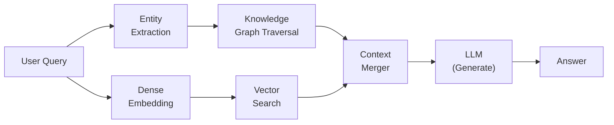
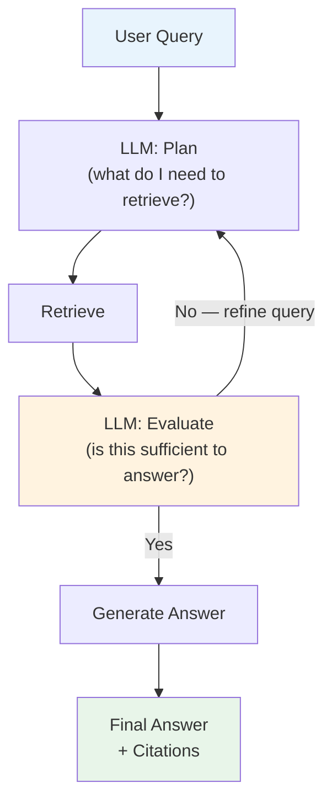
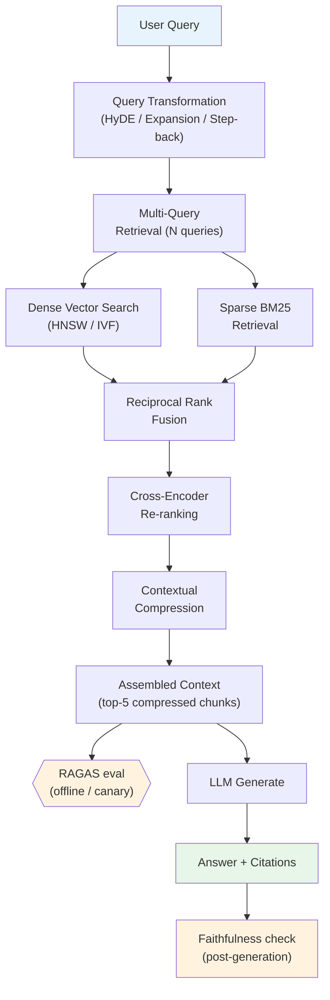

# Ch 3 — Advanced RAG

!!! info "Chapter Meta"
    **Level:** Expert | **Reading time:** 90 min  
    **Prerequisites:** Ch 1 — RAG Fundamentals, Ch 2 — Vector Databases

---

## Learning Objectives

By the end of this chapter you will be able to:

1. Explain why naive single-stage dense retrieval is a quality bottleneck and identify which stage is failing from evaluation metrics alone.
2. Implement query transformation techniques — HyDE, query expansion, and step-back prompting — and measure their impact on Recall@k.
3. Configure a two-stage retrieval pipeline: bi-encoder fast retrieval followed by cross-encoder re-ranking.
4. Apply parent-child chunking, multi-query retrieval, and contextual compression to improve answer quality on complex multi-part questions.
5. Evaluate a full RAG system with RAGAS (faithfulness, answer relevancy, context recall, context precision) and interpret the score to diagnose the dominant failure mode.

---

## 3.1 Why Naive RAG Fails

Naive RAG — embed query, ANN search, pass top-k chunks to LLM — fails in predictable ways that no amount of prompt engineering can fix.

### 3.1.1 The Retrieval Quality Bottleneck

The LLM can only answer from what is in its context. If the retrieval stage fails to surface the relevant chunk, the generation stage is doomed. Two metrics characterise the bottleneck:

| Metric | Naive RAG typical value | Production target |
|--------|------------------------|------------------|
| Recall@10 | 0.60 – 0.75 | > 0.90 |
| MRR@10 | 0.45 – 0.60 | > 0.75 |

The gap between naive and production-grade performance is almost entirely retrieval quality, not LLM capability.

### 3.1.2 Single-Stage Search Limitations

Single-stage dense search has four structural weaknesses:

1. **Vocabulary mismatch:** the query uses different words than the document (synonyms, paraphrases, domain jargon).
2. **Short query problem:** 3-word queries do not give the embedding model enough context to produce a discriminative vector.
3. **Asymmetric retrieval:** a passage may be topically relevant but not lexically or semantically similar to the query as phrased.
4. **Coarse embedding granularity:** a single 768-dim vector cannot simultaneously encode all aspects of a complex multi-part question.

Advanced RAG addresses each of these with targeted techniques.

---

## 3.2 Query Transformation

Query transformation rewrites or expands the user's query before retrieval to improve recall.

### 3.2.1 HyDE — Hypothetical Document Embeddings

**HyDE** (Gao et al., 2022) addresses vocabulary mismatch by embedding a *hypothetical answer* rather than the question. An LLM generates a plausible (not necessarily accurate) answer to the query; that answer is embedded and used as the retrieval query.

**Intuition:** a hypothetical answer uses the same vocabulary as real answer documents. If the real answer says "mitochondria produce ATP via oxidative phosphorylation", a hypothetical answer will say something similar — even if the user asked "what makes energy in cells?"

```python
"""
hyde.py — Hypothetical Document Embeddings for improved recall.
"""

from __future__ import annotations

import anthropic
import numpy as np
from sentence_transformers import SentenceTransformer


def generate_hypothetical_document(
    query: str,
    model: str = "claude-haiku-4-5",
) -> str:
    """Generate a plausible (not necessarily accurate) answer to the query."""
    client = anthropic.Anthropic()
    message = client.messages.create(
        model=model,
        max_tokens=256,
        system=(
            "Write a concise, factual-sounding passage that directly answers "
            "the question. The passage should look like an excerpt from a "
            "reference document. Do not hedge or say you are generating a hypothetical."
        ),
        messages=[{"role": "user", "content": query}],
    )
    return message.content[0].text  # type: ignore[union-attr]


def hyde_embed(
    query: str,
    embed_model: SentenceTransformer,
    n_hypothetical: int = 3,
) -> np.ndarray:
    """
    Return a HyDE embedding by averaging embeddings of N hypothetical documents.

    Averaging multiple hypothetical documents reduces variance from any single
    hallucinated answer.
    """
    hypotheticals = [generate_hypothetical_document(query) for _ in range(n_hypothetical)]
    embeddings: np.ndarray = embed_model.encode(
        hypotheticals, normalize_embeddings=True, convert_to_numpy=True
    )
    mean_emb = embeddings.mean(axis=0)
    # Re-normalise the averaged embedding
    mean_emb = mean_emb / np.linalg.norm(mean_emb)
    return mean_emb
```

### 3.2.2 Query Expansion

**Query expansion** adds related terms to the original query before retrieval. Unlike HyDE (which generates a full hypothetical document), expansion adds specific related keywords:

```python
def expand_query(query: str) -> list[str]:
    """Generate N expanded versions of the query for multi-query retrieval."""
    client = anthropic.Anthropic()
    message = client.messages.create(
        model="claude-haiku-4-5",
        max_tokens=256,
        system=(
            "You are a search query optimiser. Given a query, generate 3 alternative "
            "phrasings that cover different aspects or use different vocabulary. "
            "Output one query per line, no numbering."
        ),
        messages=[{"role": "user", "content": f"Original query: {query}"}],
    )
    lines = message.content[0].text.strip().split("\n")  # type: ignore[union-attr]
    return [query] + [line.strip() for line in lines if line.strip()]
```

### 3.2.3 Step-Back Prompting

**Step-back prompting** (Zheng et al., 2023) asks the LLM to first generate a more abstract, higher-level question from the user's specific query, retrieves on the abstract question, then returns to the specific:

- Specific: "What is the boiling point of isopropanol at 2 atm?"
- Step-back: "What is the relationship between pressure and boiling point of alcohols?"

Retrieving on the step-back question surfaces general principles; retrieving on the original question surfaces specific facts. Both result sets are merged.

---

## 3.3 Re-Ranking

Even with perfect recall, the chunk most relevant to the query might not be ranked first. Re-ranking is a second-stage model that reorders the retrieved candidates more accurately.

### 3.3.1 Bi-Encoder vs Cross-Encoder

| Property | Bi-Encoder | Cross-Encoder |
|----------|-----------|--------------|
| Architecture | Query and document encoded separately | Query and document encoded jointly |
| Accuracy | Moderate — no interaction between query and document tokens | High — full attention across query and document |
| Latency | Fast — embeddings precomputed | Slow — must run for each (query, doc) pair |
| Role in pipeline | Stage 1: fast ANN retrieval | Stage 2: accurate re-ranking of top-k candidates |

The two-stage pipeline retrieves 50–100 candidates with the bi-encoder (fast), then re-ranks them with the cross-encoder (accurate), returning the top 5.

### 3.3.2 Cross-Encoder Re-Ranking

```python
"""
reranker.py — Cross-encoder re-ranking of retrieved candidates.

Install: pip install sentence-transformers
"""

from __future__ import annotations

from sentence_transformers import CrossEncoder


def rerank(
    query: str,
    candidates: list[str],
    model_name: str = "cross-encoder/ms-marco-MiniLM-L-6-v2",
    top_k: int = 5,
) -> list[tuple[float, str]]:
    """
    Re-rank candidate passages using a cross-encoder model.

    Args:
        query: The user's original query.
        candidates: List of retrieved passages to re-rank.
        model_name: Cross-encoder model identifier.
        top_k: Number of top passages to return.

    Returns:
        List of (score, passage) tuples sorted by score descending.
    """
    model = CrossEncoder(model_name)
    pairs = [(query, passage) for passage in candidates]
    scores: list[float] = model.predict(pairs).tolist()

    ranked = sorted(zip(scores, candidates), key=lambda x: x[0], reverse=True)
    return ranked[:top_k]
```

### 3.3.3 ColBERT

**ColBERT** (Khattab & Zaharia, 2020) is a late-interaction model that offers cross-encoder-level accuracy at near-bi-encoder speed. It stores per-token embeddings for each document (rather than a single embedding), and scores query-document relevance via the MaxSim operator:

$$\text{score}(q, d) = \sum_{i \in q} \max_{j \in d} E_{q_i} \cdot E_{d_j}^\top$$

ColBERT requires more storage than a bi-encoder (one vector per token per document) but is 10–100× faster than a cross-encoder, making it attractive for the re-ranking stage at scale.

---

## 3.4 Multi-Query Retrieval

Multi-query retrieval generates \(N\) paraphrased versions of the query, retrieves independently for each, takes the union of results, and deduplicates.

```python
"""
multi_query.py — Multi-query retrieval with union and deduplication.
"""

from __future__ import annotations

import anthropic
from sentence_transformers import SentenceTransformer


def multi_query_retrieve(
    query: str,
    index,  # VectorIndex from Ch 1
    embed_model: SentenceTransformer,
    n_queries: int = 4,
    k_per_query: int = 5,
) -> list[str]:
    """
    Generate N paraphrased queries, retrieve k results per query,
    return deduplicated union.

    Returns:
        List of unique retrieved passages, deduplicated by exact text match.
    """
    client = anthropic.Anthropic()
    message = client.messages.create(
        model="claude-haiku-4-5",
        max_tokens=512,
        system=(
            "Generate exactly {n} alternative phrasings of the user's question. "
            "Each phrasing should approach the topic from a different angle. "
            "Output one phrasing per line, no numbering, no preamble."
        ).format(n=n_queries - 1),
        messages=[{"role": "user", "content": query}],
    )
    extra_queries = [
        line.strip()
        for line in message.content[0].text.strip().split("\n")  # type: ignore[union-attr]
        if line.strip()
    ]
    all_queries = [query] + extra_queries[:n_queries - 1]

    seen: set[str] = set()
    unique_passages: list[str] = []

    for q in all_queries:
        results = index.search(q, k=k_per_query)
        for _score, passage in results:
            if passage not in seen:
                seen.add(passage)
                unique_passages.append(passage)

    return unique_passages
```

The union of results from multiple query phrasings reliably increases Recall@k by 10–20% on paraphrase-sensitive benchmarks.

---

## 3.5 Parent-Child Chunking

**Parent-child chunking** (also called small-to-big retrieval) decouples the *indexing unit* from the *retrieval unit*:

- **Index** small child chunks (e.g., 128 tokens) for precise matching.
- **Retrieve** the parent paragraph (e.g., 512 tokens) for rich context.

This gives the best of both worlds: the small chunk's embedding is precise enough to retrieve the right passage; the parent chunk provides enough context for the LLM to reason correctly.

```python
"""
parent_child.py — Parent-child chunk indexing and retrieval.
"""

from __future__ import annotations

from dataclasses import dataclass

import numpy as np
from sentence_transformers import SentenceTransformer


@dataclass
class ParentChunk:
    parent_id: str
    parent_text: str
    children: list[str]


def build_parent_child_index(
    paragraphs: list[str],
    embed_model: SentenceTransformer,
    child_sentences: int = 2,
) -> tuple[np.ndarray, list[str], list[str]]:
    """
    Split each paragraph into child sentences, embed children for retrieval,
    map each child back to its parent paragraph.

    Returns:
        (child_embeddings, child_texts, parent_texts_per_child)
    """
    import nltk
    nltk.download("punkt_tab", quiet=True)

    child_texts: list[str] = []
    parent_texts: list[str] = []

    for para in paragraphs:
        sentences = nltk.sent_tokenize(para)
        for i in range(0, len(sentences), child_sentences):
            child = " ".join(sentences[i : i + child_sentences]).strip()
            if child:
                child_texts.append(child)
                parent_texts.append(para)  # map child → its parent paragraph

    embeddings: np.ndarray = embed_model.encode(
        child_texts, normalize_embeddings=True, convert_to_numpy=True
    )
    return embeddings, child_texts, parent_texts
```

At query time, retrieve by child embedding, but pass the corresponding parent text to the LLM.

---

## 3.6 Contextual Compression

**Contextual compression** (Langchain, 2023) extracts only the directly relevant portion from each retrieved chunk before passing it to the LLM. This reduces noise and context length when chunks contain both relevant and irrelevant sentences.

```python
def compress_context(
    query: str,
    passage: str,
    model: str = "claude-haiku-4-5",
) -> str:
    """Extract only the sentences from `passage` that are relevant to `query`."""
    client = anthropic.Anthropic()
    message = client.messages.create(
        model=model,
        max_tokens=512,
        system=(
            "You are a context compressor. Given a passage and a query, extract "
            "ONLY the sentences from the passage that are directly relevant to "
            "the query. Preserve the exact wording. If no sentences are relevant, "
            "return the empty string."
        ),
        messages=[{
            "role": "user",
            "content": f"Query: {query}\n\nPassage:\n{passage}",
        }],
    )
    compressed = message.content[0].text.strip()  # type: ignore[union-attr]
    return compressed if compressed else passage  # fall back to full passage
```

---

## 3.7 Knowledge Graph RAG

**Knowledge Graph RAG** (KG-RAG) augments vector retrieval with structured graph traversal.

### 3.7.1 Entity Extraction and Graph Construction

An NLP model (spaCy NER, or an LLM) extracts entities and their relationships from documents. These are stored in a knowledge graph (Neo4j, NetworkX) as `(subject, predicate, object)` triples.

### 3.7.2 Graph Traversal at Query Time

1. Extract entities from the query.
2. Look up query entities in the graph.
3. Traverse edges up to depth \(h\) (typically 2–3 hops) to find related entities.
4. Retrieve all graph facts for the traversed subgraph.
5. Merge with dense vector retrieval results.

### 3.7.3 Structured + Unstructured Hybrid

KG-RAG is particularly effective for questions requiring multi-hop reasoning over structured facts — "Who founded the company that acquired X?" — which pure dense retrieval struggles with because the relevant information spans multiple documents with no single chunk containing the complete answer.



---

## 3.8 Evaluation with RAGAS

**RAGAS** (Shahul et al., 2023) is the standard evaluation framework for RAG pipelines. It measures four orthogonal dimensions.

### 3.8.1 RAGAS Metrics

| Metric | What it measures | Range | Failure mode detected |
|--------|----------------|-------|----------------------|
| **Faithfulness** | Fraction of answer claims supported by the retrieved context | 0–1 | Hallucination — LLM fabricates beyond context |
| **Answer Relevancy** | How directly the answer addresses the question | 0–1 | Off-topic or verbose answers |
| **Context Recall** | Fraction of ground-truth answer information present in retrieved context | 0–1 | Retrieval failure — correct context not retrieved |
| **Context Precision** | Fraction of retrieved context that is actually relevant | 0–1 | Noise — irrelevant chunks retrieved alongside relevant ones |

### 3.8.2 RAGAS Code Example

```python
"""
ragas_eval.py — Evaluate a RAG pipeline with RAGAS.

Install: pip install ragas anthropic datasets
"""

from __future__ import annotations

from datasets import Dataset
from ragas import evaluate
from ragas.metrics import (
    answer_relevancy,
    context_precision,
    context_recall,
    faithfulness,
)

# ---------------------------------------------------------------------------
# Build the evaluation dataset
# ---------------------------------------------------------------------------
# Each row: question, answer, contexts (list[str]), ground_truth
eval_data = {
    "question": [
        "What is HNSW and how does its layered graph work?",
        "When should you use DPO instead of PPO?",
    ],
    "answer": [
        "HNSW is a graph-based ANN algorithm that builds multiple layers of proximity graphs.",
        "DPO is preferred when you have a fixed preference dataset and want simpler training.",
    ],
    "contexts": [
        [
            "HNSW (Hierarchical Navigable Small World) builds a multi-layer proximity graph...",
            "Higher layers contain fewer nodes with longer-range connections for fast traversal...",
        ],
        [
            "DPO eliminates the separate reward model and RL loop by deriving a supervised loss...",
            "PPO is preferred for online alignment where responses are generated during training...",
        ],
    ],
    "ground_truths": [
        ["HNSW builds a layered graph where higher layers provide long-range navigation and layer 0 provides dense local connections."],
        ["DPO is better when you have a fixed preference dataset; PPO is better for online alignment."],
    ],
}

dataset = Dataset.from_dict(eval_data)

# ---------------------------------------------------------------------------
# Run evaluation
# ---------------------------------------------------------------------------
result = evaluate(
    dataset=dataset,
    metrics=[faithfulness, answer_relevancy, context_recall, context_precision],
    # Specify your LLM judge here if not using the default OpenAI
    # llm=your_llm_wrapper,
)

print(result)
# Output: {'faithfulness': 0.92, 'answer_relevancy': 0.88,
#          'context_recall': 0.85, 'context_precision': 0.79}
```

### 3.8.3 Interpreting RAGAS Scores

| Score pattern | Diagnosis | Fix |
|--------------|-----------|-----|
| Low faithfulness, high context recall | LLM ignores context and halluccinates | Strengthen system prompt; reduce context length |
| High faithfulness, low context recall | Retrieval fails to surface relevant chunks | Better embeddings; hybrid search; query transformation |
| Low context precision | Too many irrelevant chunks retrieved | Higher relevance threshold; re-ranking |
| Low answer relevancy | Answer technically correct but doesn't address the question | Improve generation prompt; check question interpretation |

---

## 3.9 Agentic RAG

In **agentic RAG**, the LLM itself decides when to retrieve, what to retrieve, and whether to iterate — rather than having a fixed retrieve-then-generate pipeline.

### 3.9.1 The Agentic Retrieval Loop



The LLM maintains an internal state of what it has retrieved, what gaps remain, and what to retrieve next. This iterative refinement loop can handle multi-hop questions that single-pass RAG cannot.

### 3.9.2 Agentic RAG with Tool Use

```python
"""
agentic_rag.py — RAG where the LLM decides when and what to retrieve.
"""

from __future__ import annotations

import json

import anthropic

# The retrieval tool the LLM can call
RETRIEVAL_TOOL = {
    "name": "retrieve_documents",
    "description": (
        "Search the knowledge base for passages relevant to a query. "
        "Call this when you need information to answer the user's question. "
        "You may call it multiple times with different queries."
    ),
    "input_schema": {
        "type": "object",
        "properties": {
            "query": {
                "type": "string",
                "description": "The search query to find relevant passages.",
            },
            "k": {
                "type": "integer",
                "description": "Number of passages to retrieve (default 5, max 10).",
                "default": 5,
            },
        },
        "required": ["query"],
    },
}


def agentic_rag(
    user_question: str,
    vector_index,  # VectorIndex from Ch 1
    max_iterations: int = 4,
) -> str:
    """
    Run an agentic RAG loop where the LLM decides when to retrieve.

    Args:
        user_question: The question to answer.
        vector_index: Prebuilt VectorIndex instance.
        max_iterations: Maximum retrieve-evaluate cycles before forcing generation.

    Returns:
        The LLM's final answer with inline citations.
    """
    client = anthropic.Anthropic()
    messages: list[dict] = [{"role": "user", "content": user_question}]
    all_retrieved: list[str] = []

    system = (
        "You are a research assistant with access to a knowledge base. "
        "Use the retrieve_documents tool to gather information before answering. "
        "You may retrieve multiple times if the initial results are insufficient. "
        "When you have enough information, provide a comprehensive answer with citations."
    )

    for _ in range(max_iterations):
        response = client.messages.create(
            model="claude-opus-4-5",
            max_tokens=1024,
            system=system,
            tools=[RETRIEVAL_TOOL],  # type: ignore[list-item]
            messages=messages,
        )

        if response.stop_reason == "end_turn":
            # LLM decided it has enough information
            return response.content[0].text  # type: ignore[union-attr]

        # Process tool calls
        tool_results = []
        for block in response.content:
            if block.type == "tool_use" and block.name == "retrieve_documents":
                inputs = block.input
                k = min(int(inputs.get("k", 5)), 10)
                results = vector_index.search(inputs["query"], k=k)
                passages = [chunk for _score, chunk in results]
                all_retrieved.extend(passages)

                context = "\n\n---\n\n".join(
                    f"[{i + 1}] {p}" for i, p in enumerate(passages)
                )
                tool_results.append({
                    "type": "tool_result",
                    "tool_use_id": block.id,
                    "content": context,
                })

        messages.append({"role": "assistant", "content": response.content})
        messages.append({"role": "user", "content": tool_results})

    # Force final answer after max iterations
    messages.append({
        "role": "user",
        "content": "Please provide your best answer based on what you have retrieved so far.",
    })
    final = client.messages.create(
        model="claude-opus-4-5",
        max_tokens=1024,
        system=system,
        messages=messages,
    )
    return final.content[0].text  # type: ignore[union-attr]
```

---

## 3.10 Production RAG Architecture

A complete production RAG system integrates all the techniques from this chapter:



| Stage | Technique | Expected gain |
|-------|-----------|--------------|
| Query transformation | HyDE + expansion | +10–20% Recall@10 |
| Multi-query | 3–4 paraphrased queries | +10–15% Recall@10 |
| Fusion | Dense + BM25 + RRF | +5–10% NDCG@10 |
| Re-ranking | Cross-encoder (ms-marco-MiniLM) | +10–15% MRR |
| Contextual compression | Extract relevant sentences | -30% context tokens, similar faithfulness |

Cumulative improvement over naive RAG: **+25–40% on end-to-end answer accuracy** on standard benchmarks.

---

## Exercises

1. **HyDE ablation.** Index the BEIR FIQA dataset. Compare Recall@10 for (a) raw query embedding, (b) single hypothetical document, (c) average of 3 hypothetical documents. Plot the recall improvement vs number of LLM calls per query.

2. **Cross-encoder calibration.** Using `cross-encoder/ms-marco-MiniLM-L-6-v2`, re-rank 50 retrieved candidates for 100 queries. Compare MRR@10 before and after re-ranking. At what candidate count does re-ranking give the most improvement?

3. **RAGAS diagnosis.** Build a naive RAG system over 200 Wikipedia articles. Run RAGAS evaluation on 50 questions. For the bottom 10% of faithfulness scores, inspect the generated answers and retrieved contexts. What is the dominant failure pattern?

4. **Parent-child chunking.** Index 100 documents with (a) naive 512-token chunks, (b) parent-child (128-token child, 512-token parent). On 30 multi-sentence questions where the answer spans sentences within a paragraph, compare answer accuracy. Does parent-child chunking help?

5. **Agentic vs fixed RAG.** Run both the naive `rag_answer` from Chapter 1 and `agentic_rag` from Section 3.9 on 20 multi-hop questions (e.g., "Who founded the company that invented X?"). Measure: number of LLM calls, answer accuracy, and total cost. When does the agentic overhead pay off?

---

## Summary

- Naive RAG fails primarily at retrieval, not generation — diagnose with Recall@10 and Context Recall before tuning prompts.
- Query transformation (HyDE, expansion, step-back) addresses the short-query and vocabulary-mismatch problems by rewriting before retrieval.
- Re-ranking with a cross-encoder provides cross-encoder-level accuracy after fast bi-encoder retrieval; ColBERT offers a middle ground.
- Multi-query retrieval and parent-child chunking improve recall on complex, multi-part questions.
- Contextual compression reduces context length and noise by extracting only relevant sentences from each retrieved chunk.
- Knowledge Graph RAG enables multi-hop reasoning over structured entity-relationship data inaccessible to pure dense retrieval.
- RAGAS evaluates four orthogonal dimensions — faithfulness, answer relevancy, context recall, context precision — each diagnosing a distinct failure mode.
- Agentic RAG delegates retrieval decisions to the LLM, enabling iterative refinement at the cost of additional latency and API calls.
