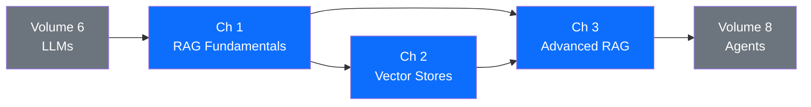

# Volume 7 — Retrieval-Augmented Generation

Large language models are trained on static snapshots of the world and cannot access knowledge created after their training cutoff. They hallucinate when asked about facts outside their training distribution, and they have no visibility into private organisational knowledge. Retrieval-Augmented Generation (RAG) addresses all three problems by equipping a model with a dynamic, queryable external memory that is consulted at inference time rather than baked into model weights. This volume teaches you to design, build, evaluate, and scale RAG systems — from a simple in-memory pipeline to production vector databases and advanced multi-stage retrieval.

---

!!! warning "The Most Common RAG Mistake"
    **Naive RAG fails silently. Most production issues are retrieval failures, not generation failures.**  
    When a RAG system returns a wrong or incomplete answer, the instinct is to improve the LLM prompt. In practice, more than 70% of production failures are caused by the retrieval stage — wrong chunks, missing chunks, or irrelevant chunks passed to the model. Always instrument and evaluate retrieval independently of generation.

---

## Volume Learning Outcomes

After completing this volume a student will be able to:

1. **Explain** the three-stage RAG architecture (Index, Retrieve, Generate) and identify where each class of failure can occur.
2. **Implement** a complete end-to-end RAG pipeline in Python using open-source embedding models, FAISS for vector search, and the Anthropic API for generation.
3. **Select and configure** a production vector database (Qdrant, Chroma, pgvector) with appropriate HNSW parameters, metadata filtering, and hybrid search for a given scale and query pattern.
4. **Evaluate** retrieval quality using Recall@k, MRR, and NDCG, and diagnose the dominant failure mode in a given RAG system using RAGAS.
5. **Apply** advanced retrieval techniques — query rewriting, HyDE, cross-encoder re-ranking, parent-child chunking, and multi-query retrieval — to close the quality gap between naive and production-grade RAG.
6. **Design** an agentic RAG system where the LLM decides when and what to retrieve, implements iterative refinement, and produces answers with verifiable citations.

---

## Prerequisites

| Requirement | Covered in |
|-------------|-----------|
| LLM fundamentals and the transformer architecture | Volume 6 — LLMs, Ch 1 |
| Prompt engineering and system prompts | Volume 6 — LLMs, Ch 2 |
| Python, NumPy, and basic linear algebra | Volume 2 — Python |
| REST API consumption | Volume 2, Ch 3 |

---

## Chapter Map

---

## Chapters

| # | Title | Key Topics | Reading Time |
|---|-------|-----------|-------------|
| 1 | [RAG Fundamentals](ch01-fundamentals/index.md) | Architecture, chunking strategies, embedding models, cosine similarity, naive pipeline in Python, failure modes, retrieval metrics | 90 min |
| 2 | [Vector Databases](ch02-vector-stores/index.md) | ANN vs exact search, HNSW, IVF, product quantisation, Qdrant, Chroma, pgvector, hybrid search (BM25 + dense), metadata filtering | 75 min |
| 3 | [Advanced RAG](ch03-advanced-rag/index.md) | Query transformation, HyDE, re-ranking, multi-query retrieval, parent-child chunking, RAGAS evaluation, agentic RAG | 90 min |

---

*Next: [Chapter 1 — RAG Fundamentals](ch01-fundamentals/index.md)*
