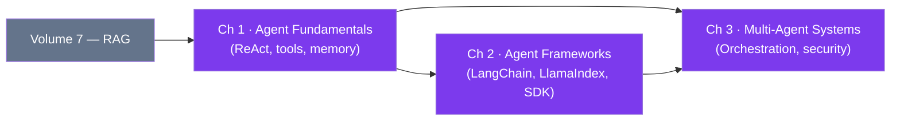

# Volume 8 — AI Agents

> **Applied AI Engineering** | Volume 8 of 10

---

## Introduction

The shift from static LLM completions to autonomous, tool-using AI agents is one of the most consequential transitions in applied AI engineering. An AI agent does not merely respond — it perceives its environment, reasons about goals, selects and invokes tools, and iterates until a task is complete or a stopping criterion is met. This loop unlocks capabilities that a single prompt-response cycle cannot: searching the web, writing and executing code, querying databases, coordinating with other agents, and adapting its own plan mid-execution.

This volume provides a rigorous, hands-on treatment of AI agents. It starts from first principles — what an agent is, how its components fit together, and why the ReAct pattern works — moves through the dominant frameworks used in industry today, and concludes with the complex challenges of multi-agent systems: coordination, communication, consensus, and safety.

By the end of this volume you will be able to design, build, evaluate, and operate agentic AI systems that go well beyond simple chatbots.

---

## Chapters

| # | Chapter | Key Topics |
|---|---------|-----------|
| 1 | [AI Agent Fundamentals](ch01-fundamentals/index.md) | Sense–Think–Act loop, ReAct, tool use, memory types, failure modes |
| 2 | [Agent Frameworks](ch02-frameworks/index.md) | LangChain, LlamaIndex, AutoGen, CrewAI, Anthropic SDK, observability |
| 3 | [Multi-Agent Systems](ch03-multi-agent/index.md) | Topologies, orchestration, consensus, security, evaluation |

---

## Chapter Dependency Graph

Chapter 1 is a prerequisite for both Chapter 2 and Chapter 3. Readers already comfortable with the ReAct pattern may skip to Chapter 2 but should review the memory and evaluation sections first.

---

## Learning Outcomes

On completing this volume you will be able to:

1. **Explain** the Sense–Think–Act loop and identify each component in a real agentic system.
2. **Implement** a ReAct agent from scratch using Anthropic's `tool_use` API, with correct loop termination conditions.
3. **Select** the right agent framework (LangChain, LlamaIndex, CrewAI, or the Anthropic Agents SDK) for a given production use case based on maturity, abstraction level, and observability needs.
4. **Design** a multi-agent architecture — choosing between hierarchical, peer-to-peer, and orchestrator-worker topologies — and justify the trade-offs.
5. **Evaluate** agent systems using task-completion rate, steps-to-completion, and tool-call accuracy, and identify common failure modes before they reach production.
6. **Apply** security best practices to isolate agents and prevent prompt-injection attacks across agent boundaries.

---

!!! tip "Prerequisites"
    This volume assumes familiarity with LLM prompting and the RAG pattern (Volume 7). Comfort with Python asyncio and HTTP APIs is helpful for Chapter 2 and Chapter 3.

!!! note "Code Repository"
    All code examples in this volume are available in the accompanying GitHub repository under `volume08-agents/`. Each chapter has a self-contained `requirements.txt`.
