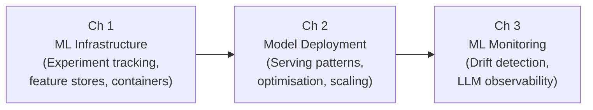

# Volume 9 — MLOps

Machine learning models that never reach production deliver zero business value. MLOps — the discipline at the intersection of ML engineering, DevOps, and data engineering — exists to close the gap between model training and reliable, sustained production operation. This volume treats MLOps not as an afterthought but as a first-class engineering practice, covering the infrastructure patterns, deployment strategies, and observability systems that keep models alive and useful. By the end of this volume, you will be able to design, deploy, and operate ML systems that degrade gracefully, recover automatically, and improve continuously.

---

## Learning Map

---

## Chapters at a Glance

| # | Chapter | Description | Reading Time |
|---|---------|-------------|--------------|
| 1 | [ML Infrastructure](ch01-infrastructure/index.md) | Experiment tracking with MLflow and W&B, feature stores, data versioning with DVC, container fundamentals, Kubernetes for ML, and cloud ML platform comparison | 90 min |
| 2 | [Model Deployment](ch02-deployment/index.md) | Serving patterns, FastAPI for LLM endpoints, model serialisation, inference optimisation (quantisation, continuous batching, KV cache), vLLM, horizontal scaling, blue-green and canary deployments | 90 min |
| 3 | [ML Monitoring & Observability](ch03-monitoring/index.md) | Infrastructure metrics, data drift detection (PSI, KS test, Chi-squared), concept drift, LLM-specific monitoring, Langfuse, Prometheus + Grafana alerting, retraining triggers | 75 min |

---

## Prerequisites

Before starting Volume 9, you should have completed:

- **Volume 1** — Foundations of AI and ML
- **Volume 2** — Python for AI Engineering
- **Volume 3** — Classical Machine Learning
- **Volume 4** — Deep Learning
- **Volume 5** — Transformers
- **Volume 6** — Large Language Models
- **Volume 7** — Retrieval-Augmented Generation
- **Volume 8** — AI Agents

---

## Volume Learning Outcomes

By completing this volume, you will be able to:

1. **Design ML infrastructure** using experiment tracking tools, feature stores, and data versioning systems that support reproducible, collaborative model development.
2. **Build production model serving systems** that handle concurrent traffic, deliver low-latency responses, and gracefully scale under varying load.
3. **Apply inference optimisation techniques** — including quantisation, continuous batching, and KV cache management — to reduce cost and latency for LLM deployments.
4. **Implement deployment strategies** such as blue-green and canary releases that enable safe, zero-downtime model updates.
5. **Detect and respond to data drift and concept drift** using statistical tests and automated alerting pipelines.
6. **Instrument LLM systems for observability** — tracking hallucination rates, cost per query, latency per token, and quality metrics through tracing frameworks.

---

!!! quote "The MLOps Imperative"
    "A model not in production is a hobby project. MLOps is the craft of keeping models alive and useful."
