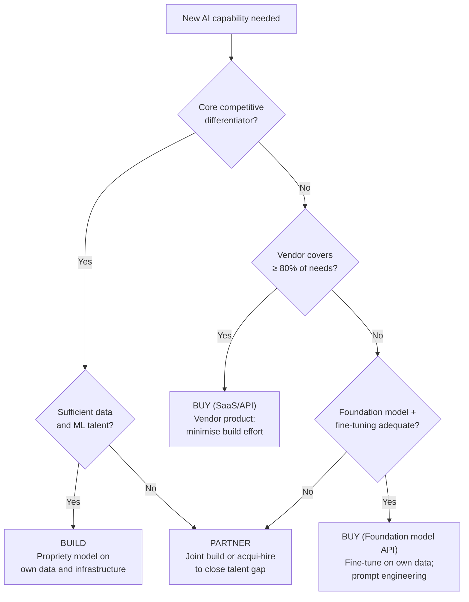

# Ch 1 — AI Strategy

!!! info "Chapter Meta"
    **Level:** Advanced &nbsp;|&nbsp; **Reading time:** 75 min &nbsp;|&nbsp; **Volume:** 10 — Enterprise AI

---

## Learning Objectives

By the end of this chapter you will be able to:

1. Place an organisation on a five-level AI maturity model and recommend the highest-leverage investments for each transition.
2. Apply a business impact vs technical feasibility matrix to prioritise an AI use-case portfolio with concrete examples.
3. Calculate AI project ROI — including cost savings, revenue uplift, and total cost of ownership — and derive a payback period.
4. Use a structured build vs buy vs partner decision tree to make a defensible technology selection.
5. Define phase-gate success criteria for each stage of the AI project lifecycle from Discovery through Scaling.

---

## AI Maturity Model

Most organisations sit between the extremes of "no intentional AI use" and "AI embedded in every decision at scale." Understanding where you are determines what investments are highest leverage — and prevents cargo-culting practices from organisations at a different maturity level.

| Level | Name | Characteristics | Data Maturity | Team Structure | Key Metrics |
|-------|------|----------------|--------------|----------------|-------------|
| **1** | Ad Hoc | Individual experiments; no coordination; off-the-shelf tools used by individuals | Siloed data in spreadsheets and departmental databases | Individual contributors only | None defined |
| **2** | Exploring | Department-level pilots; small dedicated team; basic MLflow tracking; no shared infrastructure | Central data warehouse emerging; limited quality controls | 2–5 ML engineers; no dedicated platform team | Project count; pilot success rate |
| **3** | Operationalising | First models in production; MLOps practices emerging; cross-functional collaboration between data, engineering, and business units | Data governance in place; feature store in progress; data contracts starting | ML platform team (3–8) + embedded ML engineers in product teams | Models in production; prediction volume; drift SLA compliance |
| **4** | Scaling | Multiple models across business units; centralised ML platform; A/B testing culture; model lifecycle automated | Real-time feature pipelines; data mesh emerging; data quality SLOs | Central AI platform (10+) + domain ML teams; dedicated MLOps function | Revenue impact; model refresh cadence; inference cost per unit |
| **5** | AI-Native | AI embedded in core product and operations; model lifecycle fully automated; AI R&D drives competitive differentiation | Streaming feature platform; full data mesh; real-time feature freshness SLOs | AI-first product teams; central AI safety and governance team | AI contribution to EBITDA; model portfolio ROI; governance audit pass rate |

!!! tip "Diagnostic shortcut"
    Ask: "Can we reproduce our best model from six months ago?" Level 1–2 answer: No. Level 3: Yes, with significant manual effort. Level 4–5: Automatically, from a Git commit hash plus `dvc pull`.

**Progression levers:**

- **Level 1 → 2**: Identify one high-value use case, assign a dedicated ML engineer, establish Git + experiment tracking (MLflow), and run a time-boxed PoC.
- **Level 2 → 3**: Build shared infrastructure (feature store, model registry, CI/CD for models); establish coding standards; define monitoring SLOs.
- **Level 3 → 4**: Align AI roadmap to business OKRs; instrument every model with business outcome metrics; automate the model refresh pipeline.
- **Level 4 → 5**: Automate evaluation gates in CI/CD; build an AI governance function; publish model cards for all production models; establish a red team.

---

## Use Case Selection Framework

Not all AI use cases are equal. A 2×2 matrix of **Business Impact** (Y-axis) vs **Technical Feasibility** (X-axis) provides a first-pass prioritisation that prevents two common failure modes: pursuing technically impressive but low-value projects, and underestimating feasibility barriers.

```
                     HIGH BUSINESS IMPACT
                              │
    Funded Research           │    Prioritise Now
    ─────────────────         │    ───────────────
    High value,               │    High value,
    hard to build             │    achievable today
    → invest in prerequisites │    → execute first
                              │
  LOW ───────────────────────-┼──────────────────── HIGH
  FEASIBILITY                 │                  FEASIBILITY
                              │
    Deprioritise              │    Quick Wins
    ────────────              │    ──────────
    Low value,                │    Low value,
    hard to build             │    easy to build
    → avoid                   │    → nice-to-have
                              │
                      LOW BUSINESS IMPACT
```

**Concrete examples by quadrant:**

| Quadrant | Use Case Examples |
|----------|-----------------|
| **Prioritise Now** | Internal document Q&A (RAG over existing docs), email triage classifier, meeting summarisation, customer support auto-response for FAQs |
| **Funded Research** | Autonomous end-to-end customer service agent, real-time personalised pricing, molecular drug discovery, fully autonomous code review |
| **Quick Wins** | Grammar checker for internal comms, automated meeting scheduler, simple image classification for content moderation |
| **Deprioritise** | Custom speech-to-text when Whisper works adequately, re-implementing a vendor product that fits 90% of needs |

**Scoring feasibility** (score each 1–5, sum to rank):

| Factor | Score 1 (low) | Score 5 (high) |
|--------|--------------|----------------|
| Data availability | No labelled data exists | Large, clean, labelled dataset ready |
| Integration complexity | Touches 10+ systems | Self-contained API call |
| Team capability | No ML expertise in team | Deep domain + ML expertise |
| Timeline pressure | Must ship in 4 weeks | 12+ months available |
| Regulatory constraints | High-risk AI Act tier | Minimal risk tier |

---

## ROI Calculation

Single-number ROI calculations that ignore ongoing costs systematically overstate returns. The following formula covers all material value and cost components:

$$\text{Value} = \text{Cost Savings} + \text{Revenue Uplift}$$

$$\text{TCO} = \text{Infrastructure} + \text{Talent} + \text{Data} + \text{Tooling} + \text{Compliance} + \text{Opportunity Cost}$$

$$\text{Net Annual Value} = \text{Value} - \text{TCO}_{\text{annual}}$$

$$\text{Payback Period (months)} = \frac{\text{Upfront Build Cost}}{\text{Net Monthly Value}}$$

**Worked example — AI-powered invoice processing:**

| Component | Calculation | Monthly Amount |
|-----------|-------------|----------------|
| Labour savings | 8 FTE × $6,500/mo fully-loaded | $52,000 |
| Error reduction | 2.5% → 0.3% error rate, $60/error, 10,000 invoices/mo | $13,200 |
| **Total monthly value** | | **$65,200** |
| Infrastructure | GPU + storage + API costs | $4,000 |
| Talent (1 ML engineer + 0.5 data engineer) | | $18,000 |
| Tooling | MLflow, Langfuse, monitoring | $1,500 |
| Compliance | Legal review, audits | $800 |
| **Total monthly run cost** | | **$24,300** |
| **Net monthly value** | | **$40,900** |
| Upfront build cost (4-month project) | | $185,000 |
| **Payback period** | $185,000 / $40,900 | **4.5 months** |

!!! warning "Hidden costs"
    Budget at least 20% of the build cost annually for model maintenance: patching for distribution drift, retraining on new data, handling production edge cases. This is the most consistently underestimated TCO component.

---

## Build vs Buy vs Partner Decision Framework

This is one of the highest-stakes strategic decisions in enterprise AI. The default has shifted as foundation model APIs have made "buy (API + fine-tuning)" viable for capabilities that previously required full custom builds.



| Factor | Favours Build | Favours Buy | Favours Partner |
|--------|--------------|-------------|----------------|
| **Competitive differentiation** | Core IP, unique data advantage | Commodity feature | Novel but non-core |
| **ML talent** | Strong in-house team | Limited ML expertise | Specific skill gap |
| **Time to value** | Long horizon (12+ months OK) | Need results in < 3 months | Medium horizon |
| **Data privacy** | Cannot send data to vendors | No sensitive data concerns | Selective data sharing |
| **Customisation depth** | Highly bespoke requirements | Standard use case | Moderate customisation |
| **Long-term TCO** | High volume → per-query costs dominate | Low volume → fixed cost inefficient | Shared investment model |

---

## Total Cost of Ownership

TCO analysis over a 3-year horizon consistently reveals that talent and maintenance dominate compute costs:

| Cost Category | Components | 3-Year Typical Range |
|---------------|-----------|---------------------|
| **Compute** | GPU instances (training + inference), auto-scaling, storage | $50k – $500k |
| **Data** | Labelling, cleaning, synthetic generation, storage, pipeline maintenance | $10k – $200k |
| **Talent** | ML engineers, data engineers, MLOps, product managers, compliance | $300k – $2M |
| **Tooling** | MLflow, W&B, feature store, Langfuse, Evidently, CI/CD pipelines | $5k – $80k |
| **Compliance** | Legal review, bias audits, EU AI Act registration, model cards | $20k – $150k |
| **Opportunity cost** | Engineering time redirected from other roadmap items | Highly variable |

**LLM API cost modelling:**

```python
"""
tco.py — LLM API cost modelling and 3-year TCO projection.

Requirements: pip install anthropic
"""
from __future__ import annotations


def monthly_llm_cost(
    daily_requests: int,
    mean_input_tokens: int,
    mean_output_tokens: int,
    input_price_per_million: float,
    output_price_per_million: float,
) -> dict[str, float]:
    """
    Estimate monthly LLM API cost.

    Args:
        daily_requests:             Number of API calls per day.
        mean_input_tokens:          Average input tokens per call.
        mean_output_tokens:         Average output tokens per call.
        input_price_per_million:    Vendor price per million input tokens (USD).
        output_price_per_million:   Vendor price per million output tokens (USD).

    Returns:
        Dict with token volumes and cost breakdown.
    """
    monthly = daily_requests * 30
    in_tokens = monthly * mean_input_tokens
    out_tokens = monthly * mean_output_tokens
    input_cost = in_tokens * input_price_per_million / 1_000_000
    output_cost = out_tokens * output_price_per_million / 1_000_000
    return {
        "monthly_requests": monthly,
        "monthly_input_tokens": in_tokens,
        "monthly_output_tokens": out_tokens,
        "input_cost_usd": round(input_cost, 2),
        "output_cost_usd": round(output_cost, 2),
        "total_cost_usd": round(input_cost + output_cost, 2),
    }


# Example: 5,000 requests/day, 1,200 input tokens, 600 output tokens (Haiku pricing)
cost = monthly_llm_cost(
    daily_requests=5_000,
    mean_input_tokens=1_200,
    mean_output_tokens=600,
    input_price_per_million=0.80,
    output_price_per_million=4.00,
)
print(f"Monthly LLM API cost: ${cost['total_cost_usd']:,.2f}")
# Monthly LLM API cost: $1,584.00
```

---

## AI Project Lifecycle Phases

Phase gates must have real veto power. Pressure to skip gates — especially PoC → Pilot — is the single most reliable predictor of expensive production incidents.

| Phase | Duration | Key Activities | Success Criteria (Gate) |
|-------|----------|---------------|------------------------|
| **Discovery** | 1–2 weeks | Problem framing, data audit, stakeholder alignment, feasibility scoring | Quantified success metrics agreed; data access confirmed; business owner committed; ROI above threshold |
| **Proof of Concept** | 2–4 weeks | Rapid prototype on representative data subset; internal evaluation only; baseline metric established | Model beats the defined baseline by the pre-agreed margin; no fatal data pipeline blockers; team confidence in feasibility |
| **Pilot** | 3 months | Production-quality model; limited user group (5–10%); A/B test vs control group; basic MLOps in place | Statistically significant improvement in the primary business metric (not just ML metric); p95 latency SLO met; no safety or bias issues identified |
| **Production** | Ongoing | Full rollout; drift monitoring active; incident response established; on-call rotation | Error rate below SLO; monitoring alerts tested; runbook documented; model card approved by governance |
| **Scaling** | 6–18 months | Expand to additional use cases; platform reuse; organisational capability building | ROI positive; platform adopted by 2+ additional teams; model refresh pipeline fully automated |

---

## Common Failure Modes

| Failure Mode | Description | Prevention |
|-------------|-------------|-----------|
| **Overpromising** | Committing to timelines based on cherry-picked demo performance | Present realistic confidence intervals; demonstrate on representative, not cherry-picked, data |
| **Underspecified metrics** | Starting without agreed quantitative definition of "good" | Define primary metric, secondary metrics, and guardrail metrics before PoC |
| **Data quality ignored** | Discovering data issues at Pilot that should have been caught at Discovery | Data audit is the first deliverable in Discovery — not a later concern |
| **No model monitoring** | Deploying to production without drift detection or quality scoring | Monitoring is a gate requirement for Production; missing monitoring = do not ship |
| **Talent concentration** | Critical knowledge residing in a single engineer | Encode institutional knowledge in model cards, runbooks, and reproducible DVC pipelines |
| **Boiling the ocean** | Designing a fully general AI platform before delivering value | Ship a narrow, working use case first; extract the platform from real use cases |
| **Governance surprise** | Legal or compliance issues discovered at Production | Engage legal and compliance at Discovery; build governance review into the PoC gate |

---

## Measuring Business Impact

### Leading vs Lagging Indicators

| Type | Examples | Availability | Strategic role |
|------|---------|-------------|---------------|
| **Leading (model quality)** | F1, AUC, faithfulness score, p95 latency, feature coverage | Immediate | Early warning system; operational control |
| **Lagging (business outcome)** | Revenue uplift, cost reduction, CSAT, churn rate, NPS | 30–90 day delay | Confirms that technical improvements translate to value |

Monitor leading indicators weekly; lagging indicators per experiment cycle. Neither alone is sufficient: leading metrics can improve while business outcomes stagnate (goodhart's law), and lagging metrics appear too late to catch fast-moving regressions.

### Attribution Challenges

- **Confounding factors**: seasonal effects, marketing campaigns, and product changes co-occur with model deployments.
- **Selection bias**: users who interact with the AI feature may already be higher-intent.
- **Long feedback loops**: churn reduction may not be visible for 90 days post-deployment.

*Best practice*: Randomised A/B tests with pre-registered primary metrics and minimum four-week baseline measurement. Observational correlation does not establish causation.

---

## Exercises

1. **Maturity assessment**: Apply the five-level maturity model to an organisation you know (or a publicly described case study). Write a two-page diagnosis: (a) current level with three pieces of evidence, (b) the top two investments to reach the next level, (c) the single biggest blocker and how to remove it.

2. **Use case portfolio**: Generate six AI use cases for a mid-sized retail bank. Place each on the 2×2 matrix with a one-paragraph feasibility justification. Recommend which two to pursue first and explain the sequencing rationale.

3. **ROI model**: Build a Python `ROICalculator` dataclass that accepts monthly value components (cost savings, revenue uplift), monthly run costs (infra, talent, tooling, compliance), and upfront build cost. Implement `net_annual_value()`, `roi_pct()`, and `payback_months()` methods. Run it for the invoice processing example and for two additional hypothetical use cases.

4. **Build vs buy analysis**: A healthcare company wants AI to extract structured data from clinical notes. Evaluate three options: (a) fine-tune a medical LLM on proprietary EHR data, (b) use a general-purpose foundation model API with prompt engineering, (c) purchase a specialised medical NLP SaaS. Compare on: data privacy, customisation depth, time to market, regulatory compliance burden, and 3-year TCO. Make a recommendation using the decision tree.

5. **Phase gate checklist**: Design a one-page gate review checklist for the Pilot → Production transition for an LLM-based credit decisioning system (EU AI Act high-risk). Include: minimum performance thresholds (with numbers), required documentation, required stakeholder approvals, monitoring requirements that must be active before go-live, and rollback criteria.

---

## Summary

- **AI maturity** (Level 1 Ad Hoc → Level 5 AI-Native) provides a diagnostic lens for where to invest; most organisations at Level 2–3 benefit most from shared MLOps infrastructure and cross-functional process improvements before adding more models.
- **Use case selection** via Business Impact × Technical Feasibility 2×2 prevents the twin failure modes of technically impressive but low-value projects and chronically underestimated feasibility barriers.
- **ROI calculation** must include all TCO components over a multi-year horizon; the 20% of build cost annual maintenance cost is the most consistently omitted line item.
- **Build vs buy vs partner** is a structured decision driven by competitive differentiation, talent availability, data privacy, and time to value — the default has shifted toward "buy (foundation model API)" for non-differentiating capabilities.
- **Phase gates** (Discovery → PoC → Pilot → Production → Scaling) must have real veto power; the PoC → Pilot gate is where most enterprise AI projects fail when data quality assumptions prove false.
- **Business impact measurement** requires randomised A/B tests with holdout groups for causal attribution; both leading (model quality) and lagging (business outcome) indicators are necessary for comprehensive signal coverage.

*Next: [Ch 2 — Enterprise AI Architecture](../ch02-architecture/index.md)*
