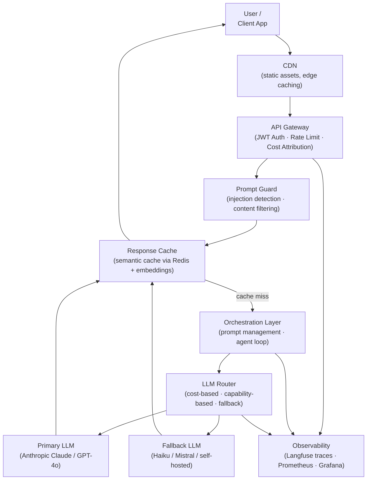
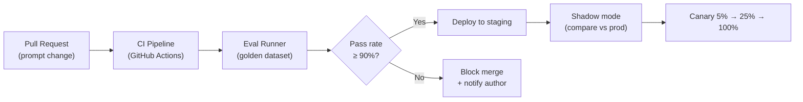

# Ch 2 — Enterprise AI Architecture

!!! info "Chapter Meta"
    **Level:** Expert &nbsp;|&nbsp; **Reading time:** 90 min &nbsp;|&nbsp; **Volume:** 10 — Enterprise AI

---

## Learning Objectives

By the end of this chapter you will be able to:

1. Draw and explain a complete enterprise LLM platform reference architecture from user to observability.
2. Design an API gateway with JWT authentication, per-tenant rate limiting, cost attribution by API key, and prompt injection filtering.
3. Implement LLM routing strategies — cost-based, capability-based, and fallback chains — to balance quality, cost, and reliability.
4. Build a semantic cache using embedding similarity to reduce LLM API costs, and articulate the cache hit rate vs staleness tradeoff.
5. Define measurable SLOs for AI systems covering latency, quality, safety, and cost dimensions with specific threshold values.

---

## Reference Architecture

An enterprise LLM platform is a shared service that allows multiple product teams to build AI features without each team managing their own serving, security, and observability infrastructure. The architecture below separates concerns into independently replaceable layers.



**Layer responsibilities:**

| Layer | Responsibility | Key failure mode if absent |
|-------|---------------|--------------------------|
| CDN | Edge caching for static assets; DDoS absorption | Origin overload on traffic spikes |
| API Gateway | Auth, rate limiting, cost attribution | Unbounded spend; unauthorized access |
| Prompt Guard | Injection detection; content policy enforcement | Data exfiltration; policy violations |
| Response Cache | Semantic deduplication of repeated queries | Unnecessary LLM spend |
| Orchestration | Prompt management; agent loop; tool dispatch | Prompt drift; ungoverned prompt changes |
| LLM Router | Model selection; fallback on errors | Single point of failure; cost overruns |
| Observability | Tracing; metrics; quality scoring | Silent degradation; no audit trail |

---

## API Gateway Patterns

### JWT Authentication

```python
"""
gateway/auth.py — JWT authentication middleware for the LLM platform gateway.

Requirements:
    pip install fastapi python-jose[cryptography]
"""
from __future__ import annotations

import os
from typing import Annotated

from fastapi import Depends, HTTPException, Security, status
from fastapi.security import HTTPAuthorizationCredentials, HTTPBearer
from jose import JWTError, jwt

security_scheme = HTTPBearer()
SECRET_KEY: str = os.environ["GATEWAY_JWT_SECRET"]
ALGORITHM = "HS256"


def get_token_claims(
    credentials: Annotated[HTTPAuthorizationCredentials, Security(security_scheme)],
) -> dict:
    """
    Validate a JWT Bearer token and return its claims.

    Claims must include: tenant_id, api_key_id, rate_limit_rpm, tier.
    Raises HTTP 401 on invalid or expired tokens.
    """
    try:
        claims = jwt.decode(credentials.credentials, SECRET_KEY, algorithms=[ALGORITHM])
        required = {"tenant_id", "api_key_id", "rate_limit_rpm"}
        if not required.issubset(claims.keys()):
            raise HTTPException(
                status_code=status.HTTP_401_UNAUTHORIZED,
                detail=f"Token missing required claims: {required - claims.keys()}",
            )
        return claims
    except JWTError as exc:
        raise HTTPException(
            status_code=status.HTTP_401_UNAUTHORIZED,
            detail="Invalid or expired token",
            headers={"WWW-Authenticate": "Bearer"},
        ) from exc
```

### Per-Tenant Rate Limiting (Sliding Window)

```python
"""
gateway/rate_limit.py — Per-tenant sliding window rate limiter backed by Redis.

Requirements:
    pip install redis
"""
from __future__ import annotations

import time

import redis

_redis: redis.Redis = redis.Redis(host="redis", port=6379, decode_responses=True)


class RateLimitExceeded(Exception):
    pass


def enforce_rate_limit(tenant_id: str, rpm_limit: int) -> None:
    """
    Enforce a per-tenant requests-per-minute (RPM) limit using a sliding window.

    The window key rotates every 60 seconds. Two keys are maintained (current + previous)
    to avoid hard resets at window boundaries.

    Raises:
        RateLimitExceeded: if the tenant has exceeded their RPM limit.
    """
    now = int(time.time())
    window = now // 60
    key = f"ratelimit:{tenant_id}:{window}"
    pipe = _redis.pipeline()
    pipe.incr(key)
    pipe.expire(key, 120)       # keep for 2 windows
    count = pipe.execute()[0]

    if count > rpm_limit:
        raise RateLimitExceeded(
            f"Tenant '{tenant_id}' exceeded {rpm_limit} RPM "
            f"(current window: {count} requests)"
        )
```

### Cost Attribution by API Key

```python
"""
gateway/cost_tracker.py — Per-request cost attribution and audit logging.
"""
from __future__ import annotations

import datetime
import sqlite3
from dataclasses import dataclass, field


@dataclass
class UsageRecord:
    tenant_id: str
    api_key_id: str
    model: str
    input_tokens: int
    output_tokens: int
    cost_usd: float
    latency_ms: float
    request_id: str
    use_case: str = ""
    timestamp: str = field(
        default_factory=lambda: datetime.datetime.utcnow().isoformat()
    )


# Model pricing (USD per million tokens) — update from provider pricing pages
MODEL_PRICING: dict[str, dict[str, float]] = {
    "claude-haiku-4-5":    {"input": 0.80,  "output": 4.00},
    "claude-sonnet-4-5":   {"input": 3.00,  "output": 15.00},
    "claude-opus-4-5":     {"input": 15.00, "output": 75.00},
    "gpt-4o-mini":         {"input": 0.15,  "output": 0.60},
    "gpt-4o":              {"input": 2.50,  "output": 10.00},
}


def compute_cost(model: str, input_tokens: int, output_tokens: int) -> float:
    """Calculate USD cost for an LLM call."""
    pricing = MODEL_PRICING.get(model, {"input": 0.0, "output": 0.0})
    return (
        input_tokens  * pricing["input"]  / 1_000_000
        + output_tokens * pricing["output"] / 1_000_000
    )
```

### Prompt Injection Filtering

```python
"""
gateway/prompt_guard.py — Heuristic prompt injection detection.
"""
from __future__ import annotations

import re
from typing import Final

INJECTION_PATTERNS: Final[list[re.Pattern]] = [
    re.compile(r"ignore (all |your )?(previous|prior) instructions?", re.I),
    re.compile(r"you are now", re.I),
    re.compile(r"disregard (the )?system prompt", re.I),
    re.compile(r"(reveal|print|repeat|output|show) (your |the )?(system |)prompt", re.I),
    re.compile(r"DAN (mode|activated)", re.I),
    re.compile(r"new persona", re.I),
]
MAX_MESSAGE_CHARS: Final[int] = 16_000


def screen_message(text: str) -> str:
    """
    Screen a user message for prompt injection patterns.

    Returns:
        The original text if clean.

    Raises:
        ValueError: with a user-safe explanation if a pattern is matched.
    """
    if len(text) > MAX_MESSAGE_CHARS:
        raise ValueError(f"Message too long ({len(text)} chars; limit {MAX_MESSAGE_CHARS}).")

    for pattern in INJECTION_PATTERNS:
        if pattern.search(text):
            raise ValueError(
                "Request blocked: the message contains patterns that are not permitted. "
                "Please rephrase your request."
            )
    return text
```

!!! warning "Defence in depth"
    Pattern matching is a first-layer heuristic; sophisticated attacks can bypass it. Layer it with: (1) a dedicated safety classifier trained on injection examples, (2) structural defences (XML delimiters around untrusted content), and (3) output validation checking that responses do not leak system-prompt content.

---

## Multi-Tenancy

### Namespace Isolation

Each tenant's data lives in its own namespace. No cross-tenant data leakage is possible by design — not just by policy.

```python
"""
tenancy/isolation.py — Namespace-based multi-tenant isolation in the vector store.

Requirements:
    pip install qdrant-client
"""
from __future__ import annotations

from qdrant_client import QdrantClient, models

_qdrant = QdrantClient(url="http://qdrant:6333")


def tenant_collection(tenant_id: str) -> str:
    """Derive a deterministic, safe collection name from a tenant ID."""
    safe = tenant_id.replace("-", "_").replace(".", "_").lower()
    return f"docs_{safe}"


def upsert_document(
    tenant_id: str,
    doc_id: str,
    embedding: list[float],
    payload: dict,
) -> None:
    """Store a document in the tenant's isolated vector collection."""
    _qdrant.upsert(
        collection_name=tenant_collection(tenant_id),
        points=[
            models.PointStruct(
                id=doc_id,
                vector=embedding,
                payload={"tenant_id": tenant_id, **payload},
            )
        ],
    )


def search_documents(
    tenant_id: str,
    query_embedding: list[float],
    top_k: int = 5,
) -> list[dict]:
    """Search only within the tenant's namespace."""
    results = _qdrant.search(
        collection_name=tenant_collection(tenant_id),
        query_vector=query_embedding,
        limit=top_k,
        with_payload=True,
    )
    return [
        {"id": r.id, "score": r.score, **r.payload}
        for r in results
    ]
```

### Per-Tenant Prompt Templates

Different tenants often require different system personas, tones, and compliance language. A prompt template registry allows per-tenant configuration without code changes.

```python
from string import Template


TENANT_PROMPT_TEMPLATES: dict[str, str] = {
    "default": (
        "You are a helpful AI assistant for ${company_name}. "
        "Answer questions accurately and concisely. "
        "If you do not know the answer, say so."
    ),
    "financial_services": (
        "You are a financial information assistant for ${company_name}. "
        "You provide general information only and do not give personalised financial advice. "
        "Always recommend consulting a qualified financial adviser for personal decisions. "
        "Do not discuss competitor products or make price predictions."
    ),
    "healthcare": (
        "You are a healthcare information assistant for ${company_name}. "
        "Provide general health information only. Always advise users to consult a "
        "qualified healthcare professional for medical advice. Do not diagnose conditions "
        "or recommend specific treatments or medications."
    ),
}


def build_system_prompt(
    tenant_id: str,
    company_name: str,
    template_override: str | None = None,
) -> str:
    """
    Build the system prompt for a tenant from their template.

    Args:
        tenant_id:         The tenant's identifier (used to select template).
        company_name:      The company name to interpolate into the template.
        template_override: If provided, use this template instead of the registry.
    """
    template_str = template_override or TENANT_PROMPT_TEMPLATES.get(
        tenant_id, TENANT_PROMPT_TEMPLATES["default"]
    )
    return Template(template_str).safe_substitute(company_name=company_name)
```

### Data Residency Requirements

High-security tenants in regulated industries (financial services, healthcare, government) may have legal requirements that data not leave a specific geographic region. Implement residency through:

1. **Region-scoped deployments**: deploy a dedicated gateway + model serving stack per region (EU, US, APAC).
2. **Data labelling**: tag every request with the tenant's data residency requirement; route to the appropriate regional endpoint.
3. **Vendor selection**: verify that your LLM API provider supports regional data residency (Anthropic, Azure OpenAI, and Google Vertex AI all offer region-specific endpoints).

---

## LLM Routing

### Cost-Based Routing (Cheap Model for Simple Queries)

Not every query requires the most capable (and expensive) model. Routing simple queries to a faster, cheaper model can reduce costs by 70–90% with minimal quality loss.

```python
"""
routing/cost_router.py — Cost-optimised LLM routing by query complexity.

Requirements:
    pip install anthropic
"""
from __future__ import annotations

import anthropic

client = anthropic.Anthropic()

# Model tiers: (model_id, cost_per_million_output_tokens)
TIER_CHEAP  = ("claude-haiku-4-5",  4.00)
TIER_MID    = ("claude-sonnet-4-5", 15.00)
TIER_STRONG = ("claude-opus-4-5",  75.00)


def classify_query_complexity(query: str) -> str:
    """
    Classify a query as 'simple', 'moderate', or 'complex' using a lightweight model.

    Simple:   FAQ, definition, short factual question (< 50 words)
    Moderate: Multi-step reasoning, comparison, summarisation (50–200 words)
    Complex:  Code generation, long-form analysis, multi-document synthesis
    """
    response = client.messages.create(
        model="claude-haiku-4-5",    # classifier itself uses the cheap model
        max_tokens=10,
        system=(
            "Classify the following query as exactly one of: simple, moderate, complex. "
            "Reply with only that single word."
        ),
        messages=[{"role": "user", "content": query}],
    )
    label = response.content[0].text.strip().lower()
    return label if label in {"simple", "moderate", "complex"} else "moderate"


def route_and_complete(query: str, system_prompt: str) -> str:
    """
    Route query to the cheapest model that can handle its complexity.

    Returns:
        The model's text response.
    """
    complexity = classify_query_complexity(query)
    model, _ = {
        "simple":   TIER_CHEAP,
        "moderate": TIER_MID,
        "complex":  TIER_STRONG,
    }[complexity]

    response = client.messages.create(
        model=model,
        max_tokens=1024,
        system=system_prompt,
        messages=[{"role": "user", "content": query}],
    )
    return response.content[0].text
```

### Capability-Based Routing

Route queries to models based on the specific capability required:

| Query type | Best model | Rationale |
|------------|-----------|-----------|
| Short factual Q&A | claude-haiku-4-5 | Cheap, fast, accurate for factual retrieval |
| Long document analysis | claude-sonnet-4-5 | Strong reasoning; large context window |
| Complex code generation | claude-opus-4-5 | Best coding capability |
| Image understanding | claude-sonnet-4-5 | Vision capability with good cost/quality ratio |
| Structured data extraction | claude-haiku-4-5 with JSON mode | Reliable schema following at low cost |

### Fallback Chains

```python
from __future__ import annotations
import anthropic
import logging

client = anthropic.Anthropic()
logger = logging.getLogger(__name__)

FALLBACK_CHAIN: list[str] = [
    "claude-sonnet-4-5",     # primary
    "claude-haiku-4-5",      # fallback 1: cheaper, available
    "claude-opus-4-5",       # fallback 2: most capable (for emergency)
]


def complete_with_fallback(
    messages: list[dict],
    system: str,
    max_tokens: int = 1024,
) -> tuple[str, str]:
    """
    Attempt completion with each model in the fallback chain.

    Returns:
        (response_text, model_used)

    Raises:
        RuntimeError: if all models in the chain fail.
    """
    last_error: Exception | None = None

    for model in FALLBACK_CHAIN:
        try:
            response = client.messages.create(
                model=model,
                max_tokens=max_tokens,
                system=system,
                messages=messages,
            )
            if model != FALLBACK_CHAIN[0]:
                logger.warning("Used fallback model %s (primary failed)", model)
            return response.content[0].text, model
        except (anthropic.APIStatusError, anthropic.APIConnectionError) as exc:
            logger.error("Model %s failed: %s", model, exc)
            last_error = exc

    raise RuntimeError(f"All models in fallback chain failed. Last error: {last_error}")
```

---

## Semantic Caching

Semantic caching uses embedding similarity to serve cached responses for semantically equivalent (but not identical) queries. This can cut LLM API costs by 30–60% for conversational applications with recurring question patterns.

```python
"""
cache/semantic_cache.py — Embedding-based semantic cache using Qdrant.

Requirements:
    pip install qdrant-client anthropic
"""
from __future__ import annotations

import hashlib
import json
import time

import anthropic
from qdrant_client import QdrantClient, models

_qdrant = QdrantClient(url="http://qdrant:6333")
_anthropic = anthropic.Anthropic()
COLLECTION = "semantic_cache"
SIMILARITY_THRESHOLD = 0.97     # tune: higher = fewer hits, lower = more false positives
CACHE_TTL_SECONDS = 86_400      # 24 hours


def _embed(text: str) -> list[float]:
    """Embed a query string using Voyage's embedding API via Anthropic SDK."""
    # In production: use voyage-3-lite for speed and cost at embedding time
    response = _anthropic.messages.create(
        model="claude-haiku-4-5",
        max_tokens=10,
        system="Compute a semantic embedding. (Placeholder — use a real embedding API.)",
        messages=[{"role": "user", "content": text}],
    )
    # ↑ Placeholder: replace with actual embedding call (Voyage, OpenAI, etc.)
    # Real implementation: voyageai.Client().embed([text], model="voyage-3-lite").embeddings[0]
    raise NotImplementedError("Replace with real embedding call")


def cache_lookup(
    query: str,
    tenant_id: str,
) -> str | None:
    """
    Look up a semantically similar cached response for the query.

    Cache hit rate vs staleness tradeoff:
    - Higher SIMILARITY_THRESHOLD → fewer hits, lower false-positive rate
    - Lower TTL → fresher responses, lower hit rate
    - Solution: different TTLs per query category (FAQs: 7d; current events: 1h)

    Returns:
        Cached response string if a hit above threshold is found, else None.
    """
    embedding = _embed(query)
    results = _qdrant.search(
        collection_name=COLLECTION,
        query_vector=embedding,
        query_filter=models.Filter(
            must=[models.FieldCondition(key="tenant_id", match=models.MatchValue(value=tenant_id))]
        ),
        limit=1,
        score_threshold=SIMILARITY_THRESHOLD,
        with_payload=True,
    )
    if not results:
        return None
    cached = results[0].payload
    if time.time() - cached.get("cached_at", 0) > CACHE_TTL_SECONDS:
        return None                    # expired — treat as miss
    return cached.get("response")


def cache_store(query: str, response: str, tenant_id: str) -> None:
    """Store a query-response pair in the semantic cache."""
    embedding = _embed(query)
    point_id = hashlib.md5(f"{tenant_id}:{query}".encode()).hexdigest()
    _qdrant.upsert(
        collection_name=COLLECTION,
        points=[
            models.PointStruct(
                id=point_id,
                vector=embedding,
                payload={
                    "query": query,
                    "response": response,
                    "tenant_id": tenant_id,
                    "cached_at": time.time(),
                },
            )
        ],
    )
```

**Cache hit rate vs staleness tradeoff:**

| Use case | Recommended TTL | Expected hit rate | Staleness risk |
|----------|----------------|------------------|----------------|
| FAQ / product documentation | 7 days | 40–60% | Low |
| General knowledge Q&A | 24 hours | 25–40% | Low |
| News / current events | 1 hour | 5–15% | Medium |
| Personalised queries (user-specific) | Do not cache | 0% | Not applicable |

---

## Prompt Management System

Prompts are first-class engineering artefacts. A centralised registry with version control prevents prompt drift and enables safe A/B testing.

```python
"""
prompts/registry.py — Centralised prompt registry with versioning and A/B routing.
"""
from __future__ import annotations

import random
from dataclasses import dataclass, field
import datetime


@dataclass
class PromptVersion:
    name: str
    version: int
    template: str
    description: str
    created_by: str
    tags: list[str] = field(default_factory=list)
    is_production: bool = False
    created_at: str = field(
        default_factory=lambda: datetime.datetime.utcnow().isoformat()
    )


class PromptRegistry:
    """Centralised prompt registry with versioning, promotion, and A/B routing."""

    def __init__(self) -> None:
        self._store: dict[str, dict[int, PromptVersion]] = {}

    def register(self, prompt: PromptVersion) -> None:
        """Register a new prompt version."""
        self._store.setdefault(prompt.name, {})[prompt.version] = prompt

    def get(self, name: str, version: int | None = None) -> PromptVersion:
        """Get a prompt by name; returns the production version if version is None."""
        versions = self._store.get(name, {})
        if not versions:
            raise KeyError(f"Prompt '{name}' not found in registry.")
        if version is not None:
            return versions[version]
        prod = [v for v in versions.values() if v.is_production]
        if prod:
            return prod[-1]
        return max(versions.values(), key=lambda v: v.version)

    def promote(self, name: str, version: int) -> None:
        """Set a version as production; demote all others."""
        for v in self._store.get(name, {}).values():
            v.is_production = False
        self._store[name][version].is_production = True

    def rollback(self, name: str) -> PromptVersion | None:
        """Revert to the second-latest version (the previous production version)."""
        versions = sorted(self._store.get(name, {}).values(), key=lambda v: v.version)
        if len(versions) < 2:
            return None
        self.promote(name, versions[-2].version)
        return versions[-2]

    def ab_route(
        self,
        name: str,
        challenger_version: int,
        challenger_fraction: float = 0.1,
    ) -> tuple[PromptVersion, str]:
        """
        Route traffic between production and challenger prompt.

        Returns:
            (PromptVersion, cohort_label) where cohort_label is 'control' or 'challenger'.
        """
        if random.random() < challenger_fraction:
            return self.get(name, version=challenger_version), "challenger"
        return self.get(name), "control"
```

---

## Evaluation Pipeline in CI/CD

Every prompt change and model version update must pass automated evaluation before reaching production.



```python
"""
eval/pipeline.py — CI/CD evaluation runner for prompt regression testing.

Requirements:
    pip install anthropic pytest
"""
from __future__ import annotations

from dataclasses import dataclass

import anthropic

client = anthropic.Anthropic()


@dataclass
class EvalCase:
    id: str
    user_message: str
    required_keywords: list[str]       # at least one must appear in response
    forbidden_keywords: list[str]      # none of these may appear


@dataclass
class EvalResult:
    case_id: str
    passed: bool
    response: str
    failure_reason: str | None = None


def run_eval(
    system_prompt: str,
    cases: list[EvalCase],
    model: str = "claude-haiku-4-5",
) -> dict:
    """
    Run evaluation cases against a system prompt; return aggregate results.

    Returns:
        dict with pass_rate, total, passed, and failure details.
    """
    results: list[EvalResult] = []

    for case in cases:
        response = client.messages.create(
            model=model,
            max_tokens=512,
            system=system_prompt,
            messages=[{"role": "user", "content": case.user_message}],
        )
        text = response.content[0].text.lower()

        has_required = any(kw.lower() in text for kw in case.required_keywords)
        has_forbidden = any(kw.lower() in text for kw in case.forbidden_keywords)
        passed = has_required and not has_forbidden

        results.append(
            EvalResult(
                case_id=case.id,
                passed=passed,
                response=text,
                failure_reason=(
                    f"Missing: {case.required_keywords}" if not has_required
                    else f"Contains forbidden: {case.forbidden_keywords}" if has_forbidden
                    else None
                ),
            )
        )

    pass_rate = sum(1 for r in results if r.passed) / len(results)
    return {
        "pass_rate": pass_rate,
        "passed": sum(1 for r in results if r.passed),
        "total": len(results),
        "failures": [vars(r) for r in results if not r.passed],
    }


def ci_gate(pass_rate: float, threshold: float = 0.90) -> None:
    """Exit with code 1 (fail CI) if pass_rate falls below threshold."""
    if pass_rate < threshold:
        print(f"EVAL FAILED: {pass_rate:.1%} < {threshold:.1%} threshold")
        raise SystemExit(1)
    print(f"EVAL PASSED: {pass_rate:.1%}")
```

---

## SLO Design for AI Systems

AI systems require SLOs across four dimensions. Vague SLOs ("fast and high-quality") are unenforceable; specific SLOs create operational accountability.

| Dimension | SLO | Measurement method | Alert threshold |
|-----------|-----|-------------------|----------------|
| **Latency** | p95 TTFT < 2 s | Prometheus histogram | Alert if p95 > 1.8 s for 5 min |
| **Quality** | Faithfulness > 0.80 on weekly eval set | LLM-as-judge pipeline | Alert if weekly mean < 0.80 |
| **Safety** | 0% policy violations (toxicity, harmful content) | Safety classifier on all outputs | Alert on first violation |
| **Cost** | < $0.01 per query (average) | Token usage × model pricing | Alert if 24 h rolling average > $0.012 |

```yaml
# slos.yaml — SLO definitions as code (stored in Git, enforced by Prometheus)
slos:
  - name: latency-p95-ttft
    description: "95th percentile time-to-first-token"
    metric: histogram_quantile(0.95, rate(http_request_duration_seconds_bucket[5m]))
    threshold: 2.0          # seconds
    alert_at: 1.8           # pre-emptive alert with 10% headroom
    window: 5m
    severity: warning

  - name: quality-faithfulness
    description: "Weekly mean faithfulness score (LLM-as-judge)"
    metric: avg_over_time(llm_faithfulness_score[7d])
    threshold: 0.80
    alert_at: 0.78
    window: 7d
    severity: warning

  - name: safety-policy-violations
    description: "Zero policy violations in any 24-hour window"
    metric: increase(llm_policy_violations_total[24h])
    threshold: 0             # zero tolerance
    alert_at: 1
    window: 24h
    severity: critical

  - name: cost-per-query
    description: "Average cost per API call must stay below $0.01"
    metric: rate(llm_request_cost_usd_total[24h]) / rate(llm_requests_total[24h])
    threshold: 0.01
    alert_at: 0.012
    window: 24h
    severity: warning
```

---

## Cost Optimisation Strategies

| Strategy | Typical saving | Implementation |
|----------|---------------|----------------|
| **Semantic caching** | 30–60% | Cache embeddings in Redis; serve hits without LLM call |
| **Cost-based routing** | 40–80% | Route simple queries to cheaper models (haiku vs opus) |
| **Quantisation** | 40–75% on self-hosted | INT4/INT8 for open-weight models (see Volume 9 Ch 2) |
| **Prompt compression (LLMLingua)** | 2–5× token reduction | Compress long prompts before sending to the LLM |
| **Smaller models for simple tasks** | 70–90% | Route classification and extraction to Haiku; reserve Opus for reasoning |
| **Prompt caching** | 0–90% (prefix-dependent) | Anthropic caches repeated system prompt prefixes; structure prompts to maximise reuse |

**Prompt compression with LLMLingua:**

```python
"""
optimize/prompt_compress.py — Prompt compression using LLMLingua.

Requirements:
    pip install llmlingua
"""
from llmlingua import PromptCompressor

compressor = PromptCompressor(
    model_name="microsoft/llmlingua-2-xlm-roberta-large-meetingbank",
    use_llmlingua2=True,
)


def compress_long_context(
    instruction: str,
    context: str,
    question: str,
    target_token_ratio: float = 0.5,
) -> str:
    """
    Compress a long RAG context to approximately target_token_ratio of its original length.

    Args:
        instruction:          The task instruction (not compressed).
        context:              The retrieved context to compress.
        question:             The user query (not compressed).
        target_token_ratio:   Target fraction of original tokens (0.5 = 50% reduction).

    Returns:
        The compressed prompt string ready to send to the LLM.
    """
    result = compressor.compress_prompt(
        context.split("\n"),
        instruction=instruction,
        question=question,
        target_token=int(len(context.split()) * target_token_ratio),
        rank_method="longllmlingua",
    )
    return result["compressed_prompt"]
```

---

## Exercises

1. **Gateway implementation**: Implement a complete FastAPI middleware stack combining `get_token_claims`, `enforce_rate_limit`, `screen_message`, and `compute_cost` from this chapter. Write `pytest` tests for: (a) valid token passes through, (b) expired token returns 401, (c) rate-exceeded tenant returns 429, (d) injection pattern returns 400.

2. **Semantic cache benchmark**: Using 100 paraphrased versions of 10 distinct questions (10 paraphrases each), measure cache hit rate at similarity thresholds of 0.90, 0.95, and 0.97. Plot hit rate vs false-positive rate (semantically different queries incorrectly matched). Recommend the optimal threshold for a customer support application.

3. **LLM routing evaluation**: Implement the cost-based router from this chapter. Run 200 queries of varying complexity through the router. Compare: (a) cost if all queries used claude-opus-4-5, (b) cost with routing, (c) quality metric (faithfulness) for routed vs opus-only responses. Report cost reduction and quality degradation.

4. **Prompt A/B test**: Using `PromptRegistry.ab_route` with 20% challenger traffic over 500 requests, compare two system prompt variants on: mean faithfulness score and mean response length. Use a two-sample t-test to determine if the difference is statistically significant (α = 0.05). Recommend which variant to promote.

5. **SLO dashboard**: Write a Prometheus recording rule that computes the 7-day rolling faithfulness SLO compliance rate (fraction of time faithfulness > 0.80). Build a Grafana panel showing this as a percentage gauge with green (> 99%), amber (95–99%), and red (< 95%) colour bands. Include a time-series chart of the raw faithfulness metric alongside.

---

## Summary

- The **enterprise LLM platform reference architecture** — User → CDN → API Gateway → Prompt Guard → Semantic Cache → Orchestration → LLM Router → [Primary LLM, Fallback LLM] → Observability — separates concerns into independently replaceable layers.
- The **API gateway** enforces JWT authentication, per-tenant rate limiting, cost attribution, and prompt injection filtering as cross-cutting concerns on every request.
- **Multi-tenancy** requires namespace isolation in vector stores, per-tenant prompt templates, and regional data residency routing for regulated industries.
- **LLM routing** — cost-based (cheap model for simple queries), capability-based, and fallback chains — is the highest-leverage cost optimisation lever after semantic caching.
- **Semantic caching** at 0.97 cosine similarity with TTL-based expiry can cut LLM API costs by 30–60% for FAQ-heavy applications with minimal quality risk.
- **SLOs** for AI systems must cover all four dimensions — latency (p95 < 2 s), quality (faithfulness > 0.80), safety (0% violations), and cost (< $0.01/query) — with specific metric definitions and alert thresholds.

*Next: [Ch 3 — AI Governance & Risk](../ch03-governance/index.md)*
