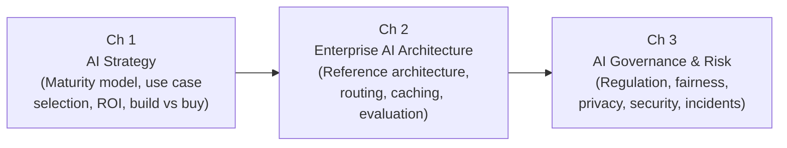

# Volume 10 — Enterprise AI

There is a persistent and costly gap between organisations that can train impressive ML models and organisations that can extract lasting business value from AI at scale. Closing that gap requires more than engineering excellence — it demands a coherent AI strategy, an architecture that makes AI safe and economical to operate, and a governance framework that keeps AI systems accountable to legal, ethical, and business obligations. This volume addresses the leadership and systems-design layer that sits above the model: the decisions, structures, and processes that determine whether an organisation's AI investments compound over time or stall in perpetual pilot purgatory. By the end of this volume, you will be able to lead AI strategy, design enterprise-grade AI architecture, and build governance programmes that make AI trustworthy and sustainable.

---

## Learning Map

---

## Chapters at a Glance

| # | Chapter | Description | Reading Time |
|---|---------|-------------|--------------|
| 1 | [AI Strategy](ch01-strategy/index.md) | AI maturity model, use case selection framework, ROI calculation, build vs buy vs partner decision tree, TCO, project lifecycle gates, common failure modes | 75 min |
| 2 | [Enterprise AI Architecture](ch02-architecture/index.md) | Reference architecture, API gateway patterns, multi-tenancy, LLM routing, semantic caching, prompt management, evaluation pipelines, SLO design, cost optimisation | 90 min |
| 3 | [AI Governance & Risk](ch03-governance/index.md) | AI risk taxonomy, EU AI Act, NIST AI RMF, bias and fairness metrics, PII detection, security threats, governance framework, model cards, incident response | 75 min |

---

## Prerequisites

Before starting Volume 10, you should have completed all previous volumes:

- **Volumes 1–4** — Foundations, Python, Classical ML, Deep Learning
- **Volume 5** — Transformers
- **Volume 6** — Large Language Models
- **Volume 7** — Retrieval-Augmented Generation
- **Volume 8** — AI Agents
- **Volume 9** — MLOps

---

## Volume Learning Outcomes

By completing this volume, you will be able to:

1. **Assess organisational AI maturity** using a five-level model and identify the highest-leverage investments to advance from the current level.
2. **Select and prioritise AI use cases** using a business impact vs technical feasibility framework and calculate ROI with payback period.
3. **Design enterprise AI reference architecture** spanning authentication, rate limiting, routing, semantic caching, and observability.
4. **Implement LLM routing, prompt management, and semantic caching** strategies that reduce cost and improve response quality at scale.
5. **Apply AI fairness metrics** — demographic parity, equalised odds, individual fairness — and detect bias using Fairlearn.
6. **Build an AI governance framework** covering model cards, impact assessments, incident response, and compliance with the EU AI Act and NIST AI RMF.

---

!!! tip "Technical Excellence is Necessary but Not Sufficient"
    "Technical excellence is necessary but not sufficient. Enterprise AI success requires strategy, governance, and organisational change management."
